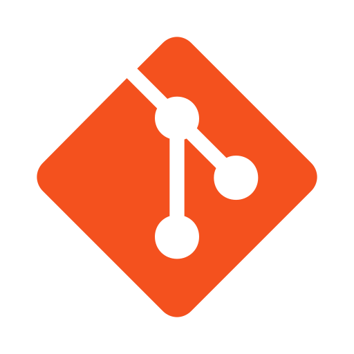

# Ferramentas

Este documento descreve as ferramentas selecionadas pela equipe para apoiar o desenvolvimento do projeto da disciplina de Requisitos de Software. A escolha dessas ferramentas teve como objetivo principal otimizar o gerenciamento, a comunicação e a elaboração dos artefatos exigidos ao longo do projeto.

A Tabela 1 apresenta as ferramentas previstas para uso durante as diversas etapas do projeto, cujo foco é a análise de requisitos do aplicativo selecionado. Essa tabela foi elaborada com base em modelos de projetos anteriores disponibilizados pelo professor da disciplina e traz uma estimativa abrangente dos recursos que serão utilizados ao longo do desenvolvimento.

Tabela 1 - Ferramentas Utilizadas no Projeto

| Logo      | Ferramenta       | Funcionalidade                                                                 |
|-----------|------------------|--------------------------------------------------------------------------------|
| 
 |**GitHub¹**|Utilizado para manter o repositório, além de hospedar a GitHub Pages do projeto.|
| 
 |**Git²**|Utilizado para fazer o controle de versão do projeto, permitindo  rastrear e gerenciar alterações.|
| 
 |**MkDocs³**|Utilizado para gerar documentação de projetos.|
| 
 |**Visual Studio Code (VSCode)⁴**| IDE utilizada para criar a GitHub Pages do projeto.|
| 
 |**Figma⁵**| Utilizado para realizar os protótipos e o guia de estilo do projeto.|
| 
 |**Excalidraw⁶**|Utilizado para criar o *Rich Picture*.|
| 
 |**WhatsApp⁷**|Aplicativo de mensagens escolhido para manter uma comunicação contínua entre os membros do grupo.|
| 
 |**Microsoft Teams⁸**| Utilizado para reuniões e gravações das mesmas, além de realizar entrevistas.|
| 
 |**YouTube⁹**|Utilizado para hospedar as gravações do projeto.|
| 
 |**ChatGPT¹⁰**|Utilizado para revisão de textos.|
| 
 |**Google Docs¹¹**|Utilizado para criar documentos em conjunto com os outros membros da equipe.|
| 
 |**Canvas¹²**|Ferramenta utilizada para montar apresentações.|
| 
 |**This Person Does Not Exist¹³**|Ferramenta utilizada para montar apresentações.|
| 
 |**Miro¹⁴**|Ferramenta utilizada Brainstorming e construção de boards.|

Fonte: [Caio Duarte](https://github.com/caioduart3), [Gabriel Pinto](https://github.com/GabrielSPinto), [João Félix](https://github.com/joaofmoreiraa), [Larysssa Felix](https://github.com/felixlaryssa), [Letícia Monteiro](https://github.com/LeticiaMonteiroo), [Ludmila Nunes](https://github.com/ludmilaaysha) e [Mayara Marques](https://github.com/maymarquee), 2025.
 

## 2. Referências

> GITHUB. *GitHub*. Disponível em: <https://github.com/>. Acesso em: 13 abr. 2025.

> SOFTWARE FREEDOM CONSERVANCY. Git. Disponível em: https://git-scm.com/. Acesso em: 16 abr. 2025.

> MKDOCS. MkDocs. Disponível em: https://www.mkdocs.org/. Acesso em: 16 abr. 2025.

> MICROSOFT CORPORATION. *Visual Studio Code*. Disponível em: <https://code.visualstudio.com/>. Acesso em: 13 abr. 2025.

> FIGMA INC. *Figma*. Disponível em: <https://www.figma.com/>. Acesso em: 13 abr. 2025.

> EXCALIDRAW. *Excalidraw*. Disponível em: <https://excalidraw.com/>. Acesso em: 13 abr. 2025.

> WHATSAPP INC. *WhatsApp*. Disponível em: <https://www.whatsapp.com/>. Acesso em: 13 abr. 2025.

> MICROSOFT CORPORATION. Microsoft Teams. Disponível em: https://www.microsoft.com/pt-br/microsoft-teams/group-chat-software. Acesso em: 13 abr. 2025.

> GOOGLE LLC. *YouTube*. Disponível em: <https://www.youtube.com/>. Acesso em: 13 abr. 2025.

> OPENAI. *ChatGPT*. Disponível em: <https://chat.openai.com/>. Acesso em: 16 abr. 2025.

> GOOGLE LLC. Google Docs. Disponível em: https://docs.google.com/. Acesso em: 13 abr. 2025.

> CANVA. Canvas. Disponível em: https://www.canva.com/. Acesso em: 16 abr. 2025.

> THIS PERSON DOES NOT EXIST. *This Person Does Not Exist*. Disponível em: <https://thispersondoesnotexist.com/>. Acesso em: 16 abr. 2025.

---

## 3. Histórico de versões

Tabela 2: Histórico de versões

| Versão |Descrição     |Autor                                       |Data    |Revisor|
|:-:     | :-:          | :-:                                        | :-:        |:-:|
|1.0     |Criação do documento|[Gabriel Pinto](https://github.com/GabrielSPinto)| 10/04/2025 | [Mayara Marques](https://github.com/maymarquee)|
|1.1     |Adição de ferramentas previstas no projeto|[Gabriel Pinto](https://github.com/GabrielSPinto)| 16/04/2025 | [Caio Duarte](https://github.com/caioduart3)|
|1.2     |Correção de fonte da planilha 1|[Gabriel Pinto](https://github.com/GabrielSPinto)| 18/04/2025 | [Caio Duarte](https://github.com/caioduart3)|
|1.4     |Adição de nova ferramenta|[Gabriel Pinto](https://github.com/GabrielSPinto)| 18/04/2025 | [Mayara Marques](https://github.com/maymarquee)|

Fonte: [Caio Duarte](https://github.com/caioduart3), [Gabriel Pinto](https://github.com/GabrielSPinto), [João Félix](https://github.com/joaofmoreiraa), [Larysssa Felix](https://github.com/felixlaryssa), [Letícia Monteiro](https://github.com/LeticiaMonteiroo), [Ludmila Nunes](https://github.com/ludmilaaysha) e [Mayara Marques](https://github.com/maymarquee), 2025.
 
