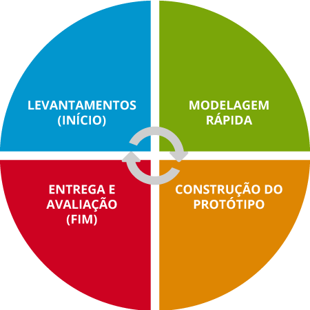

# Metodologia

Segundo o <i>Guide to the Software Engineering Body of Knowledge</i> (SWEBOK), <b>metodologia</b> é definida como um conjunto estruturado de práticas, técnicas e princípios utilizados para conduzir atividades de engenharia de software de forma sistemática e organizada. Conforme apresentado no SWEBOK, as metodologias podem ser classificadas em:

<ul style="text-align: justify; padding-left: 4em; margin-top: 0.5em;">
<li><b>Métodos heurísticos</b>: baseados em práticas consolidadas da indústria;
<li><b>Métodos formais</b>: fundamentados em notações matemáticas rigorosas;
<li><b>Métodos de prototipação</b>: que permitem o desenvolvimento de versões preliminares de um sistema;
<li><b>Métodos ágeis</b>: que priorizam entregas contínuas, colaboração com stakeholders e adaptação a mudanças.
</ul>

## 1. Aplicação no Projeto do IBGE

Neste projeto, que visa a prototipação dos requisitos do aplicativo do IBGE, adotaremos <b>Metodologias Ágeis</b> e <b>Métodos de Prototipação</b> como abordagens principais.

### 1.1 Metodologias Ágeis

As metodologias ágeis serão adotadas para organizar o desenvolvimento do sistema em ciclos iterativos, com foco em entregas frequentes e adaptabilidade às mudanças nos requisitos. Em particular, utilizaremos o modelo de sprints do <b>framework Scrum</b>, com ciclos semanais de desenvolvimento.

Para o gerenciamento das sprints, será utilizada a plataforma GitHub, onde as <b>issues</b> representarão as tarefas do projeto. O acompanhamento e a organização das atividades ocorrerão por meio do recurso de <b>projetos Kanban</b> do GitHub, estruturado com colunas que indicam o status das tarefas: <i>To Do</i>, <i>Doing</i> e <i>Done</i>.

As sprints serão organizadas com reuniões de <b>Planning</b> ao início de cada sprint, seguindo a estrutura clássica de <b>Retrospectiva</b>, <b>Revisão</b> e <b>Planejamento</b>. Esses encontros têm como objetivo avaliar o progresso da sprint anterior, revisar as entregas realizadas e planejar as próximas tarefas com base nas prioridades do projeto.

Para facilitar a aplicação do framework e garantir a fluidez do processo ágil, o integrante <b>Caio Duarte</b> foi designado como <b>Scrum Master</b> do projeto. Ele será responsável por promover os valores e práticas do Scrum, apoiar a equipe na remoção de impedimentos, organizar as cerimônias ágeis e assegurar que todos os membros estejam alinhados com os objetivos das sprints. Sua atuação será essencial para manter o foco, a colaboração e a melhoria contínua ao longo do desenvolvimento.

 

  

      
    <b><a href="https://github.com/caioduart3" target="_blank" style="text-decoration: none; color: #0366d6;">Caio Duarte</a></b> 
    Scrum Master
  

 

A equipe avaliou a disponibilidade de seus integrantes por meio de um mapa de calor, apresentado na Imagem 1, com o intuito de otimizar a organização das atividades do grupo e identificar os horários mais adequados para a realização das reuniões.

  
Imagem 1 – Heatmap de Disponilidade

  
  
Fonte: Google Planilhas

Com base nessa análise, foi definido que os melhores horários para as reuniões seriam na quarta-feira, das 21h às 22h. Sempre que possível, as reuniões são realizadas por meio da plataforma Microsoft Teams, onde também são gravadas e documentadas para fins de registro e consulta futura.

### 1.2 Métodos de Prototipação

O <b>Modelo de Prototipação</b>, também conhecido como <b>Modelo Evolucionário</b>, é caracterizado por uma abordagem cíclica que permite o acompanhamento da evolução dos requisitos do projeto. A principal vantagem desse modelo é a significativa participação do cliente, o que possibilita uma aproximação gradual ao produto final a cada ciclo. Além disso, destaca-se pela rapidez em apresentar resultados ao cliente, mesmo que inacabados.

Será adotado o método de prototipação para o desenvolvimento de versões preliminares do sistema, com o objetivo de facilitar a comunicação com os usuários e permitir a validação antecipada das funcionalidades. As etapas do Modelo de Prototipação serão seguidas conforme ilustrado na Imagem 2 a seguir:

  
Imagem 2 – Ciclo da Metodologia de Prototipação

  
  
Fonte: Curso Projetos de Sistemas da Fundação Bradesco

<ol style="text-align: justify; padding-left: 4em; margin-top: 0.5em;">
<li><b>Levantamento de Requisitos:</b> Ocorre o entendimento das expectativas e das necessidades do cliente, bem como o levantamento dos requisitos.
<li><b>Modelagem Rápida:</b> Criação de uma versão inicial do sistema que representa as funcionalidades desejadas. Não há preocupação com detalhes que possam tomar tempo, já que o objetivo não é construir algo que será mostrado ao cliente.
<li><b>Construção do Protótipo:</b> É construído um protótipo para ser mostrado ao cliente. O protótipo pode ou não ser funcional.
<li><b>Entrega e Avaliação:</b> Nessa etapa, o protótipo é apresentado ao cliente, que fará uma avaliação. A partir da avaliação, surgem ajustes nos requisitos e novas solicitações.
</ol>

Este ciclo é repetido até que o sistema atenda satisfatoriamente aos requisitos dos usuários.

Essa abordagem mista é recomendada pelo SWEBOK para projetos em que a interação com usuários e o refinamento incremental dos requisitos são fatores-chave para o sucesso.

## 2. Política de Revisão

Para que nenhum arquivo fique com alguma informação faltando ou errada, foi definido que, a cada nova modificação feita nos arquivos, será escolhido pelo autor um outro membro da equipe para executar a revisão e apontar os pontos que precisarão ser modificados, caso necessário. Torna-se, assim, <b>obrigatória</b> a requisição de um revisor desde a Sprint 1, onde foi acordado tal exigência.

## 3. Referências

> IEEE COMPUTER SOCIETY. *Guide to the Software Engineering Body of Knowledge (SWEBOK)*: Version 4.0. Los Alamitos, CA: IEEE, 2024. Disponível em: <https://www.computer.org/education/bodies-of-knowledge/software-engineering>. Acesso em: abr. 2025.

> FUNDAÇÃO BRADESCO. Curso Projetos de Sistemas de TI. Tópico: Modelo de Prototipação. Disponível em: <https://lms.ev.org.br/mpls/Custom/Cds/COURSES/2510-PROJ_SIST_TI/pag/1_2_8.html>. Acesso em: abr. 2025.

---
## 4. Histórico de versões

Tabela 1: Histórico de versões

| Versão |Descrição     |Autor                                       |Data    |Revisor|
|:-:     | :-:          | :-:                                        | :-:        |:-:|
|1.0     |Criação do documento|[Gabriel Pinto](https://github.com/GabrielSPinto)| 13/04/2025 | [Mayara Marques](https://github.com/maymarquee)|
|1.1     |Adicionando Scrum Master|[Gabriel Pinto](https://github.com/GabrielSPinto)| 13/04/2025 | [Caio Duarte](https://github.com/caioduart3)|
|1.2     |Introdução de imagens no texto|[Gabriel Pinto](https://github.com/GabrielSPinto)| 18/04/2025 | [Caio Duarte](https://github.com/caioduart3)|

Fonte: [Caio Duarte](https://github.com/caioduart3), [Gabriel Pinto](https://github.com/GabrielSPinto), [João Félix](https://github.com/joaofmoreiraa), [Larysssa Felix](https://github.com/felixlaryssa), [Letícia Monteiro](https://github.com/LeticiaMonteiroo), [Ludmila Nunes](https://github.com/ludmilaaysha) e [Mayara Marques](https://github.com/maymarquee), 2025.
 
