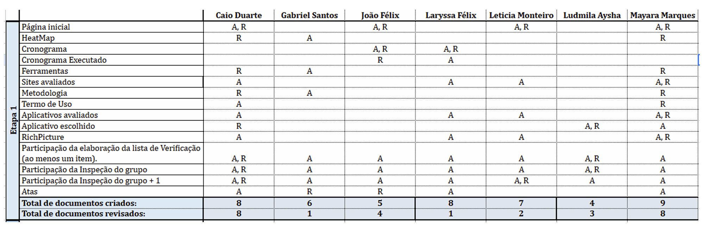

# Entrega 1 - Inspeção do Monitor

**Nome do Monitor**: Gabriel Rosa  
**Grupo**: 05  
**Aplicativo**: IBGE  
**Data**: 28/04/2025

<b>Integrantes do grupo</b>: 

<ul style="text-align: justify; padding-left: 4em; margin-top: 0.5em;">
<li>Caio Duarte;
<li>Gabriel Santos;
<li>João Victor Félix;
<li>Laryssa Félix;
<li>Leticia Monteiro;
<li>Ludmila Aysha;
<li>Mayara Marques.
</ul>

<b>Entrega 1: Planejamento do Projeto, equipe,  App selecionado para o projeto da disciplina, 
Ferramentas do projeto, cronograma detalhado das atividades do projeto (com data de início e fim de 
cada atividade, responsáveis e período de gravação da apresentação), Rich Picture.</b>

## 1. Tabelas de Inspeção

### 1.1 Itens do Planejamento Geral do Projeto

Tabela 1: Inspeção do monitor: Itens do Planejamento Geral do Projeto
 

| Questão: O github pages possui: | Resposta (Sim / Não / Incompleto)  | Versão, Data e hora da avaliação |
|-------|------|---------|
| 1 – Uma página apresentando os integrantes da equipe (com foto) com nome e sem matrícula? | Sim |  1.7 / 17/04 |
| 2 - O cronograma do planejamento apresenta todas as atividades de todas as etapas para cada integrante com as datas de início e fim das entrega dos artefatos e com o período da revisão deles?  | Sim | 1.4 / 17/04 |
| 3 - O cronograma do planejamento apresenta um período de gravação da apresentação de cada etapa.  | Sim | 1.4 / 17/04 | 
| 4  - O cronograma prever um período de revisão/ajustes nos artefatos devidos as considerações dos  monitores/professor?  | Sim | 1.4 / 17/04 |
| 5 - O cronograma prevê cada uma das técnicas de elicitação de requisitos que serão usadas no projeto?  | Sim | 1.4 / 17/04 |
|  6 - O cronograma prevê cada uma das técnicas de priorização de requisitos que serão usadas no projeto?   | Não | 1.4 / 17/04  | 
| 7 -  A motivação e os critérios para a escolha do App?  | Sim | 1.0 / 10/04 | 
| 8 - Cópia do Termo de Uso, Direito de Uso ou Propriedade Intelectual do aplicativo permitindo o estudo na disciplina.  | Sim | 1.7 / 10/04  |
| 9 - Possui opção de contraste de cores?   | Sim | - |

Fonte: Gabriel Rosa, 2025.
 

### 1.2 Itens do Desenvolviemnto do Projeto

Tabela 2: Inspeção do monitor: Itens do Desenvolvimento do Projeto
 

| Questão: O github pages possui: | Resposta (Sim / Não / Incompleto)  | Versão, Data e hora da avaliação |
|-------|------|---------|
| 1 – O histórico de versão padronizado?  | Sim | 17/04 |
| 2 -  O(s) autor(es) e o(s) revisor(es) para cada artefato?  | Sim | 17/04 |
| 3 - Referências bibliográficas e/ou bibliografia em todos os artefatos?   | Sim | 17/04 | 
| 4  - As tabelas e imagens possuem legenda e fonte e elas chamadas dentro dos texto? | Incompleto | 17/04 |
| 5 -  Um texto fazendo uma introdução dos artefatos? | Sim | 17/04 |
|  6 - O cronograma executado com quem realizou cada artefato/atividade com as datas de início e fim da construção/realização do artefato/atividade.  | Sim | 1.4 / 17/04  | 
| 7 -  Ata(s) da(s) reuniões (com data, horário de início e do final, participantes, objetivo, atividades definidas etc). | Sim | 17/04 | 
| 8 -  A gravação da reunião do grupo.   | Sim | 17/04  |
| 9 - Vídeo de apresentação na categoria “não listado” no youtube?    | Sim | 17/04 |

Fonte: Gabriel Rosa, 2025.
 

### 1.3 Itens do Desenvolviemnto do Projeto

Tabela 3: Inspeção do monitor: Itens do conteúdo da disciplina 
 

| Questão: O github pages possui: | Resposta (Sim / Não / Incompleto)  | Versão, Data e hora da avaliação |
|-------|------|---------|
| 1 –  No artefato “Rich Picture” possui uma legenda explicando os símbolos utilizados no diagrama?   Referência bibliográfica da fonte: Introducing Rich Pictures - Rich Picture Drawing Guidelines. CTEC2402 - Software Development Project.   Autor: Prof. André    | Incompleto | 1.3 20/04  |
| 2 -  Todos os 5 componentes de um “Rich Picture” estão presentes no artefato do “Rich Picture” apresentado pelo grupo.    Referência bibliográfica da fonte: Introducing Rich Pictures - Rich Picture Drawing Guidelines. CTEC2402 - Software Development Project.   Autor: Prof. André   | Sim | 1.3 30/04 |
| Na lista de verificação contém item de conteúdo da disciplina com referência bibliográfica da fonte e foto do texto da referência?    | Incompleto | 1.1 15/04  | 

Fonte: Gabriel Rosa, 2025.
 

## 2. Observações

<ul style="text-align: justify; padding-left: 4em; margin-top: 0.5em;">
<li>No Rich Picture do Banco do Brasil ficou faltando a legenda, mas o restante está certo. E aí como faltou a legenda, mas ajustando isso, todos ficam corretos. 
<li> E na lista de verificação ficou faltando o conteúdo da disciplina com referência bibliográfica da fonte e foto do texto da referência 
<li> Ficou faltando no cronograma quais vão ser as técnicas de priorização de requisitos. 
<li> E seria importante padronizar algumas tabelas, como por exemplo do histórico de versão, algumas tem a legenda e fonte e outras não tem. Mas é isso, parabéns pela entrega! 
</ul>

Figura 1: Observações monitor 
 

 

Fonte: Gabriel Rosa, 2025.
 

## 3. Histórico de Versões

Tabela 4: Histórico de Versões
 

| Versão |Descrição     |Autor                                       |Data    |Revisor|
|:-:     | :-:          | :-:                                        | :-:        |:-:|
|1.0     |Criação do documento| [Mayara Marques](https://github.com/maymarquee)| 27/05/2025 | [João Félix](https://github.com/joaofmoreiraa) |

Fonte: [Caio Duarte](https://github.com/caioduart3), [Gabriel Pinto](https://github.com/GabrielSPinto), [João Félix](https://github.com/joaofmoreiraa), [Laryssa Felix](https://github.com/felixlaryssa), [Letícia Monteiro](https://github.com/LeticiaMonteiroo), [Ludmila Nunes](https://github.com/ludmilaaysha) e [Mayara Marques](https://github.com/maymarquee), 2025.
