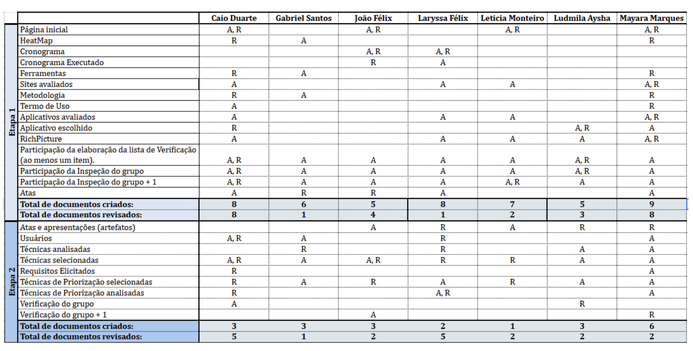

# Entrega 2 - Inspeção do Monitor

**Nome do Monitor**: Gabriel Rosa  
**Grupo**: 05  
**Aplicativo**: IBGE  
**Data**: 21/05/2025

<b>Integrantes do grupo</b>: 

<ul style="text-align: justify; padding-left: 4em; margin-top: 0.5em;">
<li>Caio Duarte;
<li>Gabriel Santos;
<li>João Victor Félix;
<li>Laryssa Félix;
<li>Leticia Monteiro;
<li>Ludmila Aysha;
<li>Mayara Marques.
</ul>

 

<b>Entrega da apresentação do projeto 2: Elicitação – Técnicas e Priorização</b>

## 1. Tabelas de Inspeção

### 1.1 Itens do Desenvolvimento do Projeto

Tabela 1: Inspeção do monitor: Itens do Desenvolvimento do Projeto
 

| Questão: O github pages possui: | Resposta (Sim / Não / Incompleto)  | Versão, Data e hora da avaliação |
|-------|------|---------|
| 1 – O histórico de versão padronizado? | Sim |   |
| 2 - O(s) autor(es) e o(s) revisor(es) para cada artefato?  | Sim |  |
| 3 - Referências bibliográficas e/ou bibliografia em todos os artefatos?  | Sim |  | 
| 4  - As tabelas e imagens possuem legenda e fonte e elas chamadas dentro dos texto? | Incompleto |  |
| 5 - Um texto fazendo uma introdução dos artefatos? | Sim |  |
|  6 - O cronograma executado com quem realizou cada artefato/atividade com as datas de início e fim da construção/realização do artefato/atividade. | Sim |   | 
| 7 -  Ata(s) da(s) reuniões (com data, horário de início e do final, participantes, objetivo, atividades definidas etc). | Sim |  | 
| 8 - A gravação da reunião do grupo.  | Sim |  |
| 9 - Vídeo de apresentação na categoria “não listado” no youtube?   | Sim |  |

Fonte: Gabriel Rosa, 2025.
 

### 1.2 Itens do Conteúdo da Disciplina

Tabela 2: Inspeção do monitor: Itens do Conteúdo da Disciplina
 

| Questão: O github pages possui: | Resposta (Sim / Não / Incompleto)  | Versão, Data e hora da avaliação |
|-------|------|---------|
| 1 – A Especificação do Perfil do usuário com:   - idade (criança, jovem, adulto, terceira idade etc.);   - experiência (leigo/ novato, especialista);   - atitudes (tecnófilos, tecnófobos); e   - tarefas primárias (compra, venda) | Sim | 1.1 21/05 |
| 2 -  O artefato do Perfil do Usuário apresenta uma tabela com os participantes (membro da equipe) e o que foi desenvolvido por cada um deles no artefato. | Não | 1.1 21/05 |
| 3 - Na conclusão do artefato do Perfil do usuário explica a razão e onde esse conteúdo será utilizado no projeto? Por que o perfil de usuário foi definido no projeto?  | Não | 1.1 21/05 | 
| 4  - Se foi utilizado questionário na elaboração do Perfil do Usuário, há uma tabela resumo dizendo onde, quando (período) que o questionário foi aplicado? Se o questionário foi aplicado em algum grupo telegram/whatsapp, no documento é apresentado o(s) nome(s) do(s) grupo(s) e uma justificativa desses grupos terem sido selecionados? | Incompleto | 1.1 21/05 |
| 5 -  Se foi utilizado questionário na elaboração do Perfil do Usuário, o questionário foi aplicado ao público alvo (perfil do usuário)? | Sim | 1.1 21/05 |
|  6 - Se foi utilizado questionário na elaboração do Perfil do Usuário, é apresentado as perguntas do questionário no projeto?  | Incompleto | 1.1 21/05  | 
| 7 -  Uma outra técnica além do questionário para auxiliar o perfil do usuário? | Sim |  | 
| 8 -  A especificação das Personas?   | Sim | 1.1 21/05  |
| 9 - O artefato das Personas apresenta uma tabela com os participantes (membro da equipe) e o que foi desenvolvido por cada um deles no artefato.    | Não | 1.1 / 21/05 |
| 10 - As personas foram criadas baseadas nos dados do perfil do usuário?   | Sim | 1.1 / 21/05 |
| 11 - Cada persona possui:   - identidade: nome e sobrenome;   - idade e dados demográficos;  - foto  - status: primária, secundária, outro stakeholder ou representa um antiusuário do seu sistema;  - objetivos: quais são os objetivos desta persona?  - habilidades: especialidade, educação, treinamento e competências específicas   - tarefas: em linhas gerais, quais as tarefas básicas ou críticas que a persona realiza? Qual é a frequência, importância e duração dessas tarefas?   - relacionamentos: entender com quem a persona se relaciona é importante, pois ajuda a identificar outros stakeholders;   - requisitos: de que a persona precisa? Inclua citações que ajudam a dar mais vida a essas necessidades;   - expectativas: como a persona acredita que o produto funciona? Como ela organiza as informações no seu domínio ou trabalho? | Sim | 1.1 / 21/05 |
| 12 - Antipersona que representa um perfil fora do escopo do público alvo (perfil do usuário) do sistema | Sim | 1.1 / 21/05 |
| 13 - A maneira que as Personas foram elaboradas?  | Sim | 1.1 / 21/05 |
| 14 - A referência bibliográfica sobre o conteúdo de Personas? | Sim | 1.1 / 21/05 |
| 15 - O Elenco de Personas? Quantas Personas no Projeto? O porquê dessa quantidade? | Sim | 1.1 / 21/05 |
| 16 - O cronograma (data e horário) e local para realização da elicitação dos requisitos com o do cliente e/ou persona do projeto? | Não | 1.1 / 21/05 |
| 17 - Na conclusão do artefato da Persona explica a razão e onde esse conteúdo será utilizado no projeto? Por que as Personas foram definidas no projeto?| Não | 1.1 / 21/05 |
| 18 - Os requisitos foram elicitados com o cliente real? | Sim | 1.1 / 21/05 |
| 19 - O artefato de cada técnica de elecitação apresenta uma tabela com os participantes (membro da equipe, papel e usuários - em anonimato) e o porquê da participação de cada um deles no artefato/técnica. | Sim | 1.1 / 21/05 |
| 20 - Se os requisitos foram elicitados com a técnica de encenação (persona), o membro da equipe realizou antes a elicitação com um cliente real?  | Sim | 1.1 / 21/05 |
| 21 - Foi apresentado um cronograma (data e horário) e local para realização da elicitação dos requisitos com o do cliente e/ou persona do projeto? | Sim | 1.1 / 21/05 |
| 22 - No mínimo quatro técnicas de elicitação foram utilizadas (quanto mais melhor)? Técnica(s): Análise de Documentos / Observação / Entrevista /Análise de protocolo Prototipação / Brainstorming //Entrevista em grupo / Storytelling / Análise de discurso / Introspecção / Etnografia / JAD / Questionários / Reuniões/ Grupo Focal / Workshops/ Outra técnica? | Sim |  |
| 23 - A gravação e o(s) registro(s) da elicitação dos requisitos (pré-rastreabilidade)? | Sim |  |
| 23 - A gravação da elicitação dos requisitos em uma reunião presencial? | Não |  |
| 24 - especifica se os requisitos que já foram implementados ou não. | Sim | 1.1 / 21/05 |
| 25 - Na especificação de requisitos através da técnica de análise da interface do sistemas, é apresentado a versão do aplicativo e cópias (prints) das telas de origem do requisito (rastreabilidade)| - | - |
| 26 - Na elicitação de análise de documentos é apresentada a versão do documento e é disponibilizada uma cópia digital dessa versão (.pdf)?| - | - |
| 27 - Uma consolidação de todos os requisitos em uma tabela apresentando a origem (rastreablidade). Essa tabela será usado na priorização dos requisitos. | Sim |  |
| 28 - Nessa tabela do item 27, todo requisito possui ao menos uma fonte de origem? | Sim |  |
| 29 - Como requisito pode ser verificado na aplicação (critério de aceitação). | Sim | 1.1 / 21/05 |
| 30 - Um cronograma (data e horário) e local para realização da priorização dos requisitos com o do cliente e/ou persona do projeto? | Sim |  |
| 31 - No mínimo quatro técnicas de priorização (quanto mais melhor)? MoSCoW* / 100 $* / First thing First  ROI / QFD / TQM / Outra técnica?    * A técnica de MoSCoW* / 100 $* só devem ser utilizados no projeto após a utilização de outras duas técnicas de priorização no projeto. | Sim |  |
| 32 - O artefato de cada técnica de priorização apresenta uma tabela com os participantes (membro da equipe, papel, (qual o perfil) - com o nome em anônimo).| Sim |  |
| 33 - Os requisitos foram priorizados com o cliente real? | Sim |  |
| 34 - Se os requisitos foram elicitados com a técnica de encenação (persona), o membro da equipe realizou antes a elicitação com um cliente real? | Sim |  |
| 35 - A gravação de todas as priorização?  | Sim |  |
| 35 - A gravação da priorização dos requisitos em um reunião presencial? | Não |  |
| 36 - Uma lista de verificação do perfil do usuário com referência bibliográfica da fonte e com foto. A foto possui o texto marcado referente ao item de verificação? | Sim | 1.1 / 21/05 |
| 37 - Uma lista de verificação da personas com referência bibliográfica da fonte e com foto. A foto possui o texto marcado referente ao item de verificação? | Sim | 1.1 / 21/05 |
| 38 - Uma lista de verificação das técnicas de elicitação utilizadas no projeto com referência bibliográfica da fonte e com foto. A foto possui o texto marcado referente ao item de verificação? | Sim | 1.1 / 21/05 |
| 39 - Uma lista de verificação das técnicas de priorização utilizadas no projeto com referência bibliográfica da fonte e com foto. A foto possui o texto marcado referente ao item de verificação? | Sim | 1.1 / 21/05 |

Fonte: Gabriel Rosa, 2025.
 

## 2. Observações

<ul style="text-align: justify; padding-left: 4em; margin-top: 0.5em;">
<li><b>Item 4 - Parte 1</b>: Durante a análise dos documentos pude perceber que algumas figuras e tabelas não estão sendo citadas nos textos. Um exemplo é no artefato de metodologia que a tabela 1 não é citada durante o texto, porém não apenas essa, encontrei isso em outros lugares, então, seria importante revisar os documentos e fazer esses ajustes. 
<li> <b>Item 5 - Parte 1</b>: Em dois documentos (Técnicas analisadas e brainstorming) existe a introdução, mas falta o título “introdução” apenas para ficar padronizados com os outros documentos.
<li> <b>Item 2 - Parte 2</b>: Não encontrei nenhuma tabela com os participantes (membro da equipe) e o que foi desenvolvido por cada um no artefato de Perfil de Usuário.
<li> <b> Item 3 - Parte 2</b>: Faltou uma conclusão no artefato de Perfil de Usuário dizendo onde esse conteúdo será utilizado no projeto.
<li> <b>Item 4 - Parte 2</b>: Não fala o período de aplicação do questionário. É citado apenas que foi respondido por uma página @ibgemilgrau, mas seria bom detalhar mais e a justificativa para escolher esse público.
<li> <b>Item 6 - Parte 2</b>: Em algumas figuras tem algumas perguntas, mas não em todas, ficou de fato confuso. Seria interessante colocar separado todas perguntas que foram realizadas. E nas figuras apenas o título, caso for necessário, pois isso pode ser colocado na legenda da figura.
<li> <b>Item 9 - Parte 2</b>: Idem do Item 2 - Parte 2.
<li> <b> Item 16 - Parte 2</b>: Dentro do documento requisitos elicitados ficou faltando um cronograma com data/hora e local da elicitação de requisitos com o cliente/persona.
<li> <b>Item 17 - Parte 2</b>: Faltou uma conclusão no documento dizendo de esse conteúdo será utilizado no projeto.
<li> <b>Item 23 - Parte 2</b>: Não foi feita reunião presencial, teve algumas gravações que foram realizadas com a câmera fechada, então não deu para saber se foi presencial.
<li> <b>Item 35 - Parte 2</b>: Não houve gravação presencial.

 
 
Parabéns pela entrega! Algumas correções, mas a qualidade dos documentos estão muito boas, e uma
menção especial ao Caio Duarte e a Mayara pelo engajamento.
</ul>

Figura 1: Observações monitor 
 

 

Fonte: Gabriel Rosa, 2025.
 

## 3. Histórico de Versões

Tabela 3: Histórico de Versões
 

| Versão |Descrição     |Autor                                       |Data    |Revisor|
|:-:     | :-:          | :-:                                        | :-:        |:-:|
|1.0     |Criação do documento| [Mayara Marques](https://github.com/maymarquee)| 12/06/2025 | [João Félix](https://github.com/joaofmoreiraa) |

Fonte: [Caio Duarte](https://github.com/caioduart3), [Gabriel Pinto](https://github.com/GabrielSPinto), [João Félix](https://github.com/joaofmoreiraa), [Laryssa Felix](https://github.com/felixlaryssa), [Letícia Monteiro](https://github.com/LeticiaMonteiroo), [Ludmila Nunes](https://github.com/ludmilaaysha) e [Mayara Marques](https://github.com/maymarquee), 2025.
