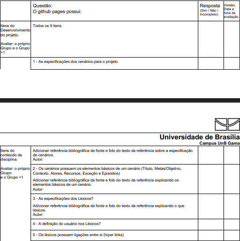

## 1. Lista de Verificação dos Entregáveis

Esta é uma lista de verificação com critérios para serem observados na [**terceira** entrega](https://requisitos-de-software.github.io/2025.1-IBGE/aps/ap3/ap3/): Modelagem de Requisitos: Cenários , Léxico, Use Case, Especificação Suplementar.

### 1.1 Itens do conteúdo da Disciplina

Tabela 1: Itens do conteúdo da Disciplina 

| Item | Autor | Data | Revisor | Status |
| ---- | ----- | ---- | ------- | ------ |
| <a href="#REF01">01-</a> As especificações dos cenários para o projeto. Adicionar referência bibliográfica da fonte e foto do texto da referência sobre a especificação de cenários. | [Caio Duarte](https://github.com/caioduart3) | 02/05/2025 | [Ludmila Nunes](https://github.com/ludmilaaysha) | Conforme |
| <a href="#REF02">02-</a> Os cenários possuem os elementos básicos de um cenário (Título, Metas/Objetivo, Contexto, Atores, Recursos, Exceção e Episódios). Adicionar referência bibliográfica da fonte e foto do texto da referência explicando os elementos básicos de um cenário. | [Caio Duarte](https://github.com/caioduart3) | 02/05/2025 | [Ludmila Nunes](https://github.com/ludmilaaysha) | Conforme |
| <a href="#REF03">03-</a> As especificações dos Léxicos? Adicionar referência bibliográfica da fonte e foto do texto da referência explicando o que léxicos.| [Caio Duarte](https://github.com/caioduart3) | 18/05/2025 | [Ludmila Nunes](https://github.com/ludmilaaysha) | Conforme |
| <a href="#REF04">04-</a> A definição do usuário nos Léxicos?| [Caio Duarte](https://github.com/caioduart3) | 18/05/2025 | [Ludmila Nunes](https://github.com/ludmilaaysha) | Conforme |
| <a href="#REF05">05-</a> Os léxicos possuem ligações entre si (hiper links)? | [Caio Duarte](https://github.com/caioduart3) | 18/05/2025 | [Ludmila Nunes](https://github.com/ludmilaaysha) | Conforme |
| <a href="#REF06">06-</a> Os léxicos utilizam a estrutura de dicionário (verbo, objeto, estado)? Adicionar referência bibliográfica da fonte e foto do texto da referência explicando a estrutura do dicionário. | [Caio Duarte](https://github.com/caioduart3) | 18/05/2025 | [Ludmila Nunes](https://github.com/ludmilaaysha) | Conforme |
| <a href="#REF07">07-</a> A especificação do caso de uso? | [Caio Duarte](https://github.com/caioduart3) | 18/05/2025 | [Ludmila Nunes](https://github.com/ludmilaaysha) | Conforme |
| <a href="#REF08">08-</a> Os atores principais e atores secundários no diagrama de caso de uso? Adicionar referência bibliográfica da fonte e foto do texto da referência explicando os atores principais e atores secundários. | [Caio Duarte](https://github.com/caioduart3) | 18/05/2025 | [Ludmila Nunes](https://github.com/ludmilaaysha) | Conforme |
| <a href="#REF09">09-</a> O ator principal está do lado esquerdo do sistema no diagrama de caso de uso? Adicionar referência bibliográfica da fonte e foto do texto da referência explicando esse item. | [Caio Duarte](https://github.com/caioduart3) | 18/05/2025 | [Ludmila Nunes](https://github.com/ludmilaaysha) | Conforme |
| <a href="#REF10">10-</a> Os atores estão fora da caixa de limite do sistema no diagrama de caso de uso? Adicionar referência bibliográfica da fonte e foto do texto da referência explicando esse item. | [Caio Duarte](https://github.com/caioduart3) | 18/05/2025 | [Ludmila Nunes](https://github.com/ludmilaaysha) | Conforme |
| <a href="#REF11">11-</a> A especificação do diagrama de caso de uso (com Nome, Descrição, Atores, Pré-Condição, Pós-Condição, Fluxo Principal, Fluxo Alternativo e Fluxo de Exceção etc.)? Adicionar referência bibliográfica da fonte e foto do texto da referência explicando a estrutura da especificação. | [Caio Duarte](https://github.com/caioduart3) | 18/05/2025 | [Ludmila Nunes](https://github.com/ludmilaaysha) | Conforme |
| <a href="#REF12">12-</a> No diagrama de Caso de Uso há ao menos um caso de uso com pontos de extensão? Adicionar referência bibliográfica da fonte e foto do texto da referência explicando o ponto de extensão. | [Caio Duarte](https://github.com/caioduart3) | 18/05/2025 | [Ludmila Nunes](https://github.com/ludmilaaysha) | Conforme |
| <a href="#REF13">13-</a> A participação do cliente e/ou persona na validação do Diagrama de Casa de Uso? | [Caio Duarte](https://github.com/caioduart3) | 18/05/2025 | [Ludmila Nunes](https://github.com/ludmilaaysha) | Conforme |
| <a href="#REF14">14-</a> A especificação suplementar? Adicionar referência bibliográfica da fonte e foto do texto da referência explicando o que é especificação suplementar. | [Caio Duarte](https://github.com/caioduart3) | 18/05/2025 | [Ludmila Nunes](https://github.com/ludmilaaysha) | Conforme |
| <a href="#REF15">15-</a> O artefato segue o modelo FURPS+? | [Caio Duarte](https://github.com/caioduart3) | 18/05/2025 | [Ludmila Nunes](https://github.com/ludmilaaysha) | Conforme |
| <a href="#REF16">16-</a> O documento especifica o tempo de resposta, no Desempenho? | [Caio Duarte](https://github.com/caioduart3) | 18/05/2025 | [Ludmila Nunes](https://github.com/ludmilaaysha) | Conforme |
| <a href="#REF17">17-</a> O documento especifica qual plataforma o aplicativo pode ser executado? | [Caio Duarte](https://github.com/caioduart3) | 18/05/2025 | [Ludmila Nunes](https://github.com/ludmilaaysha) | Conforme |
| <a href="#REF18">18-</a> Todos os requisitos podem ser testados (RF e RNF)? Identificar quais requisitos não são testáveis / verificáveis.| [Caio Duarte](https://github.com/caioduart3) | 18/05/2025 | [Ludmila Nunes](https://github.com/ludmilaaysha) | Conforme |
| <a href="#REF19">19-</a> O diagrama de casos de uso mostra pessoas, organizações ou outros sistemas que interagem com ele? | [Ludmila Nunes](https://github.com/ludmilaaysha) | 18/05/2025 | [Caio Duarte](https://github.com/caioduart3)| Conforme |
| <a href="#REF20">20-</a> Na especificação suplementar, há uma seção que indica as restrições do projeto? | [Letícia Monteiro](https://github.com/LeticiaMonteiroo) | 18/05/2025 | [Caio Duarte](https://github.com/caioduart3)| Conforme |
| <a href="#REF21">21-</a> Cada caso de uso está associado a pelo menos um ator? | [Larysssa Felix](https://github.com/felixlaryssa) | 18/05/2025 | [Caio Duarte](https://github.com/caioduart3)| Conforme |
| <a href="#REF22">22-</a> Os atores estão representados fora do sistema (fora do retângulo que representa o sistema)? |[Mayara Marques](https://github.com/maymarquee) | 18/05/2025 | [Caio Duarte](https://github.com/caioduart3)| Conforme |
| <a href="#REF23">23-</a> Há especificação a respeito da requisitos de implementação? |[João Félix](https://github.com/joaofmoreiraa) | 18/05/2025 | [Caio Duarte](https://github.com/caioduart3)| Conforme |
| <a href="#REF24">24-</a> O sistema é representado por um retângulo, com o nome do sistema inserido no topo. | [Gabriel Silva](https://github.com/GabrielSPinto) | 18/05/2025 | [Caio Duarte](https://github.com/caioduart3)| Conforme |
| <a href="#REF25">25-</a> Há especificação a respeito da restrição de design? | [Caio Duarte](https://github.com/caioduart3) | 18/05/2025 | [Ludmila Nunes](https://github.com/ludmilaaysha) | Conforme |

Fonte: [Caio Duarte](https://github.com/caioduart3), 2025.

## 2. Bibliografia

### 2.1 Bibliografia dos Itens do conteúdo da Disciplina

A lista de verificação dos itens do conteúdo da Disciplina de 1 a 18 tiveram como referência:

> SALES, André Barros de. Plano de ensino – Requisitos de Software: REE012025 – Turma 03. Brasília: Universidade de Brasília, Faculdade UnB Gama, 2025. Disponível em: <https://aprender3.unb.br/pluginfile.php/3106711/mod_resource/content/58/Lista%20de%20Verifificac%CC%A7a%CC%83o%20-%20Plano_de_Ensino%20RE%20012025%20Turma%2003%20v2.pdf>. Acesso em: 3 Mai. 2025.

Figura 1: <i>Referência da lista de verificação dos itens 1 a 18 </i> dos usuários

Fonte: [Caio Duarte](https://github.com/caioduart3), 2025.

Figura 1: <i>Referência da lista de verificação dos itens 19 a 25 </i> dos usuários

Fonte: [Caio Duarte](https://github.com/caioduart3), 2025.

Figura 1: <i>Continuação das referências da lista de verificação dos itens 19 a 25 </i> dos usuários

Fonte: [Caio Duarte](https://github.com/caioduart3), 2025.

Tabela 2: Referências dos Itens de 13 a 19 do conteúdo da Disciplina 

| Item                 | Referência                                                                                         | Imagem                                                                       |
| -------------------- | -------------------------------------------------------------------------------------------------- | ---------------------------------------------------------------------------- |
| <b id="REF19">19</b> | Lucid Software Português. Tutorial de Caso de Uso UML. YouTube,  25 de abril de 2019. Disponível em: <https://youtu.be/ab6eDdwS3rA?si=TuSD2E2sgC6tj_m7>. Acesso em: 14 de maio de 2025. (00:44).| Não se aplica|
| <b id="REF20">20</b> | Especificação Suplementar do MINISTÉRIO DA CIÊNCIA, TECNOLOGIA, INOVAÇÕES E COMUNICAÇÕES. Disponível em: <https://aprender3.unb.br/pluginfile.php/3096129/mod_resource/content/2/SiglaProjeto_EspecificacaoSuplementar.pdf>. Acesso em: 14 de maio de 2025.| [Ver imagem ](./../../assets/images/entrega3_lv_img/restProjeto.png)|
| <b id="REF21">21</b> | Lucid Software Português. Tutorial de Caso de Uso UML. YouTube,  25 de abril de 2019. Disponível em: <https://youtu.be/ab6eDdwS3rA?si=PDKEbmpu0IKhQmOC&t=320>. Acesso em: 14 de maio de 2025. (5:20). | Não se aplica |
| <b id="REF22">22</b> | Lucid Software Português. Tutorial de Caso de Uso UML. YouTube,  25 de abril de 2019. Disponível em: <https://youtu.be/ab6eDdwS3rA?si=TuSD2E2sgC6tj_m7>. Acesso em: 14 de maio de 2025. (02:50).    | Não se aplica|
| <b id="REF23">23</b> | SERRANO, Milene; SERRANO, Maurício. Requisitos – Aula 13. [S.l.: s.n.], [s.d.]. Disponível em: https://aprender3.unb.br/pluginfile.php/3096118/mod_resource/content/1/Requisitos%20-%20Aula%20013a.pdf. Acesso em: 13 maio 2025. p. 28.   | [Ver imagem](./../../assets/images/entrega3_lv_img/image.png) | 
| <b id="REF24">24</b> | Lucid Software Português. Tutorial de Caso de Uso UML. YouTube,  25 de abril de 2019. Disponível em: <https://youtu.be/ab6eDdwS3rA?si=Ysm2XpYgw01JUUBa&t=106>. Acesso em: 14 de maio de 2025. (01:46).  | Não se aplica|
| <b id="REF25">25</b> | SERRANO, Milene; SERRANO, Maurício. Requisitos – Aula 13. [S.l.: s.n.], [s.d.]. Disponível em: https://aprender3.unb.br/pluginfile.php/3096118/mod_resource/content/1/Requisitos%20-%20Aula%20013a.pdf. Acesso em: 13 maio 2025. p. 28.   | [Ver imagem](./../../assets/images/entrega3_lv_img/image.png)     |

Fonte: [Caio Duarte](https://github.com/caioduart3), [Gabriel Pinto](https://github.com/GabrielSPinto), [João Félix](https://github.com/joaofmoreiraa), [Larysssa Felix](https://github.com/felixlaryssa), [Letícia Monteiro](https://github.com/LeticiaMonteiroo), [Ludmila Nunes](https://github.com/ludmilaaysha) e [Mayara Marques](https://github.com/maymarquee), 2025.

## 3. Histórico de Versões

Tabela 3: Histórico de Versões

| Versão |                 Descrição                  |                    Autor                     |    Data    |                     Revisor                      |
| :----: | :----------------------------------------: | :------------------------------------------: | :--------: | :----------------------------------------------: |
|  1.0   |            Criação da documento            | [Caio Duarte](https://github.com/caioduart3) | 18/05/2025 | [Ludmila Nunes](https://github.com/ludmilaaysha) |
|  1.1   | Adição do conteúdo da lista de verificação | [Caio Duarte](https://github.com/caioduart3) | 18/05/2025 | [Ludmila Nunes](https://github.com/ludmilaaysha) |

Fonte: [Caio Duarte](https://github.com/caioduart3).

