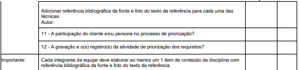

## 1. Lista de Verificação dos Entregáveis
Esta é uma lista de verificação com critérios para serem observados na [**segunda** entrega](ap2.md):  Elicitação – Técnicas e Priorização.

### 1.1 Itens do conteúdo da Disciplina 

Tabela 3: Itens do conteúdo da Disciplina 
 

| Item                                                                                                                                                   | Autor                                        | Data       | Revisor                                          | Status   |
| ------------------------------------------------------------------------------------------------------------------------------------------------------ | -------------------------------------------- | ---------- | ------------------------------------------------ | -------- |
| <a href="#REF01">01-</a> A especificação do perfil do usuário possui informações como idade, experiência, atitudes e tarefas primárias?                | [Caio Duarte](https://github.com/caioduart3) | 02/05/2025 | [Ludmila Nunes](https://github.com/ludmilaaysha) | Conforme |
| <a href="#REF02">02-</a> Há um cronograma (data e horário) e local para realização da elicitação dos requisitos com o cliente e/ou pessoa do projeto?  | [Caio Duarte](https://github.com/caioduart3) | 02/05/2025 | [Ludmila Nunes](https://github.com/ludmilaaysha) | Conforme |
| <a href="#REF03">03-</a> Foi informado quais técnicas de elicitação foram utilizadas (quanto mais, melhor)?                                            | [Caio Duarte](https://github.com/caioduart3) | 02/05/2025 | [Ludmila Nunes](https://github.com/ludmilaaysha) | Conforme |
| <a href="#REF04">04-</a> A participação do cliente e/ou persona na elicitação de requisitos?                                            | [Caio Duarte](https://github.com/caioduart3) | 02/05/2025 | [Ludmila Nunes](https://github.com/ludmilaaysha) | Conforme |
| <a href="#REF05">05-</a> A gravação e o(s) registro(s) da elicitação dos requisitos estão disponíveis (pré-rastreabilidade)?                           | [Caio Duarte](https://github.com/caioduart3) | 02/05/2025 | [Ludmila Nunes](https://github.com/ludmilaaysha) | Conforme |
| <a href="#REF06">06-</a> Cada requisito possui pelo menos uma fonte de origem?                                                                         | [Caio Duarte](https://github.com/caioduart3) | 02/05/2025 | [Ludmila Nunes](https://github.com/ludmilaaysha) | Conforme |
| <a href="#REF07">07-</a> São apresentados requisitos implementados e não implementados para a aplicação?                                          | [Caio Duarte](https://github.com/caioduart3) | 02/05/2025 | [Ludmila Nunes](https://github.com/ludmilaaysha) | Conforme |
| <a href="#REF08">08-</a> Está sendo apresentado como requisito pode ser verificado na aplicação (critério de
aceitação).              | [Caio Duarte](https://github.com/caioduart3) | 02/05/2025 | [Ludmila Nunes](https://github.com/ludmilaaysha) | Conforme |
| <a href="#REF09">09-</a> Há um cronograma (data e horário) e local para realização da priorização dos requisitos com o cliente e/ou pessoa do projeto? | [Caio Duarte](https://github.com/caioduart3) | 02/05/2025 | [Ludmila Nunes](https://github.com/ludmilaaysha) | Conforme |
| <a href="#REF10">10-</a> No mínimo quatro técnicas de priorização (quanto mais melhor)? MoSCoW* / 100 $* / First thing First / ROI / QFD / TQM / Outra técnica? * A técnica de MoSCoW* / 100 $* só devem ser utilizados no projeto após a utilização de outras duas técnicas de priorização no projeto. Adicionar referência bibliográfica da fonte e foto do texto da referência para cada uma das técnicas.| [Caio Duarte](https://github.com/caioduart3) | 02/05/2025 | [Ludmila Nunes](https://github.com/ludmilaaysha) | Conforme |
| <a href="#REF11">11-</a>  A participação do cliente e/ou persona no processo de priorização?          | [Caio Duarte](https://github.com/caioduart3) | 02/05/2025 | [Ludmila Nunes](https://github.com/ludmilaaysha) | Conforme |
| <a href="#REF12">12-</a> A gravação e o(s) registro(s) da atividade de priorização dos requisitos estão disponíveis? | [Caio Duarte](https://github.com/caioduart3) | 02/05/2025 | [Ludmila Nunes](https://github.com/ludmilaaysha) | Conforme |
| <a href="#REF13">13-</a>  No perfil do usuário é identificado a idade? | [Caio Duarte](https://github.com/caioduart3) | 02/05/2025 | [Ludmila Nunes](https://github.com/ludmilaaysha) | Conforme |
| <a href="#REF14">14-</a>  No perfil do usuário é identificado seu nível de instrução? | [Letícia Monteiro](https://github.com/LeticiaMonteiroo) | 02/05/2025 | [Caio Duarte](https://github.com/caioduart3) | Conforme |
| <a href="#REF15">15-</a>  No perfil do usuário é identificado sua atitude frente à tecnologia?  | [Larysssa Felix](https://github.com/felixlaryssa) | 02/05/2025 | [Caio Duarte](https://github.com/caioduart3) | Conforme |
| <a href="#REF16">16-</a>  A persona tem um nome e sobrenome?  |[Mayara Marques](https://github.com/maymarquee) | 02/05/2025 | [Caio Duarte](https://github.com/caioduart3) | Conforme |
| <a href="#REF17">17-</a>  A persona tem uma foto?  | [Ludmila Nunes](https://github.com/ludmilaaysha) | 02/05/2025 | [Caio Duarte](https://github.com/caioduart3) | Conforme |
| <a href="#REF18">18-</a>  A persona tem uma idade definida?  | [João Félix](https://github.com/joaofmoreiraa) | 02/05/2025 | [Caio Duarte](https://github.com/caioduart3) | Conforme |
| <a href="#REF19">19-</a>  A persona tem objetivos definidos?  | [Gabriel Silva](https://github.com/GabrielSPinto) | 02/05/2025 | [Caio Duarte](https://github.com/caioduart3) | Conforme |

Fonte: [Caio Duarte](https://github.com/caioduart3), 2025.
 

## 2. Referências

### 2.1 Referências dos Itens do conteúdo da Disciplina 

A lista de verificação dos itens do conteúdo da Disciplina de 1 a 12 tiveram como referência: 

> SALES, André Barros de. Plano de ensino – Requisitos de Software: REE012025 – Turma 03. Brasília: Universidade de Brasília, Faculdade UnB Gama, 2025. Disponível em: <https://aprender3.unb.br/pluginfile.php/3106711/mod_resource/content/58/Lista%20de%20Verifificac%CC%A7a%CC%83o%20-%20Plano_de_Ensino%20RE%20012025%20Turma%2003%20v2.pdf>. Acesso em: 3 Mai. 2025.

Figura 1: <i>Referência da lista de verificação dos itens 1 a 10 </i> dos usuários

 

Fonte: [Caio Duarte](https://github.com/caioduart3), 2025.
 

Figura 1: <i>Referência da lista de verificação dos itens 11 e 12 </i> dos usuários

Fonte: [Caio Duarte](https://github.com/caioduart3), 2025.
 

Tabela 6: Referências dos Itens de 13 a 19 do conteúdo da Disciplina 
 

| Item | Referência | Imagem |
|------|------------|--------|
| <b id="REF13">13</b> | BARBOSA, Simone D. J.; SILVA, Bruno S. D. Interação humano-computador. [S.l.: s.n.], 2021. p. 166. | [Ver imagem](./../../assets/images/entrega2_lv_img/fonte-perfilUsuario1.png) |
| <b id="REF14">14</b> | BARBOSA, Simone D. J.; SILVA, Bruno S. D. Interação humano-computador. [S.l.: s.n.], 2021. p. 166. | [Ver imagem](./../../assets/images/entrega2_lv_img/fonte-perfilUsuario1.png) |
| <b id="REF15">15</b> | BARBOSA, Simone D. J.; SILVA, Bruno S. D. Interação humano-computador. [S.l.: s.n.], 2021. p. 166. | [Ver imagem](./../../assets/images/entrega2_lv_img/fonte-perfilUsuario1.png) |
| <b id="REF16">16</b> | BARBOSA, S.D.J. & SILVA, B.S. Interação Humano Computador. [S.l.: s.n.], 2021. p. 167.  | [Ver imagem](./../../assets/images/entrega2_lv_img/fonte-persona1.png) |
| <b id="REF17">17</b> | BARBOSA, S.D.J. & SILVA, B.S. Interação Humano Computador. [S.l.: s.n.], 2021. p. 167.  | [Ver imagem](./../../assets/images/entrega2_lv_img/fonte-persona1.png) |
| <b id="REF18">18</b> | BARBOSA, S.D.J. & SILVA, B.S. Interação Humano Computador. [S.l.: s.n.], 2021. p. 167.  | [Ver imagem](./../../assets/images/entrega2_lv_img/fonte-persona1.png) |
| <b id="REF19">19</b> | BARBOSA, S.D.J. & SILVA, B.S. Interação Humano Computador. [S.l.: s.n.], 2021. p. 168.  | [Ver imagem](./../../assets/images/entrega2_lv_img/fonte-persona2.png) |

Fonte: [Caio Duarte](https://github.com/caioduart3), [Gabriel Pinto](https://github.com/GabrielSPinto), [João Félix](https://github.com/joaofmoreiraa), [Larysssa Felix](https://github.com/felixlaryssa), [Letícia Monteiro](https://github.com/LeticiaMonteiroo), [Ludmila Nunes](https://github.com/ludmilaaysha) e [Mayara Marques](https://github.com/maymarquee), 2025.
 

## 3. Histórico de Versões

Tabela 7: Histórico de Versões
 

| Versão |Descrição     |Autor                                       |Data    |Revisor|
|:-:     | :-:          | :-:                                        | :-:        |:-:|
|1.0   |Criação da documento|[Caio Duarte](https://github.com/caioduart3)| 03/05/2025 | [Ludmila Nunes](https://github.com/ludmilaaysha) |
|1.1   |Adição do conteúdo da lista de verificação|[Caio Duarte](https://github.com/caioduart3)| 03/05/2025 | [Ludmila Nunes](https://github.com/ludmilaaysha) |

Fonte: [Caio Duarte](https://github.com/caioduart3).
 