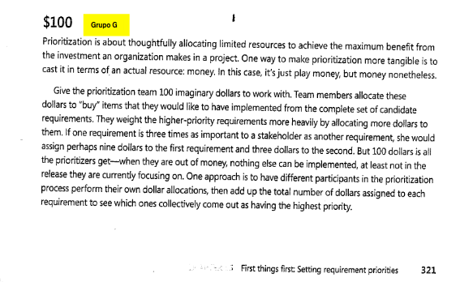

# $100:

## 1. Introdução

 Durante o processo de elicitação de requisitos para o sistema voltado ao apoio das atividades do IBGE, tornou-se essencial estabelecer uma hierarquia de importância entre os requisitos identificados. Para isso, foi utilizada a técnica de priorização conhecida como <b>técnica dos $100</b>, conforme proposta por Wiegers e Beatty (2013) em sua obra sobre engenharia de requisitos. 
 
 Essa técnica consiste em atribuir a cada participante uma quantia fictícia de $100, que deve ser distribuída entre os requisitos com base em sua percepção de valor ou importância. A distribuição é livre, permitindo que os participantes concentrem mais recursos em determinados requisitos que considerem mais críticos, o que promove a reflexão sobre trade-offs e auxilia na tomada de decisões estratégicas. Trata-se de uma abordagem simples, porém eficaz, para captar preferências e alinhar prioridades entre stakeholders com diferentes perspectivas. 
 
 A aplicação desta técnica se deu sobre a lista de requisitos elicitados e documentados no arquivo <a href="https://requisitos-de-software.github.io/2025.1-IBGE/elicitacao/Requisitos/">Requisitos Elicitados</a>. Os resultados da priorização guiarão as etapas seguintes do projeto, como modelagem, prototipagem e definição de backlog, assegurando que as funcionalidades de maior valor sejam contempladas nas entregas iniciais. 

## 2. Participantes

O participante <b>Leonardo Gomes</b> foi selecionado por estar atualmente cursando o mestrado na Universidade de São Paulo (USP), atuando como pesquisador. Sua participação foi considerada pertinente por representar um perfil alinhado aos usuários do aplicativo, especialmente no que diz respeito à busca por informações confiáveis e relevantes para pesquisa. Assim, Leonardo possui experiência prática com as necessidades informacionais típicas de quem pretende se engajar em atividades científicas, técnicas ou institucionais, sendo capaz de contribuir significativamente para a validação dos requisitos do sistema. Já <b>Gabriel Pinto</b> atuou como mediador do processo, apoiando a coleta e organização das contribuições fornecidas durante a elicitação.

## 3. Metodologia

A técnica de priorização dos $100 foi aplicada com o objetivo de identificar os requisitos considerados mais relevantes sob a ótica do usuário final. O participante Leonardo Gomes foi orientado a distribuir um valor fictício de $100 entre os requisitos elicitados, de acordo com sua percepção de importância para o funcionamento do aplicativo.

A distribuição não foi limitada a valores iguais, permitindo que Leonardo atribuísse quantias maiores aos requisitos que julgasse mais críticos e menores àqueles considerados secundários. Esse processo proporcionou uma visão prática das prioridades do sistema, considerando a experiência do participante enquanto pesquisador e potencial usuário.

O mediador Gabriel Pinto ficou responsável por conduzir a aplicação da técnica, explicando as regras de distribuição, esclarecendo dúvidas, registrando os valores atribuídos e consolidando os dados para posterior análise pela equipe de desenvolvimento.

### 3.1 Cronograma da priorização

O cronograma dessa elicitação, junto com a função de cada um presente na priorização está apresentada na tabela 1: 

Tabela 1: Cronograma da priorização.

| Nome           | Data       | Hora  | Função    |
|----------------|------------|-------|-----------|
| Gabriel Pinto  | 03/05/2025 | 19:00 | Mediador  |
| Leonardo Gomes | 03/05/2025 | 19:00 | Cliente   |

Fonte: Gabriel Pinto, 2025

## 4. Resultados

A técnica dos $100 foi aplicada para priorizar os requisitos elicitados, permitindo que o participante distribuíssem um valor simbólico conforme a importância percebida de cada item. A Tabela 2 apresenta os resultados dessa priorização, destacando os requisitos considerados mais relevantes para o sistema.

Tabela 2: Resultados da priorização dos requisitos.

| ID    | Descrição | Valor ($) |
|-------|-----------|----------------------|
| RF01 | O sistema deve possuir notícias atualizadas sobre dados demográficos/socioeconômicos do Brasil, de seus estados e municípios. | $1,00 |
| RF02 | Sistema deve possuir uma funcionalidade de busca, que independe da tela em que o usuário se encontra. | $2,00 |
| RF03 | Se houver algum dado/indicador atrelado à notícia lida, esse indicador deve estar presente no topo da página da notícia. | $2,00 |
| RF04 | A notícia deve estar na aba de notícias do aplicativo. | $0,50 |
| RF05 | O aplicativo deve possuir uma navbar inferior que permita que o usuário navegue pelas diversas funcionalidades principais da aplicação. | $1,00 |
| RF06 | Sistema deve possuir a aba de indicadores, com principais dados do IBGE, prévia de gráfico e valor com coloração simbólica (verde/vermelha). | $1,00 |
| RF07 | Ao clicar no dado, deve aparecer gráfico mais completo com evolução temporal do indicador. | $1,50 |
| RF08 | Notícias relacionadas ao dado devem aparecer na tela do dado. | $0,75 |
| RF09 | Ao lado do nome do indicador, deve aparecer a definição daquele indicador. | $2,00 |
| RF10 | Uma aba de calendário deve estar presente, com eventos/pesquisas principais do IBGE. | $1,00 |
| RF11 | Cada dado da aba de síntese deve possuir uma fonte atrelada. | $2,00 |
| RF12 | Uma aba de extras deve existir. | $0,00 |
| RF13 | O sistema deve oferecer opção de controle de notificações (ativar ou desativar). | $0,50 |
| RF14 | O sistema deve notificar o usuário sobre novas notícias. | $0,50 |
| RF15 | Deve haver uma opção de avaliação do aplicativo com coleta de perfil, satisfação, funcionalidades mais usadas e sugestões. | $0,50 |
| RF16 | Deve haver uma opção de compartilhar o aplicativo. | $0,25 |
| RF17 | Uma opção de suporte deve existir, com ligação ao site do IBGE. | $0,50 |
| RF18 | As redes sociais do IBGE devem ser linkadas. | $0,25 |
| RF19 | As notícias devem ser compartilháveis. | $0,50 |
| RF20 | No calendário, os dias com evento/pesquisa devem ter cor diferente dos demais. | $0,00 |
| RF21 | O calendário deve permitir visualização de meses passados e futuros em relação ao mês atual. | $1,00 |
| RF22 | Na aba “síntese”, dados como gentílico, área territorial, população, renda, orçamento, IDH, matrículas, salário médio, PIB per capita e mortalidade infantil devem estar disponíveis por estado e município. | $2,00 |
| RF23 | Filtros por país, estado e município devem estar disponíveis na aba “síntese”. | $0,00 |
| RF24 | Jogos educativos sobre geografia, demografia e temas sociais. | $0,25 |
| RF25 | Modo offline para uso do aplicativo sem conexão com a internet. | $1,00 |
| RF26 | Central de Ajuda dentro do app, com informações sobre o uso do aplicativo | $1,50 |
| RF27 | Notificações para notícias relevantes e atualizações dos indicadores favoritos. | $1,50 |
| RF28 | O usuário pode favoritar indicadores e visualizar as últimas atualizações. | $1,00 |
| RF29 | Comparativo de indicadores por região. | $2,00 |
| RF30 | Possibilidade de responder a questionários relacionados ao censo diretamente pelo app. | $2,00 |
| RF31 | Possibilidade de realizar e preencher questionários diretamente no aplicativo. | $2,00 |
| RF32 | Integração com outras fontes como sites ou APIs externas (ex: dados de transporte público). | $3,50 |
| RF33 | Acesso a dados de diferentes fontes como o IBGE, através do app. | $2,00 |
| RF34 | Mapas interativos, com visualização de dados geográficos e demográficos. | $3,00 |
| RF35 | Possibilidade de filtro por tipo de dado. | $2,00 |
| RF36 | Possibilidade de exportar gráficos e resumos em formatos como PDF. | $2,00 |
| RF37 | Computar informações de dados e gerar relatórios para exportação. | $3,00 |
| RF38 | O sistema deve apresentar os indicadores sociais e agropecuários. | $1,00 |
| RF39 | O sistema deve filtrar notícias por região e/ou tempo. | $1,00 |
| RF40 | O sistema deve apresentar mais dados na seção síntese para os respectivos locais (estado, município), como IDH, total de veículos, governante, entre outros, semelhante ao site de referência. | $0,00 |
| RF41 | O sistema deve exibir conteúdos produzidos para outras plataformas, como YouTube, TikTok e Instagram, em uma aba dedicada. | $0,50 |
| RF42 | O sistema deve analisar os conteúdos acessados pelo usuário para recomendar conteúdos similares. | $1,00 |
| RF43 | O sistema deve permitir a comparação dos censos realizados em diferentes anos. | $2,00 |
| RF44 | O sistema deve exibir uma confirmação sobre a identidade do recenseador. | $1,50 |
| RF45 | O sistema deve realizar estudos preditivos com base nos dados atuais. | $3,00 |
| RF46 | O sistema deve informar quais fatores influenciam o aumento ou a diminuição de determinado indicador. | $2,50 |
| RF47 | O sistema deve indicar políticas públicas com base na análise dos dados adquiridos. | $2,50 |
| RF48 | O sistema deve comparar os locais com maior e menor taxa de resposta ao censo. | $1,00 |
| RF49 | Compartilhamento de métricas do aplicativo com a fonte atrelada ao IBGE | $1,00 |
| RF50 | Possibilidade de realizar o próximo censo pelo aplicativo | $3,00 |
| RF51 | Opção de modo noturno. | $0,50 |
| RF52 | Opção de mudança de idiomas (Português, Inglês, Espanhol) | $1,00 |
| RF53 | Opção de alterar o tamanho da fonte (com botão) | $2,00 |
| RF54 | Opção de alto contraste do aplicativo (com botão) | $2,00 |
| RF55 | O sistema deve permitir busca refinada por dados e publicações. | $3,00 |
| RF56 | O sistema deve disponibilizar explicações simplificadas sobre os termos técnicos. | $2,00 |
| RF57 | O sistema deve integrar-se com a conta Gov.br. | $3,00 |
| RF58 | O sistema deve permitir o compartilhamento de gráficos com link da fonte. | $2,00 |
| RF59 | O sistema deve permitir a consulta a dados demográficos e indicadores por nível territorial detalhado. | $0,00 |
| RF60 | O sistema deve possuir uma FAQ com respostas às dúvidas mais comuns. | $1,00 |
| RF61 | O sistema deve apresentar os dados do Censo de forma visual e interativa (ex: infográficos, gráficos). | $3,00 |
| RF62 | O sistema deve permitir acesso às publicações completas de cada pesquisa com a metodologia detalhada. | $2,00 |
| RF63 | O sistema deve integrar todos ou a maioria dos aplicativos utilizados na coleta de dados de pesquisas. | $1,00 |
| RNF01 | O sistema deve estar disponível de forma estável, sem travamentos ou quedas frequentes. | $3,00 |
| RNF02 | O sistema deve permitir uso fluido tanto em computadores quanto em dispositivos móveis. | $3,00 |
| RNF03 | O sistema deve ser compatível com ferramentas de acessibilidade (áudio, Libras). | $2,00 |
| RNF04 | O sistema deve garantir que usuários com baixo letramento estatístico consigam utilizar a interface. | $2,00 |
| **Total** |  | **$100.00** |

Fonte: Técnica de Priorização $100, 2025.

## 5. Anexos

### 5.1 Termo de Consentimento

Todos os participantes envolvidos nas atividades de priorização assinaram um Termo de Consentimento Livre e Esclarecido (TCLE), conforme exigido pelas boas práticas de pesquisa e ética. O termo assegura que os participantes foram informados sobre os objetivos do estudo, a utilização dos dados e sua participação voluntária. O documento pode ser acessado no link abaixo:

📄 [Termo de Consentimento - TCLE (PDF)](https://drive.google.com/file/d/1O4Iriac8bLoDxsCZ5ttU1YF7goXHWL4z/view?usp=sharing)

### 5.2 Registro da Gravação da Técnica

Para fins de transparência, registro e validação do processo, a atividade de priorização foi gravada com o consentimento prévio dos participantes. A gravação contém a aplicação prática da técnica de priorização $100, permitindo futura consulta ou auditoria do processo. O arquivo da gravação está disponível no link a seguir:

🎥 [Gravação da Técnica de Priorização $100 (Vídeo)](https://youtu.be/CuPg2vg4jpQ)

## 6. Referências
> WIEGERS, Karl; BEATTY, Joy. Software Requirements. 3. ed. Redmond: Microsoft Press, 2013.
> 
<strong>Figura 1:</strong> Referência $100

> 
> 
<strong>Fonte:</strong> Software Requirements, página 321 

## 7. Histórico de Versões 

Tabela 3: Histórico de versões

| Versão |Descrição     |Autor                                       |Data    |Revisor|
|:-:     | :-:          | :-:                                        | :-:        |:-:|
|1.0     |Criação da documento|[Gabriel Pinto](https://github.com/GabrielSPinto)| 03/05/2025 | [Caio Duarte](https://github.com/caioduart3)  |
|1.1     |Adicionando imagem da fonte de referência|[Gabriel Pinto](https://github.com/GabrielSPinto)| 04/05/2025 | [Caio Duarte](https://github.com/caioduart3)  |
|1.2     |Adicionando Cronograma da Priorização|[Gabriel Pinto](https://github.com/GabrielSPinto)| 04/05/2025 | [Caio Duarte](https://github.com/caioduart3)  |
|1.3     |Adicionando Link do TCLE e Gravação|[Gabriel Pinto](https://github.com/GabrielSPinto)| 04/05/2025 | [Caio Duarte](https://github.com/caioduart3)  |

Fonte: [Caio Duarte](https://github.com/caioduart3), [Gabriel Pinto](https://github.com/GabrielSPinto), [João Félix](https://github.com/joaofmoreiraa), [Laryssa Felix](https://github.com/felixlaryssa), [Letícia Monteiro](https://github.com/LeticiaMonteiroo), [Ludmila Nunes](https://github.com/ludmilaaysha) e [Mayara Marques](https://github.com/maymarquee), 2025.
