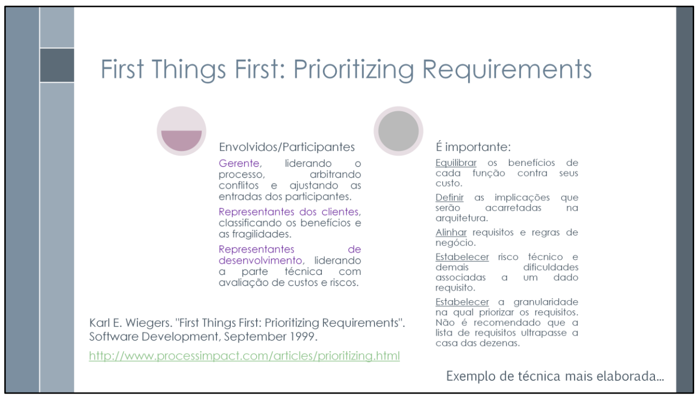
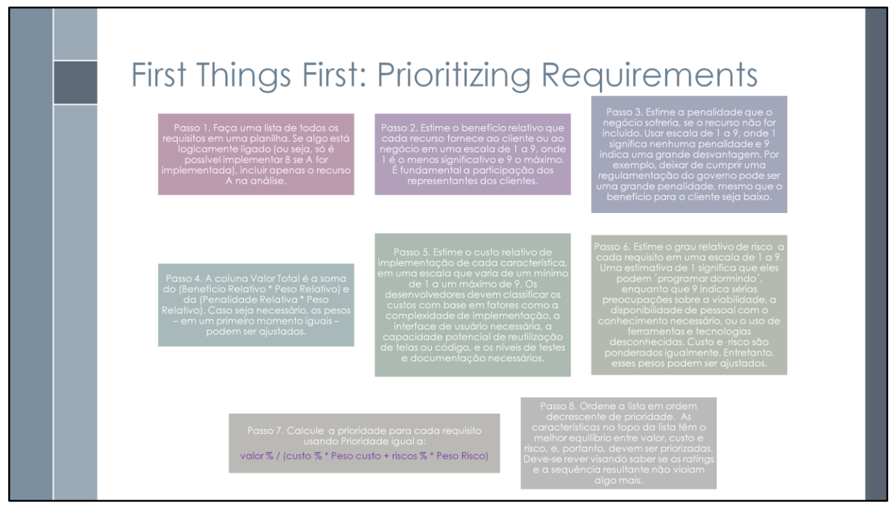
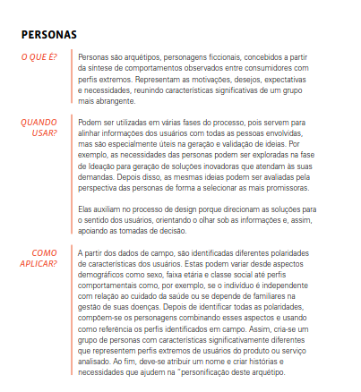

# First Things First 

## 1. Introdução

<b><i>First Things First</i></b> (FTF) é uma técnica de priorização de requisitos que se baseia em critérios objetivos. O processo envolve personalidades como um gerente, cliente(s) - ou persona(s) - e desenvolvedor(es), que avaliam benefícios, penalidades, custos e riscos de cada requisito elicitado com base em uma nota que varia de 1 a 9.

Após a análise de todos os requisitos, a priorização se dá por aqueles requisitos que obtiveram as maiores notas na coluna "Prioridade", que se baseia em uma fórmula fixa. Os requisitos foram ordenados de maneira decrescente, logo, os com maior prioridade apareceram no topo.

## 2. Metodologia

A priorização ocorreu em uma reunião pela plataforma <a href= "https://www.microsoft.com/pt-br/microsoft-teams/free">Microsoft Teams</a> e contou com a presença de um <b>gerente</b> - responsável por mediar a priorização e listar os requisitos, uma <b>persona</b> - responsável por julgar notas de benefício e de penalidade na implementação de cada requisito e um <b>desenvolvedor</b> - responsável por classificar custos e riscos na implementação de cada requisito.

### 2.1. Cronograma

O cronograma dessa elicitação, junto com a função de cada um presente na priorização está apresentada na tabela 1: 

Tabela 1: Cronograma da priorização.

| Nome                                             | Data                   |  Hora |     Função |
| ------------------------------------------------ | ------------------------ | -------------- | -------------- |
| [Mayara Marques](https://github.com/maymarquee)   |  03/05/2025|  21:00 | Gerente |
| [Marcos Rodrigues](https://requisitos-de-software.github.io/2025.1-IBGE/elicitacao/usuarios/Personas/#anchor_PSM)   |  03/05/2025|  21:00 | Persona |
| [João Félix](https://github.com/joaofmoreiraa)   |  03/05/2025|  21:00 | Personificação da Persona |
| [Caio Duarte](https://github.com/caioduart3)   |  03/05/2025|  21:00 | Desenvolvedor |

Fonte: [Mayara Marques](https://github.com/maymarquee), 2025. 

### 2.2. Aplicação da técnica
#### 2.2.1. Fórmulas

Além das colunas de Código, Descrição, Benefício, Penalidade, Custo e Risco, que não continham nenhuma fórmula, outras colunas continham fórmulas para seguir as diretrizes da técnica TFT, que são: 

  <ul>
    <li><strong>Valor Total</strong>
      <ul>
        <li><code>Valor Total = (Benefício * Peso Relativo) + (Penalidade * Peso Relativo)</code></li>
      </ul>
    </li>
</ul>
    <ul>
        <li><b>Valor (%)</b>
        <ul>
            <li><code>Valor (%) =  (Valor Total / Soma de Valor Total)  * 100 </code></li>
        </ul>
    </ul>
    <ul>
        <li><b>Custo (%)</b>
        <ul>
            <li><code>Custo (%) =  (Custo / Soma de Custo)  * 100 </code></li>
        </ul>
    </ul>
    <ul>
        <li><b>Risco (%)</b>
        <ul>
            <li><code>Risco (%) =  (Risco / Soma de Risco)  * 100 </code></li>
        </ul>
    </ul>
        <ul>
        <li><b>Prioridade</b>
        <ul>
            <li><code>Prioridade =  (Valor (%) / (Custo (%) * Peso Relativo + Risco (%) * Peso Relativo))  * 100 </code></li>
        </ul>
    </ul>

#### 2.2.2. Pesos

Os pesos relativos referentes a cada coluna especificada foram escolhidos pela persona e pelo desenvolvedor, cada um decidindo os seus pesos encarregados. Seus valores podem ser observados na tabela 2.

Tabela 2: Pesos Relativos.
 

| Peso Relativo |Valor     |
|:-:     | :-:          | 
| Benefício   | 8 | 
| Penalidade   | 5 | 
| Custo   | 7 | 
| Risco   | 7 | 

Fonte: [Mayara Marques](https://github.com/maymarquee), 2025. 

#### 2.2.3. Justificativa do uso de personas

  De acordo com Brown (2016), no livro <i>Design Thinking</i> (como pode ser observado na Figura 3), as personas são apresentadas como uma ferramenta fundamental para alinhar soluções aos usuários.

>Personas são arquétipos, personagens ficcionais, concebidos a partir da síntese de comportamentos observados entre consumidores com perfis extremos [...].
>Podem ser utilizadas em várias fases do processo, [...] mas são especialmente úteis na geração e validação de ideias. [...] Elas auxiliam no processo de design porque direcionam as soluções para o sentido dos usuários, orientando o olhar sob as informações e, assim, apoiando as tomadas de decisão (BROWN, T., 2010).

Desse modo, as personas representam usuários fictícios, mas baseados em dados reais e comportamentos observáveis, o que permite uma abordagem mais humanizada e direcionada na definição de prioridades.

Para a aplicação da técnica, ao utilizar personas, foi possível:

<ul>
<li>Identificar quais funcionalidades são mais relevantes para cada perfil de usuário.
<li>Avaliar o impacto de cada requisito na experiência do usuário final.
<li>Tornar o processo de priorização mais alinhado às necessidades reais dos usuários, e não apenas baseado em suposições técnicas.
</ul>

Essa abordagem foi aplicada com base nas <a href="../../usuarios/Personas">personas</a> definidas a partir do <a href="../../usuarios/PerfilDoUsuario/">perfil de usuário</a> do aplicativo. Para essa técnica, o integrante <a href="https://github.com/joaofmoreiraa">João Félix</a> representou a persona Marcos Rodrigues, um estudante de Políticas Públicas em busca do primeiro emprego ou estágio. Dessa forma, o integrante ficou responsável por defender os interesses dessa persona durante o processo de priorização dos requisitos.

## 3. Priorização

O resultado dessa priorização pode ser observada na tabela 3: 

Tabela 3: Priorização FTF.
 

| Código | Descrição                                                                 | Implementado | Benefício Relativo | Penalidade Relativa | Valor Total | Valor (%) | Custo Relativo | Custo (%) | Risco Relativo | Risco (%) | Prioridade |
|--------|---------------------------------------------------------------------------|--------------|---------------------|----------------------|-------------|-----------|----------------|-----------|----------------|-----------|------------|
| RFE06  | O sistema deve possuir uma FAQ com respostas às dúvidas mais comuns.      |Não       | 9                   | 6                    | 102         | 1,69      | 1              | 0,26      | 3              | 0,74      | 24,383     |
| RFA18  | Uma opção de suporte deve existir, com ligação ao site do IBGE.           | Sim           |7                   | 5                    | 81          | 1,34      | 3              | 0,77      | 1              | 0,25      | 19,003     |
| RFA19  | As redes sociais do IBGE devem ser linkadas.                              |Sim        |3                   | 3                    | 39          | 0,65      | 1              | 0,26      | 1              | 0,25      | 18,471     |
| RFQ09    | Opção de alto contraste do aplicativo (com botão)                                       |Não        |                   9 |                     9 |           117 | 1,94        |                3 | 0,77        |                3 | 0,74        | 18,471       |
| RFE02    | O sistema deve disponibilizar explicações simplificadas sobre os termos técnicos.       |Não        |                   9 |                     9 |           117 | 1,94        |                3 | 0,77        |                3 | 0,74        | 18,471       |
| RNFE01   | O sistema deve estar disponível de forma estável, sem travamentos ou quedas frequentes. |Não        |                    9 |                     9 |           117 | 1,94        |                3 | 0,77        |                5 | 1,23        | 13,918       |
| RNFE02   | O sistema deve permitir uso fluido tanto em computadores quanto em dispositivos móveis. |Não        |                   9 |                     9 |           117 | 1,94        |                3 | 0,77        |                5 | 1,23        | 13,918       |
| RFA13    | Uma aba de extras deve existir.                                                         |Sim        |                   3 |                     1 |            29 | 0,48        |                1 | 0,26        |                1 | 0,25        | 13,735       |
| RFA20    | As notícias devem ser compartilháveis.                                                  |Sim        |                   7 |                     5 |            81 | 1,34        |                3 | 0,77        |                3 | 0,74        | 12,788       |
| RFI7     | O sistema deve exibir uma confirmação sobre a identidade do recenseador.                |Não        |                   6 |                     6 |            78 | 1,30        |                3 | 0,77        |                3 | 0,74        | 12,314       |
| RFQ06    | Opção de modo noturno                                                                   |Não        |                   6 |                     6 |            78 | 1,30        |                3 | 0,77        |                3 | 0,74        | 12,314       |
| RFA14    | O sistema deve oferecer opção de controle de notificações (ativar ou desativar).        |Sim      |                 7 |                     3 |            71 | 1,18        |                3 | 0,77        |                3 | 0,74        | 11,209       |
| RFA15    | O sistema deve notificar o usuário sobre novas notícias.                                |Sim        |                   7 |                     3 |            71 | 1,18        |                3 | 0,77        |                3 | 0,74        | 11,209       |
| RFQ08   | Opção de alterar o tamanho da fonte (com botão)                                            | Não        |                   9 |                      9 |           117 | 1.94       |                 5 | 1.28       |                 5 | 1.23       | 11.083      |
| RFE04   | O sistema deve permitir o compartilhamento de gráficos com link da fonte.                  | Não        |                   6 |                      4 |            68 | 1.13       |                 3 | 0.77       |                 3 | 0.74       | 10.735      |
| RFA5    | O aplicativo deve possuir uma navbar inferior que permita que o usuário navegue pelas...   | Sim       |                   9 |                      9 |           117 | 1.94       |                 2 | 0.51       |                 9 | 2.21       | 10.197      |
| RFA9    | Ao lado do nome do indicador, deve aparecer a definição daquele indicador.                 | Sim       |                   9 |                      8 |           112 | 1.86       |                 2 | 0.51       |                 9 | 2.21       | 9.761       |
| RFQ07   | Opção de mudança de idiomas (Português, Inglês, Espanhol)                                  | Não        |                   8 |                      7 |            99 | 1.64       |                 5 | 1.28       |                 5 | 1.23       | 9.378       |
| RNFE05  | O sistema deve garantir que usuários com baixo letramento estatístico consigam utilizar... | Não        |                   9 |                      9 |           117 | 1.94       |                 7 | 1.79       |                 5 | 1.23       | 9.207       |
| RFA7    | Ao clicar no dado, deve aparecer gráfico mais completo com evolução temporal do indicador. |Sim       |                    8 |                      6 |            94 | 1.56       |                 3 | 0.77       |                 7 | 1.72       | 8.971       |
| RFI11   | O sistema deve comparar os locais com maior e menor taxa de resposta ao censo.             |Não        |                    9 |                      8 |           112 | 1.86       |                 7 | 1.79       |                 5 | 1.23       | 8.813       |
| RFA2    | Sistema deve possuir uma funcionalidade de busca, que independe da tela em que o...        |Sim        |                    6 |                      5 |            73 | 1.21       |                 3 | 0.77       |                 5 | 1.23       | 8.684       |
| RFA21   | No calendário, os dias com evento/pesquisa devem ter cor diferente dos demais.             |Sim       |                   5 |                      3 |            55 | 0.91       |                 3 | 0.77       |                 3 | 0.74       | 8.683       |
|RFA1  |	O sistema deve possuir notícias atualizadas sobre dados demográficos/socioeconômicos do Brasil, de seus estados e municípios. |	Sim           |9	| 7 |	107 |	1,78	| 5| 	1,28|	7 |	1,72	| 8,473 |
|RFI10 |	O sistema deve indicar políticas públicas com base na análise dos dados adquiridos.	|Não        |9|	7	| 107 |	1,78 |	7	| 1,79 |	5 |	1,23	| 8,420 |
|RFB15	| Integração com outras fontes como sites ou APIs externas (ex: dados de transporte público).	|Não        |9 |	3 |	87 |	1,44| 	5	| 1,28 |	5	| 1,23 |	8,241 |
|RFA4 |	A notícia deve estar na aba de notícias do aplicativo.	|Sim       |9	| 9	| 117|	1,94|	5	| 1,28	| 9 |	2,21 |	7,959 |
|RFA6	| Sistema deve possuir a aba de indicadores, com principais dados do IBGE, prévia de gráfico e valor com coloração simbólica (verde/vermelha). |Sim        |9 |	9 |	117	| 1,94 |	5	| 1,28	| 9	 | 2,21	| 7,959 |
|RFA12	|Cada dado da aba de síntese deve possuir uma fonte atrelada. |Sim           |9	|9	|117	|1,94	|5	|1,28	|9	|2,21	|7,959|
|RFB16	|Acesso a dados de diferentes fontes como o IBGE, através do app. |	Sim           |9	|9	|117	|1,94	|5	|1,28	|9	|2,21	|7,959|
|RFA3	|Se houver algum dado/indicador atrelado à notícia lida, esse indicador deve estar presente no topo da página da notícia.	|Sim           |8	| 4	|84	|1,39|	5	|1,28	|5	|1,23	|7,957|
|RFA8	|Notícias relacionadas ao dado devem aparecer na tela do dado.	|Sim           |9	|4	|92	|1,53|	6	|1,53	|5	|1,23	|7,909|
|RFE08	|O sistema deve permitir acesso às publicações completas de cada pesquisa com a metodologia detalhada. |Sim        |	8	|6	|94	|1,56|	7	|1,79	|5	|1,23	|7,397|
|RFI9	|O sistema deve informar quais fatores influenciam o aumento ou a diminuição de determinado indicador.	|Não           |	9 | 4	|92	|1,53|	7	|1,79	|5	|1,23	|7,239|
| RFA23	|Na aba “síntese”, dados como gentílico, área territorial, população, renda, orçamento, IDH, matrículas, salário médio, PIB per capita e mortalidade infantil devem estar disponíveis por estado e município.	|Sim           |9	|9	| 117	|1,94	|7	|1,79	|9	|2,21	|6,943|
| RFA24	|Filtros por país, estado e município devem estar disponíveis na aba “síntese”. |	Sim          |9	|9	| 117	|1,94	|7	|1,79	|9	|2,21	|6,943|
| RFB18	|Possibilidade de filtro por tipo de dado.	|Não           |9	|9	|117	|1,94	|7	|1,79	|9	|2,21	|6,943|
|RNFE04	|O sistema deve ser compatível com ferramentas de acessibilidade (áudio, Libras). |	Não           |9	|9	|117	|1,94|	7	|1,79	|9	|2,21	|6,943|
|RFA22	|O calendário deve permitir visualização de meses passados e futuros em relação ao mês atual. |	Sim           |9	|6	|102	|1,69	|7	|1,79	|7	|1,72	|6,901|
|RFE05	|O sistema deve permitir a consulta a dados demográficos e indicadores por nível territorial detalhado. |	Não           |9	|6	|102|	1,69|	7	|1,79	|7	|1,72	|6,901|
|RFQ01	|Compartilhamento de métricas do aplicativo com a fonte atrelada ao IBGE	|Não           | 7 |	3	|71	|1,18	|5	|1,28	|5	|1,23	|6,725|
|RFB8	|O usuário pode favoritar indicadores e visualizar as últimas atualizações. |	Não           |7	| 3	|71	|1,18	|7	|1,79	|3	|0,74	|6,675|
|RFA10	|Uma aba de calendário deve estar presente, com eventos/pesquisas principais do IBGE. |	Sim           |7	| 3|	71|	1,18|	7	|1,79	|3	|0,74	|6,675|
|RFB7	|Notificações para notícias relevantes e atualizações dos indicadores favoritos. |Não           |	9	| 4	|92	|1,53	|7	|1,79	|7	|1,72	|6,225|
|RFA17	|Deve haver uma opção de compartilhar o aplicativo. |	Sim          |1	| 1	|13|	0,22	| 1	|0,26	|1	|0,25	|6,157|
|RFB2	|Modo offline para uso do aplicativo sem conexão com a internet.	|Não        |7	|7|	91	|1,51	|7	|1,79|	7	|1,72|	6,157|
|RFB17	|Mapas interativos, com visualização de dados geográficos e demográficos.	|Não        |9	| 9	|117	|1,94|	9	|2,30	|9	|2,21	|6,157|
|RFI1	|O sistema deve apresentar os indicadores sociais e agropecuários.	|Não        |9	|9	|117	|1,94	|9	|2,30	|9	|2,21	|6,157|
|RFE01	|O sistema deve permitir busca refinada por dados e publicações. |	Não           |9	| 9	|117	|1,94	|9	|2,30	|9	|2,21	|6,157|
|RFI3	|O sistema deve apresentar mais dados na seção síntese para os respectivos locais (estado, município), como IDH, total de veículos, governante, entre outros, semelhante ao site de referência.	|Não        |9	| 6	|102	|1,69	|9	|2,30|	7	|1,72|	6,024|
|RFQ04	|Possibilidade de realizar o próximo censo pelo aplicativo	|Não        | 9	| 6	|102|	1,69|	9	|2,30	|7	|1,72	|6,024|
|RFB10	|Comparativo de indicadores por região. |	Não           |9	| 8	|112	|1,86	|9	|2,30	|9	|2,21	|5,894|
|RFI6	|O sistema deve permitir a comparação dos censos realizados em diferentes anos. |Não           |	9	| 8	|112 |	1,86|	9	|2,30	|9	|2,21	|5,894|
|RFA16	|Deve haver uma opção de avaliação do aplicativo com coleta de perfil, satisfação, funcionalidades mais usadas e sugestões.	|Sim           |6	| 2	|58	|0,96	|7	|1,79|	3	|0,74|	5,453|
|RFE07	|O sistema deve apresentar os dados do Censo de forma visual e interativa (ex: infográficos, gráficos).	 |Parcialmente           |9	| 6	|102	|1,69	| 9|	2,30	|9	|2,21|	5,368|
|RFE03	|O sistema deve integrar-se com a conta Gov.br.	|Não           |8	|3	|79|	1,31	|7	|1,79	|7	|1,72	|5,345|
|RFI2	|O sistema deve filtrar notícias por região e/ou tempo.|	Não           |9	|5	|97	|1,61	|9	|2,30|	9	|2,21|	5,104|
|RFI8	|O sistema deve realizar estudos preditivos com base nos dados atuais. |Não           |	9	| 4	|92	|1,53|	9	|2,30	|9	|2,21	|4,841|
|RFB6	|Central de Ajuda dentro do app, com informações sobre o uso do aplicativo	|Não        |7	| 3	|71	|1,18|	7	|1,79	|7	|1,72	|4,804|
|RFB20	|Possibilidade de exportar gráficos e resumos em formatos como PDF. |	Não           |9	|2	|82	|1,36	|9	|2,30	|9	|2,21	|4,315|
|RFB21	|Computar informações de dados e gerar relatórios para exportação.	|Não        |9	| 2	|82	|1,36	|9	|2,30	|9	|2,21	|4,315|
|RFE09	|O sistema deve integrar todos ou a maioria dos aplicativos utilizados na coleta de dados de pesquisas.	|Não        |7	| 2|	66	|1,10	|9	|2,30|	7	|1,72|	3,898|
|RFB12	|Possibilidade de realizar e preencher questionários diretamente no aplicativo.	|Não        |5	| 4	|60	|1,00	|9	|2,30	|7	|1,72	|3,544|
|RFI5	|O sistema deve analisar os conteúdos acessados pelo usuário para recomendar conteúdos similares. |	Não           |6	| 3	|63	|1,05	|9	|2,30	|9	|2,21	|3,315|
|RFB11	|Possibilidade de responder a questionários relacionados ao censo diretamente pelo app.	|Não        |5	| 4	|60	|1,00	|9	|2,30	|9	|2,21	|3,157|
|RFI4	|O sistema deve exibir conteúdos produzidos para outras plataformas, como YouTube, TikTok e Instagram, em uma aba dedicada.	|Não        |3	| 1	|29	|0,48|	7	|1,79	|3	|0,74|	2,726|
|RFB1	|Jogos educativos sobre geografia, demografia e temas sociais. |	Não           |3	| 1	| 29	|0,48	|9	|2,30|	9	|2,21|	1,526|
|**TOTAL**	|	 |    |516	| 379	|6023	|100,00	|392	|100,00	|407	|100,00	|   |

Fonte: [Mayara Marques](https://github.com/maymarquee), 2025. 

## 4. Gravação da Priorização

<iframe width="560" height="315" src="https://www.youtube.com/embed/i0Agde0xSWg?si=B21jStJCCMFDu39W" title="YouTube video player" frameborder="0" allow="accelerometer; autoplay; clipboard-write; encrypted-media; gyroscope; picture-in-picture; web-share" referrerpolicy="strict-origin-when-cross-origin" allowfullscreen></iframe>

## 5. Bibliografia

> SERRANO, Milene; SERRANO, Maurício. Requisitos – Aula 07. UnB, 2025.  Disponível em: <https://aprender3.unb.br/pluginfile.php/3096086/mod_resource/content/2/Requisitos%20-%20Aula%2007.pdf>. Acesso em: 03 maio 2025.

Figura 1: Referência 1 de First Things First

Fonte: SERRANO, et al.

Figura 2: Referência 2 de First Things First

Fonte: SERRANO, et al.

> BROWN, Tim. Design thinking: uma metodologia poderosa para decretar o fim das velhas ideias. Tradução de André Czarnobai. Rio de Janeiro: Alta Books, 2010. p. 80.

Figura 3: Referência de persona

Fonte: BROWN, T., 2010.

## 6. Histórico de Versões 

Tabela 4: Histórico de versões

| Versão |Descrição     |Autor                                       |Data    |Revisor|
|:-:     | :-:          | :-:                                        | :-:        |:-:|
|1.0     |Criação da documento|[Laryssa Felix](https://github.com/felixlaryssa)| 03/05/2025 |  [Letícia Monteiro](https://github.com/LeticiaMonteiroo)  |
|1.1     |Adição de dados da técnica, metodologia e introdução|[Mayara Marques](https://github.com/maymarquee)| 04/05/2025 |  [Laryssa Felix](https://github.com/felixlaryssa)  |
|1.2     |Adição da coluna de implementado|[Laryssa Felix](https://github.com/felixlaryssa)| 09/05/2025 |  [Letícia Monteiro](https://github.com/LeticiaMonteiroo)  |
|1.3   |Adição da justificativa do uso de personas|[Ludmila Nunes](https://github.com/ludmilaaysha)| 13/05/2025 |  [Caio Duarte](https://github.com/caioduart3) |

Fonte: [Caio Duarte](https://github.com/caioduart3), [Gabriel Pinto](https://github.com/GabrielSPinto), [João Félix](https://github.com/joaofmoreiraa), [Laryssa Felix](https://github.com/felixlaryssa), [Letícia Monteiro](https://github.com/LeticiaMonteiroo), [Ludmila Nunes](https://github.com/ludmilaaysha) e [Mayara Marques](https://github.com/maymarquee), 2025.
