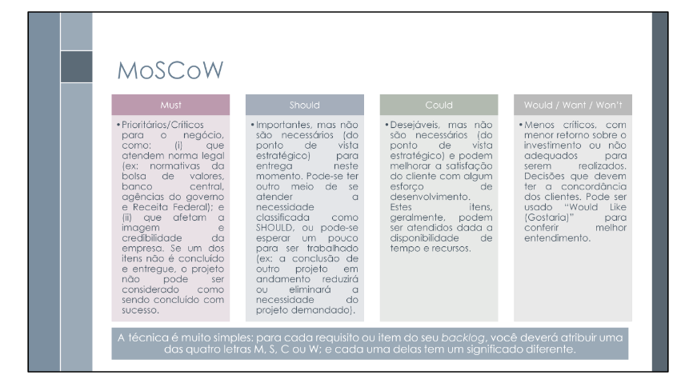

# MoSCoW

## 1. Introdução

Durante o processo de elicitação de requisitos para o sistema voltado ao apoio das atividades do IBGE, tornou-se essencial estabelecer uma hierarquia de importância entre os requisitos levantados. Para isso, foi aplicada a técnica de priorização conhecida como <b>técnica MoSCoW</b>, conforme descrita no material didático utilizado na disciplina, disponível em <i>Sales (2025)</i>.

Essa técnica é amplamente utilizada em projetos de desenvolvimento de software, permitindo que os stakeholders classifiquem os requisitos com base em sua importância e urgência. A técnica MoSCoW oferece uma abordagem clara e estruturada para categorizar os requisitos em diferentes níveis de prioridade:

- **Must have (M):** funcionalidades essenciais, cuja ausência inviabiliza o uso do sistema;
- **Should have (S):** requisitos importantes, mas não críticos para a operação mínima;
- **Could have (C):** funcionalidades desejáveis, que agregam valor se implementadas;
- **Won’t have (W):** itens que não serão tratados nesta versão, mas que podem ser considerados no futuro.

## 2. Participantes

Para aplicação da técnica, foram definidos dois participantes com perfis distintos e relevantes ao contexto de uso do sistema. <b>Clístenes Mendonça</b>, atualmente cursando mestrado na Escola Nacional de Saúde Pública (Fiocruz) e atuando como servidor público da Secretaria de Estado da Saúde do Distrito Federal (SES-DF), foi selecionado como representante do público-alvo. Seu conhecimento sobre as demandas informacionais em políticas públicas e institucionais contribuiu para uma avaliação alinhada às necessidades reais dos usuários. Já <b>Gabriel Pinto</b> atuou como mediador do processo, sendo responsável por orientar a aplicação da técnica, esclarecer dúvidas e organizar os resultados.

## 3. Metodologia

A técnica de priorização MoSCoW foi aplicada com o objetivo de classificar os requisitos do sistema segundo o grau de importância percebido pelo usuário final. O participante <b>Clístenes Mendonça</b> foi responsável por realizar a priorização com base em sua experiência em políticas públicas e uso de dados institucionais.

Cada requisito foi apresentado individualmente, e então classificado por Clístenes em uma das quatro categorias da técnica MoSCoW: <i>Must have</i> (deve ter), <i>Should have</i> (deveria ter), <i>Could have</i> (poderia ter) ou <i>Won’t have</i> (não terá por agora). Essa categorização permitiu identificar quais funcionalidades são essenciais para o funcionamento mínimo do sistema e quais podem ser planejadas para versões futuras.

O mediador <b>Gabriel Pinto</b> conduziu a sessão, explicando os critérios da técnica MoSCoW, esclarecendo dúvidas durante a análise e registrando as classificações atribuídas. Os resultados foram consolidados em uma tabela, servindo como base para o planejamento das próximas fases do desenvolvimento.

### 3.1 Cronograma da priorização

O cronograma dessa elicitação, junto com a função de cada um presente na priorização está apresentada na tabela 1: 

Tabela 1: Cronograma da priorização.

| Nome           | Data       | Hora  | Função    |
|----------------|------------|-------|-----------|
| Gabriel Pinto  | 03/05/2025 | 19:00 | Mediador  |
| Clístene Mendonça | 03/05/2025 | 21:00 | Cliente   |

Fonte: Gabriel Pinto, 2025

## 4. Resultados

Para apoiar a priorização dos requisitos do sistema, aplicou-se a técnica MoSCoW, que os classifica em quatro categorias conforme sua importância. A Tabela 2 apresenta os requisitos distribuídos segundo essa abordagem, servindo de base para decisões estratégicas no desenvolvimento.

Tabela 2: Resultados da priorização dos requisitos.

| ID    | Descrição                                                                                                                                                                                                    | Implementado | Priorização MoSCoW        |
| :---- | :----------------------------------------------------------------------------------------------------------------------------------------------------------------------------------------------------------- | :----------- | :------------------------ |
| RF01  | O sistema deve possuir notícias atualizadas sobre dados demográficos/socioeconômicos do Brasil, de seus estados e municípios.                                                                                | Sim          | Must have (deve ter)      |
| RF02  | Sistema deve possuir uma funcionalidade de busca, que independe da tela em que o usuário se encontra.                                                                                                        | Sim          | Must have (deve ter)      |
| RF03  | Se houver algum dado/indicador atrelado à notícia lida, esse indicador deve estar presente no topo da página da notícia.                                                                                     | Sim          | Must have (deve ter)      |
| RF04  | A notícia deve estar na aba de notícias do aplicativo.                                                                                                                                                       | Sim          | Must have (deve ter)      |
| RF05  | O aplicativo deve possuir uma navbar inferior que permita que o usuário navegue pelas diversas funcionalidades principais da aplicação.                                                                      | Sim          | Must have (deve ter)      |
| RF06  | Sistema deve possuir a aba de indicadores, com principais dados do IBGE, prévia de gráfico e valor com coloração simbólica (verde/vermelha).                                                                 | Sim          | Must have (deve ter)      |
| RF07  | Ao clicar no dado, deve aparecer gráfico mais completo com evolução temporal do indicador.                                                                                                                   | Sim          | Should have (deveria ter) |
| RF08  | Notícias relacionadas ao dado devem aparecer na tela do dado.                                                                                                                                                | Sim          | Should have (deveria ter) |
| RF09  | Ao lado do nome do indicador, deve aparecer a definição daquele indicador.                                                                                                                                   | Sim          | Should have (deveria ter) |
| RF10  | Uma aba de calendário deve estar presente, com eventos/pesquisas principais do IBGE.                                                                                                                         | Sim          | Should have (deveria ter) |
| RF11  | Cada dado da aba de síntese deve possuir uma fonte atrelada.                                                                                                                                                 | Sim          | Could have (poderia ter)  |
| RF12  | Uma aba de extras deve existir.                                                                                                                                                                              | Sim          | Should have (deveria ter) |
| RF13  | O sistema deve oferecer opção de controle de notificações (ativar ou desativar).                                                                                                                             | Sim          | Must have (deve ter)      |
| RF14  | O sistema deve notificar o usuário sobre novas notícias.                                                                                                                                                     | Sim          | Should have (deveria ter) |
| RF15  | Deve haver uma opção de avaliação do aplicativo com coleta de perfil, satisfação, funcionalidades mais usadas e sugestões.                                                                                   | Sim          | Must have (deve ter)      |
| RF16  | Deve haver uma opção de compartilhar o aplicativo.                                                                                                                                                           | Sim          | Should have (deveria ter) |
| RF17  | Uma opção de suporte deve existir, com ligação ao site do IBGE.                                                                                                                                              | Sim          | Must have (deve ter)      |
| RF18  | As redes sociais do IBGE devem ser linkadas.                                                                                                                                                                 | Sim          | Must have (deve ter)      |
| RF19  | As notícias devem ser compartilháveis.                                                                                                                                                                       | Sim          | Must have (deve ter)      |
| RF20  | No calendário, os dias com evento/pesquisa devem ter cor diferente dos demais.                                                                                                                               | Sim          | Should have (deveria ter) |
| RF21  | O calendário deve permitir visualização de meses passados e futuros em relação ao mês atual.                                                                                                                 | Sim          | Could have (poderia ter)  |
| RF22  | Na aba “síntese”, dados como gentílico, área territorial, população, renda, orçamento, IDH, matrículas, salário médio, PIB per capita e mortalidade infantil devem estar disponíveis por estado e município. | Sim          | Must have (deve ter)      |
| RF23  | Filtros por país, estado e município devem estar disponíveis na aba “síntese”.                                                                                                                               | Sim          | Must have (deve ter)      |
| RF24  | Jogos educativos sobre geografia, demografia e temas sociais.                                                                                                                                                | Não          | Could have (poderia ter)  |
| RF25  | Modo offline para uso do aplicativo sem conexão com a internet.                                                                                                                                              | Não          | Should have (deveria ter) |
| RF26  | Central de Ajuda dentro do app, com informações sobre o uso do aplicativo                                                                                                                                    | Não          | Must have (deve ter)      |
| RF27  | Notificações para notícias relevantes e atualizações dos indicadores favoritos.                                                                                                                              | Não          | Should have (deveria ter) |
| RF28  | O usuário pode favoritar indicadores e visualizar as últimas atualizações.                                                                                                                                   | Não          | Should have (deveria ter) |
| RF29  | Comparativo de indicadores por região.                                                                                                                                                                       | Não          | Must have (deve ter)      |
| RF30  | Possibilidade de responder a questionários relacionados ao censo diretamente pelo app.                                                                                                                       | Não          | Must have (deve ter)      |
| RF31  | Possibilidade de realizar e preencher questionários diretamente no aplicativo.                                                                                                                               | Não          | Should have (deveria ter) |
| RF32  | Integração com outras fontes como sites ou APIs externas (ex: dados de transporte público).                                                                                                                  | Não          | Should have (deveria ter) |
| RF33  | Acesso a dados de diferentes fontes como o IBGE, através do app.                                                                                                                                             | Não          | Must have (deve ter)      |
| RF34  | Mapas interativos, com visualização de dados geográficos e demográficos.                                                                                                                                     | Não          | Must have (deve ter)      |
| RF35  | Possibilidade de filtro por tipo de dado.                                                                                                                                                                    | Não          | Must have (deve ter)      |
| RF36  | Possibilidade de exportar gráficos e resumos em formatos como PDF.                                                                                                                                           | Não          | Should have (deveria ter) |
| RF37  | Computar informações de dados e gerar relatórios para exportação.                                                                                                                                            | Não          | Must have (deve ter)      |
| RF38  | O sistema deve apresentar os indicadores sociais e agropecuários.                                                                                                                                            | Não          | Must have (deve ter)      |
| RF39  | O sistema deve filtrar notícias por região e/ou tempo.                                                                                                                                                       | Não          | Must have (deve ter)      |
| RF40  | O sistema deve apresentar mais dados na seção síntese para os respectivos locais (estado, município), como IDH, total de veículos, governante, entre outros, semelhante ao site de referência.               | Não          | Must have (deve ter)      |
| RF41  | O sistema deve exibir conteúdos produzidos para outras plataformas, como YouTube, TikTok e Instagram, em uma aba dedicada.                                                                                   | Não          | Should have (deveria ter) |
| RF42  | O sistema deve analisar os conteúdos acessados pelo usuário para recomendar conteúdos similares.                                                                                                             | Não          | Must have (deve ter)      |
| RF43  | O sistema deve permitir a comparação dos censos realizados em diferentes anos.                                                                                                                               | Não          | Must have (deve ter)      |
| RF44  | O sistema deve exibir uma confirmação sobre a identidade do recenseador.                                                                                                                                     | Não          | Could have (poderia ter)  |
| RF45  | O sistema deve realizar estudos preditivos com base nos dados atuais.                                                                                                                                        | Não          | Must have (deve ter)      |
| RF46  | O sistema deve informar quais fatores influenciam o aumento ou a diminuição de determinado indicador.                                                                                                        | Não          | Should have (deveria ter) |
| RF47  | O sistema deve indicar políticas públicas com base na análise dos dados adquiridos.                                                                                                                          | Não          | Should have (deveria ter) |
| RF48  | O sistema deve comparar os locais com maior e menor taxa de resposta ao censo.                                                                                                                               | Não          | Should have (deveria ter) |
| RF49  | Compartilhamento de métricas do aplicativo com a fonte atrelada ao IBGE                                                                                                                                      | Não          | Could have (poderia ter)  |
| RF50  | Possibilidade de realizar o próximo censo pelo aplicativo                                                                                                                                                    | Não          | Should have (deveria ter) |
| RF51  | Opção de modo noturno.                                                                                                                                                                                       | Não          | Could have (poderia ter)  |
| RF52  | Opção de mudança de idiomas (Português, Inglês, Espanhol)                                                                                                                                                    | Não          | Must have (deve ter)      |
| RF53  | Opção de alterar o tamanho da fonte (com botão)                                                                                                                                                              | Não          | Must have (deve ter)      |
| RF54  | Opção de alto contraste do aplicativo (com botão)                                                                                                                                                            | Não          | Must have (deve ter)      |
| RF55  | O sistema deve permitir busca refinada por dados e publicações.                                                                                                                                              | Não          | Must have (deve ter)      |
| RF56  | O sistema deve disponibilizar explicações simplificadas sobre os termos técnicos.                                                                                                                            | Não          | Should have (deveria ter) |
| RF57  | O sistema deve integrar-se com a conta Gov.br.                                                                                                                                                               | Não          | Must have (deve ter)      |
| RF58  | O sistema deve permitir o compartilhamento de gráficos com link da fonte.                                                                                                                                    | Não          | Should have (deveria ter) |
| RF59  | O sistema deve permitir a consulta a dados demográficos e indicadores por nível territorial detalhado.                                                                                                       | Sim          | Must have (deve ter)      |
| RF60  | O sistema deve possuir uma FAQ com respostas às dúvidas mais comuns.                                                                                                                                         | Não          | Must have (deve ter)      |
| RF61  | O sistema deve apresentar os dados do Censo de forma visual e interativa (ex: infográficos, gráficos).                                                                                                       | Não          | Must have (deve ter)      |
| RF62  | O sistema deve permitir acesso às publicações completas de cada pesquisa com a metodologia detalhada.                                                                                                        | Não          | Must have (deve ter)      |
| RF63  | O sistema deve integrar todos ou a maioria dos aplicativos utilizados na coleta de dados de pesquisas.                                                                                                       | Não          | Must have (deve ter)      |
| RNF01 | O sistema deve estar disponível de forma estável, sem travamentos ou quedas frequentes.                                                                                                                      | Sim          | Must have (deve ter)      |
| RNF02 | O sistema deve permitir uso fluido tanto em computadores quanto em dispositivos móveis.                                                                                                                      | Sim          | Must have (deve ter)      |
| RNF03 | O sistema deve ser compatível com ferramentas de acessibilidade (áudio, Libras).                                                                                                                             | Parcialmente          | Must have (deve ter)      |
| RNF04 | O sistema deve garantir que usuários com baixo letramento estatístico consigam utilizar a interface.                                                                                                         | Não          | Must have (deve ter)        |

Fonte: Técnica de Priorização MoSCoW, 2025.

## 5. Anexos

### 5.1 Termo de Consentimento

Todos os participantes envolvidos nas atividades de priorização assinaram um Termo de Consentimento Livre e Esclarecido (TCLE), conforme exigido pelas boas práticas de pesquisa e ética. O termo assegura que os participantes foram informados sobre os objetivos do estudo, a utilização dos dados e sua participação voluntária. O documento pode ser acessado no link abaixo:

📄 [Termo de Consentimento - TCLE (PDF)](https://drive.google.com/file/d/1WZ3gBeExYH11Q9Xp_prKqW6jigS1J4he/view?usp=sharing)

### 5.2 Registro da Gravação da Técnica

Para fins de transparência, registro e validação do processo, a atividade de priorização foi gravada com o consentimento prévio dos participantes. A gravação contém a aplicação prática da técnica de priorização MoSCoW, permitindo futura consulta ou auditoria do processo. O arquivo da gravação está disponível no link a seguir:

🎥 [Gravação da Técnica de Priorização MoSCoW(Vídeo)](https://youtu.be/ZQDdjv1U1so)

## 6. Referências

> SERRANO, Milene; SERRANO, Mauricio. Requisitos – Aula 07. Material interno acadêmico da UnB.
> 
<strong>Figura 1:</strong> Referência MoSCoW

> 
> 
<strong>Fonte:</strong> Slide Material Interno UnB, 2025.

## 7. Histórico de Versões

Tabela 3: Histórico de versões

| Versão | Descrição            | Autor                                               | Data       | Revisor                                 |
|--------|----------------------|-----------------------------------------------------|------------|------------------------------------------|
| 1.0    | Criação do documento | [Gabriel Pinto](https://github.com/GabrielSPinto)  | 03/05/2025 | [Caio Duarte](https://github.com/caioduart3) |
| 1.1     |Adicionando imagem da fonte de referência|[Gabriel Pinto](https://github.com/GabrielSPinto)| 04/05/2025 | [Caio Duarte](https://github.com/caioduart3)  |
| 1.2     |Adicionando Cronograma da Priorização|[Gabriel Pinto](https://github.com/GabrielSPinto)| 04/05/2025 | [Caio Duarte](https://github.com/caioduart3)  |
| 1.3     |Adicionando Link do TCLE e Gravação|[Gabriel Pinto](https://github.com/GabrielSPinto)| 04/05/2025 | [Caio Duarte](https://github.com/caioduart3)  |
|1.4     |Adicionando coluna de implementado|[Laryssa Felix](https://github.com/felixlaryssa)| 09/05/2025 |  [Letícia Monteiro](https://github.com/LeticiaMonteiroo)  |

Fonte: [Caio Duarte](https://github.com/caioduart3), [Gabriel Pinto](https://github.com/GabrielSPinto), [João Félix](https://github.com/joaofmoreiraa), [Laryssa Felix](https://github.com/felixlaryssa), [Letícia Monteiro](https://github.com/LeticiaMonteiroo), [Ludmila Nunes](https://github.com/ludmilaaysha) e [Mayara Marques](https://github.com/maymarquee), 2025.
