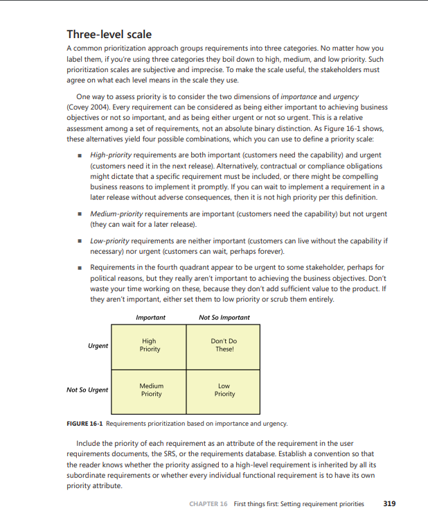

# Priorização por 3 Níveis

## 1. Introdução

As abordagens tradicionais de priorização de requisitos costumam classificá-los em alta, média ou baixa prioridade. No entanto, essa categorização pode ser imprecisa e subjetiva, uma vez que exige consenso entre os <i>stakeholders</i>. Para mitigar essa limitação e tornar o processo mais preciso, o grupo adotou a técnica de <b>Priorização por 3 Níveis</b>, que considera duas dimensões: <b>urgência</b> e <b>importância</b> do requisito (WIEGERS et al., 2013). Essa abordagem foi aplicada na classificação dos requisitos elicitados para o aplicativo do IBGE. A <a href="#6-referencias">referência</a> utilizada pode ser observada através da Figura 2.

## 2. Metodologia

### 2.1. Cronograma

Na Tabela 1 estão apresentados os participantes da priorização, bem como data e hora de suas participações.

Tabela 1: Cronograma da Priorização de 3 Níveis

| Nome                                                    | Data        |  Hora |
| ------------------------------------------------------- | ----------- |------ |
| [Laryssa Felix](https://github.com/felixlaryssa)        |  03/05/2025 | 09:40 |
| [Letícia Monteiro](https://github.com/LeticiaMonteiroo) |  03/05/2025 | 09:40 |
| [Ludmila Nunes](https://github.com/ludmilaaysha)        |  03/05/2025 | 09:40 |

Fonte: [Ludmila Nunes](https://github.com/ludmilaaysha).

### 2.2. Aplicação da técnica

Para a aplicação dessa técnica de priorização, foi utilizada uma matriz — a qual está representada na <b>Figura 1</b> — baseada em importância e urgência, que conta com 4 quadrantes para facilitar a tomada de decisão sobre a ordem do q deve ser feito. Foi levado em consideração a referência bibliográfica, que diz

> Use essa matriz para focar no que realmente traz valor para o projeto. Evite gastar tempo com coisas que parecem urgentes mas não são importantes (WIEGERS et al., 2013).
 

Figura 1: Matriz de 4 quadrantes

Fonte: [Ludmila Nunes](https://github.com/ludmilaaysha), 2025. Criado na ferramenta [Excalidraw](https://excalidraw.com).

As seguintes definições também foram utilizadas:

<ul>
<li><b>Alta prioridade:</b> Requisitos importantes e urgentes, essenciais para a próxima versão ou exigidos por contrato ou lei.</li>

<li><b>Prioridade média:</b> Importantes, mas não urgentes; podem ser entregues em versões futuras.</li>

<li><b>"Não faça isso!":</b> Parecem urgentes, mas não são importantes; surgem por pressões internas e devem ser reavaliados ou descartados.</li>

<li><b>Baixa prioridade:</b> Nem importantes nem urgentes; dispensáveis e podem ser ignorados sem impacto.</li>
</ul>

## 3. Participantes

A Priorização por 3 Níveis foi conduzida em uma videochamada que contou com a participação de <a href="https://github.com/LeticiaMonteiroo">Letícia Monteiro</a>, representando a equipe de desenvolvedores, <a href="https://github.com/felixlaryssa">Laryssa Felix</a>, representando cliente, e <a href="https://github.com/ludmilaaysha">Ludmila Nunes</a>, como representante dos usuários através da utilização das <a href="../../usuarios/personas">personas</a>.

A reunião foi realizada no dia 03/05/2025 e durou de 09:40 a 11:00. A <a href="../../Requisitos">lista de todos os requisitos</a> foi utilizada e todos os requisitos nela contidos foram analisados um a um. Cada parte interessada deu sua opinião sobre sua importância e urgência e ele foi alocado em um quadrante da matriz de priorização. As tabelas 2 e 3 apresentam o resultado da priorização.

## 4. Requisitos priorizados

A legenda para cada sigla é a seguinte:

<ul>
<li>RF* - Requisito Funcional nº*
<li>RNF* - Requisito Não Funcional nº*  
<li>RFA* - Requisito Funcional de Análise de Interface nº*
<li>RFB* - Requisito Funcional de Brainstorming nº*
<li>RFI* -  Requisito Funcional de Instrospecção nº* 
<li>RFQ* -  Requisito Funcional de Questionário nº*
<li>RFE* -  Requisito Funcional de Entrevista nº*
<li>RNFE* -  Requisito Não Funcional de Entrevista nº*
</ul>

!!! info

    Os requisitos marcados como prioridade N/A são aqueles que já estão implementados no sistema e, por conta disso, a categorização não se aplica.

### 4.1. Funcionais

Tabela 2: Priorização requisitos funcionais

| ID   | Descrição                                                                                                                                                                                                    | Rastreabilidade                                                                                                                                                                                                                                                                                                                                                                                        | Prioridade |
| ---- | ------------------------------------------------------------------------------------------------------------------------------------------------------------------------------------------------------------ | ------------------------------------------------------------------------------------------------------------------------------------------------------------------------------------------------------------------------------------------------------------------------------------------------------------------------------------------------------------------------------------------------------ | ---------- |
| RF01 | O sistema deve possuir notícias atualizadas sobre dados demográficos/socioeconômicos do Brasil, de seus estados e municípios.                                                                                | <a href="https://requisitos-de-software.github.io/2025.1-IBGE/elicitacao/tecnicas_selecionadas/analise_interface/#anchor_A">RFA1</a>                                                                                                                                                                                                                                                                   | N/A        |
| RF02 | Sistema deve possuir uma funcionalidade de busca, que independe da tela em que o usuário se encontra.                                                                                                        | <a href="https://requisitos-de-software.github.io/2025.1-IBGE/elicitacao/tecnicas_selecionadas/analise_interface/#anchor_A">RFA2</a>                                                                                                                                                                                                                                                                   | N/A        |
| RF03 | Se houver algum dado/indicador atrelado à notícia lida, esse indicador deve estar presente no topo da página da notícia.                                                                                     | <a href="https://requisitos-de-software.github.io/2025.1-IBGE/elicitacao/tecnicas_selecionadas/analise_interface/#anchor_A">RFA3</a>                                                                                                                                                                                                                                                                   | N/A        |
| RF04 | A notícia deve estar na aba de notícias do aplicativo.                                                                                                                                                       | <a href="https://requisitos-de-software.github.io/2025.1-IBGE/elicitacao/tecnicas_selecionadas/analise_interface/#anchor_A">RFA4</a>                                                                                                                                                                                                                                                                   | N/A        |
| RF05 | O aplicativo deve possuir uma navbar inferior que permita que o usuário navegue pelas diversas funcionalidades principais da aplicação.                                                                      | <a href="https://requisitos-de-software.github.io/2025.1-IBGE/elicitacao/tecnicas_selecionadas/analise_interface/#anchor_A">RFA5</a>                                                                                                                                                                                                                                                                   | N/A        |
| RF06 | Sistema deve possuir a aba de indicadores, com principais dados do IBGE, prévia de gráfico e valor com coloração simbólica (verde/vermelha).                                                                 | <a href="https://requisitos-de-software.github.io/2025.1-IBGE/elicitacao/tecnicas_selecionadas/analise_interface/#anchor_A">RFA6</a>, <a href="https://requisitos-de-software.github.io/2025.1-IBGE/elicitacao/tecnicas_selecionadas/brainstorming/#anchor_B">RFB22</a>                                                                                                                                | N/A        |
| RF07 | Ao clicar no dado, deve aparecer gráfico mais completo com evolução temporal do indicador.                                                                                                                   | <a href="https://requisitos-de-software.github.io/2025.1-IBGE/elicitacao/tecnicas_selecionadas/analise_interface/#anchor_A">RFA7</a>                                                                                                                                                                                                                                                                   | N/A        |
| RF08 | Notícias relacionadas ao dado devem aparecer na tela do dado.                                                                                                                                                | <a href="https://requisitos-de-software.github.io/2025.1-IBGE/elicitacao/tecnicas_selecionadas/analise_interface/#anchor_A">RFA8</a>                                                                                                                                                                                                                                                                   | N/A        |
| RF09 | Ao lado do nome do indicador, deve aparecer a definição daquele indicador.                                                                                                                                   | <a href="https://requisitos-de-software.github.io/2025.1-IBGE/elicitacao/tecnicas_selecionadas/analise_interface/#anchor_A">RFA9</a>, <a href="https://requisitos-de-software.github.io/2025.1-IBGE/elicitacao/tecnicas_selecionadas/brainstorming/#anchor_B">RFB3</a>                                                                                                                                 | Alta       |
| RF10 | Uma aba de calendário deve estar presente, com eventos/pesquisas principais do IBGE.                                                                                                                         | <a href="https://requisitos-de-software.github.io/2025.1-IBGE/elicitacao/tecnicas_selecionadas/analise_interface/#anchor_A">RFA10</a>                                                                                                                                                                                                                                                                  | N/A        |
| RF11 | Cada dado da aba de síntese deve possuir uma fonte atrelada.                                                                                                                                                 | <a href="https://requisitos-de-software.github.io/2025.1-IBGE/elicitacao/tecnicas_selecionadas/analise_interface/#anchor_A">RFA12</a>                                                                                                                                                                                                                                                                  | N/A        |
| RF12 | Uma aba de extras deve existir.                                                                                                                                                                              | <a href="https://requisitos-de-software.github.io/2025.1-IBGE/elicitacao/tecnicas_selecionadas/analise_interface/#anchor_A">RFA13</a>                                                                                                                                                                                                                                                                  | N/A        |
| RF13 | O sistema deve oferecer opção de controle de notificações (ativar ou desativar).                                                                                                                             | <a href="https://requisitos-de-software.github.io/2025.1-IBGE/elicitacao/tecnicas_selecionadas/analise_interface/#anchor_A">RFA14</a>                                                                                                                                                                                                                                                                  | N/A        |
| RF14 | O sistema deve notificar o usuário sobre novas notícias.                                                                                                                                                     | <a href="https://requisitos-de-software.github.io/2025.1-IBGE/elicitacao/tecnicas_selecionadas/analise_interface/#anchor_A">RFA15</a>                                                                                                                                                                                                                                                                  | N/A        |
| RF15 | Deve haver uma opção de avaliação do aplicativo com coleta de perfil, satisfação, funcionalidades mais usadas e sugestões.                                                                                   | <a href="https://requisitos-de-software.github.io/2025.1-IBGE/elicitacao/tecnicas_selecionadas/analise_interface/#anchor_A">RFA16</a>                                                                                                                                                                                                                                                                  | N/A        |
| RF16 | Deve haver uma opção de compartilhar o aplicativo.                                                                                                                                                           | <a href="https://requisitos-de-software.github.io/2025.1-IBGE/elicitacao/tecnicas_selecionadas/analise_interface/#anchor_A">RFA17</a>                                                                                                                                                                                                                                                                  | N/A        |
| RF17 | Uma opção de suporte deve existir, com ligação ao site do IBGE.                                                                                                                                              | <a href="https://requisitos-de-software.github.io/2025.1-IBGE/elicitacao/tecnicas_selecionadas/analise_interface/#anchor_A">RFA18</a>                                                                                                                                                                                                                                                                  | N/A        |
| RF18 | As redes sociais do IBGE devem ser linkadas.                                                                                                                                                                 | <a href="https://requisitos-de-software.github.io/2025.1-IBGE/elicitacao/tecnicas_selecionadas/analise_interface/#anchor_A">RFA19</a>                                                                                                                                                                                                                                                                  | N/A        |
| RF19 | As notícias devem ser compartilháveis.                                                                                                                                                                       | <a href="https://requisitos-de-software.github.io/2025.1-IBGE/elicitacao/tecnicas_selecionadas/analise_interface/#anchor_A">RFA20</a>                                                                                                                                                                                                                                                                  | N/A        |
| RF20 | No calendário, os dias com evento/pesquisa devem ter cor diferente dos demais.                                                                                                                               | <a href="https://requisitos-de-software.github.io/2025.1-IBGE/elicitacao/tecnicas_selecionadas/analise_interface/#anchor_A">RFA21</a>                                                                                                                                                                                                                                                                  | N/A        |
| RF21 | O calendário deve permitir visualização de meses passados e futuros em relação ao mês atual.                                                                                                                 | <a href="https://requisitos-de-software.github.io/2025.1-IBGE/elicitacao/tecnicas_selecionadas/analise_interface/#anchor_A">RFA22</a>                                                                                                                                                                                                                                                                  | N/A        |
| RF22 | Na aba “síntese”, dados como gentílico, área territorial, população, renda, orçamento, IDH, matrículas, salário médio, PIB per capita e mortalidade infantil devem estar disponíveis por estado e município. | <a href="https://requisitos-de-software.github.io/2025.1-IBGE/elicitacao/tecnicas_selecionadas/analise_interface/#anchor_A">RFA23</a>                                                                                                                                                                                                                                                                  | N/A        |
| RF23 | Filtros por país, estado e município devem estar disponíveis na aba “síntese”.                                                                                                                               | <a href="https://requisitos-de-software.github.io/2025.1-IBGE/elicitacao/tecnicas_selecionadas/analise_interface/#anchor_A">RFA24</a>, <a href="https://requisitos-de-software.github.io/2025.1-IBGE/elicitacao/tecnicas_selecionadas/brainstorming/#anchor_B">RFB9</a>                                                                                                                                | Média      |
| RF24 | Jogos educativos sobre geografia, demografia e temas sociais.                                                                                                                                                | <a href="https://requisitos-de-software.github.io/2025.1-IBGE/elicitacao/tecnicas_selecionadas/brainstorming/#anchor_B">RFB1</a>                                                                                                                                                                                                                                                                       | Baixa      |
| RF25 | Modo offline para uso do aplicativo sem conexão com a internet.                                                                                                                                              | <a href="https://requisitos-de-software.github.io/2025.1-IBGE/elicitacao/tecnicas_selecionadas/brainstorming/#anchor_B">RFB2</a>                                                                                                                                                                                                                                                                       | Baixa      |
| RF26 | Central de Ajuda dentro do app, com informações sobre o uso do aplicativo                                                                                                                                    | <a href="https://requisitos-de-software.github.io/2025.1-IBGE/elicitacao/tecnicas_selecionadas/brainstorming/#anchor_B">RFB6</a>                                                                                                                                                                                                                                                                       | Alta       |
| RF27 | Notificações para notícias relevantes e atualizações dos indicadores favoritos.                                                                                                                              | <a href="https://requisitos-de-software.github.io/2025.1-IBGE/elicitacao/tecnicas_selecionadas/brainstorming/#anchor_B">RFB7</a>                                                                                                                                                                                                                                                                       | Baixa      |
| RF28 | O usuário pode favoritar indicadores e visualizar as últimas atualizações.                                                                                                                                   | <a href="https://requisitos-de-software.github.io/2025.1-IBGE/elicitacao/tecnicas_selecionadas/brainstorming/#anchor_B">RFB8</a>                                                                                                                                                                                                                                                                       | Baixa      |
| RF29 | Comparativo de indicadores por região.                                                                                                                                                                       | <a href="https://requisitos-de-software.github.io/2025.1-IBGE/elicitacao/tecnicas_selecionadas/brainstorming/#anchor_B">RFB10</a>                                                                                                                                                                                                                                                                      | Média      |
| RF30 | Possibilidade de responder a questionários relacionados ao censo diretamente pelo app.                                                                                                                       | <a href="https://requisitos-de-software.github.io/2025.1-IBGE/elicitacao/tecnicas_selecionadas/brainstorming/#anchor_B">RFB11</a>                                                                                                                                                                                                                                                                      | Baixa      |
| RF31 | Possibilidade de realizar e preencher questionários diretamente no aplicativo.                                                                                                                               | <a href="https://requisitos-de-software.github.io/2025.1-IBGE/elicitacao/tecnicas_selecionadas/brainstorming/#anchor_B">RFB12</a>                                                                                                                                                                                                                                                                      | Baixa      |
| RF32 | Integração com outras fontes como sites ou APIs externas (ex: dados de transporte público).                                                                                                                  | <a href="https://requisitos-de-software.github.io/2025.1-IBGE/elicitacao/tecnicas_selecionadas/brainstorming/#anchor_B">RFB15</a>                                                                                                                                                                                                                                                                      | Média      |
| RF33 | Acesso a dados de diferentes fontes como o IBGE, através do app.                                                                                                                                             | <a href="https://requisitos-de-software.github.io/2025.1-IBGE/elicitacao/tecnicas_selecionadas/brainstorming/#anchor_B">RFB16</a>                                                                                                                                                                                                                                                                      | Média      |
| RF34 | Mapas interativos, com visualização de dados geográficos e demográficos.                                                                                                                                     | <a href="https://requisitos-de-software.github.io/2025.1-IBGE/elicitacao/tecnicas_selecionadas/brainstorming/#anchor_B">RFB17</a>, <a href="https://requisitos-de-software.github.io/2025.1-IBGE/elicitacao/tecnicas_selecionadas/brainstorming/#anchor_B">RFB19</a>                                                                                                                                   | Baixa      |
| RF35 | Possibilidade de filtro por tipo de dado.                                                                                                                                                                    | <a href="https://requisitos-de-software.github.io/2025.1-IBGE/elicitacao/tecnicas_selecionadas/brainstorming/#anchor_B">RFB18</a>                                                                                                                                                                                                                                                                      | Média      |
| RF36 | Possibilidade de exportar gráficos e resumos em formatos como PDF.                                                                                                                                           | <a href="https://requisitos-de-software.github.io/2025.1-IBGE/elicitacao/tecnicas_selecionadas/brainstorming/#anchor_B">RFB20</a>                                                                                                                                                                                                                                                                      | Média      |
| RF37 | Computar informações de dados e gerar relatórios para exportação.                                                                                                                                            | <a href="https://requisitos-de-software.github.io/2025.1-IBGE/elicitacao/tecnicas_selecionadas/brainstorming/#anchor_B">RFB21</a>                                                                                                                                                                                                                                                                      | Baixa      |
| RF38 | O sistema deve apresentar os indicadores sociais e agropecuários.                                                                                                                                            | <a href="https://requisitos-de-software.github.io/2025.1-IBGE/elicitacao/tecnicas_selecionadas/introspeccao/#anchor_I">RFI1</a>                                                                                                                                                                                                                                                                        | Alta       |
| RF39 | O sistema deve filtrar notícias por região e/ou tempo.                                                                                                                                                       | <a href="https://requisitos-de-software.github.io/2025.1-IBGE/elicitacao/tecnicas_selecionadas/introspeccao/#anchor_I">RFI2</a>                                                                                                                                                                                                                                                                        | Alta       |
| RF40 | O sistema deve apresentar mais dados na seção síntese para os respectivos locais (estado, município), como IDH, total de veículos, governante, entre outros, semelhante ao site de referência.               | <a href="https://requisitos-de-software.github.io/2025.1-IBGE/elicitacao/tecnicas_selecionadas/introspeccao/#anchor_I">RFI3</a>                                                                                                                                                                                                                                                                        | Alta       |
| RF41 | O sistema deve exibir conteúdos produzidos para outras plataformas, como YouTube, TikTok e Instagram, em uma aba dedicada.                                                                                   | <a href="https://requisitos-de-software.github.io/2025.1-IBGE/elicitacao/tecnicas_selecionadas/introspeccao/#anchor_I">RFI4</a>                                                                                                                                                                                                                                                                        | Baixa      |
| RF42 | O sistema deve analisar os conteúdos acessados pelo usuário para recomendar conteúdos similares.                                                                                                             | <a href="https://requisitos-de-software.github.io/2025.1-IBGE/elicitacao/tecnicas_selecionadas/introspeccao/#anchor_I">RFI5</a>                                                                                                                                                                                                                                                                        | Baixa      |
| RF43 | O sistema deve permitir a comparação dos censos realizados em diferentes anos.                                                                                                                               | <a href="https://requisitos-de-software.github.io/2025.1-IBGE/elicitacao/tecnicas_selecionadas/introspeccao/#anchor_I">RFI6</a>                                                                                                                                                                                                                                                                        | Média      |
| RF44 | O sistema deve exibir uma confirmação sobre a identidade do recenseador.                                                                                                                                     | <a href="https://requisitos-de-software.github.io/2025.1-IBGE/elicitacao/tecnicas_selecionadas/introspeccao/#anchor_I">RFI7</a>                                                                                                                                                                                                                                                                        | Alta       |
| RF45 | O sistema deve realizar estudos preditivos com base nos dados atuais.                                                                                                                                        | <a href="https://requisitos-de-software.github.io/2025.1-IBGE/elicitacao/tecnicas_selecionadas/introspeccao/#anchor_I">RFI8</a>                                                                                                                                                                                                                                                                        | N/A        |
| RF46 | O sistema deve informar quais fatores influenciam o aumento ou a diminuição de determinado indicador.                                                                                                        | <a href="https://requisitos-de-software.github.io/2025.1-IBGE/elicitacao/tecnicas_selecionadas/introspeccao/#anchor_I">RFI9</a>                                                                                                                                                                                                                                                                        | Média      |
| RF47 | O sistema deve indicar políticas públicas com base na análise dos dados adquiridos.                                                                                                                          | <a href="https://requisitos-de-software.github.io/2025.1-IBGE/elicitacao/tecnicas_selecionadas/introspeccao/#anchor_I">RFI10</a>                                                                                                                                                                                                                                                                       | N/A        |
| RF48 | O sistema deve comparar os locais com maior e menor taxa de resposta ao censo.                                                                                                                               | <a href="https://requisitos-de-software.github.io/2025.1-IBGE/elicitacao/tecnicas_selecionadas/introspeccao/#anchor_I">RFI11</a>                                                                                                                                                                                                                                                                       | Baixa      |
| RF49 | Compartilhamento de métricas do aplicativo com a fonte atrelada ao IBGE                                                                                                                                      | <a href="https://requisitos-de-software.github.io/2025.1-IBGE/elicitacao/tecnicas_selecionadas/questionario/#anchor_Q">RFQ01</a>                                                                                                                                                                                                                                                                       | Média      |
| RF50 | Possibilidade de realizar o próximo censo pelo aplicativo                                                                                                                                                    | <a href="https://requisitos-de-software.github.io/2025.1-IBGE/elicitacao/tecnicas_selecionadas/brainstorming/#anchor_B">RFB13</a>, <a href="https://requisitos-de-software.github.io/2025.1-IBGE/elicitacao/tecnicas_selecionadas/brainstorming/#anchor_B">RFB14</a>, <a href="https://requisitos-de-software.github.io/2025.1-IBGE/elicitacao/tecnicas_selecionadas/questionario/#anchor_Q">RFQ04</a> | Baixa      |
| RF51 | Opção de modo noturno                                                                                                                                                                                        | <a href="https://requisitos-de-software.github.io/2025.1-IBGE/elicitacao/tecnicas_selecionadas/brainstorming/#anchor_B">RFB4</a>, <a href="https://requisitos-de-software.github.io/2025.1-IBGE/elicitacao/tecnicas_selecionadas/entrevista/#anchor_E">RFE10</a>, <a href="https://requisitos-de-software.github.io/2025.1-IBGE/elicitacao/tecnicas_selecionadas/questionario/#anchor_Q">RFQ06</a>     | Alta       |
| RF52 | Opção de mudança de idiomas (Português, Inglês, Espanhol)                                                                                                                                                    | <a href="https://requisitos-de-software.github.io/2025.1-IBGE/elicitacao/tecnicas_selecionadas/questionario/#anchor_Q">RFQ07</a>                                                                                                                                                                                                                                                                       | Alta       |
| RF53 | Opção de alterar o tamanho da fonte (com botão)                                                                                                                                                              | <a href="https://requisitos-de-software.github.io/2025.1-IBGE/elicitacao/tecnicas_selecionadas/brainstorming/#anchor_B">RFB5</a>, <a href="https://requisitos-de-software.github.io/2025.1-IBGE/elicitacao/tecnicas_selecionadas/entrevista/#anchor_E">RFE11</a>, <a href="https://requisitos-de-software.github.io/2025.1-IBGE/elicitacao/tecnicas_selecionadas/questionario/#anchor_Q">RFQ08</a>     | Alta       |
| RF54 | Opção de alto contraste do aplicativo (com botão)                                                                                                                                                            | <a href="https://requisitos-de-software.github.io/2025.1-IBGE/elicitacao/tecnicas_selecionadas/brainstorming/#anchor_B">RFB5</a>, <a href="https://requisitos-de-software.github.io/2025.1-IBGE/elicitacao/tecnicas_selecionadas/entrevista/#anchor_E">RFE11</a>, <a href="https://requisitos-de-software.github.io/2025.1-IBGE/elicitacao/tecnicas_selecionadas/questionario/#anchor_Q">RFQ09</a>     | Alta       |
| RF55 | O sistema deve permitir busca refinada por dados e publicações.                                                                                                                                              | <a href="https://requisitos-de-software.github.io/2025.1-IBGE/elicitacao/tecnicas_selecionadas/entrevista/#anchor_E">RFE01</a>                                                                                                                                                                                                                                                                         | Alta       |
| RF56 | O sistema deve disponibilizar explicações simplificadas sobre os termos técnicos.                                                                                                                            | <a href="https://requisitos-de-software.github.io/2025.1-IBGE/elicitacao/tecnicas_selecionadas/entrevista/#anchor_E">RFE02</a>                                                                                                                                                                                                                                                                         | Alta       |
| RF57 | O sistema deve integrar-se com a conta Gov.br.                                                                                                                                                               | <a href="https://requisitos-de-software.github.io/2025.1-IBGE/elicitacao/tecnicas_selecionadas/brainstorming/#anchor_B">RFB23</a>, <a href="https://requisitos-de-software.github.io/2025.1-IBGE/elicitacao/tecnicas_selecionadas/entrevista/#anchor_E">RFE03</a>                                                                                                                                      | Alta       |
| RF58 | O sistema deve permitir o compartilhamento de gráficos com link da fonte.                                                                                                                                    | <a href="https://requisitos-de-software.github.io/2025.1-IBGE/elicitacao/tecnicas_selecionadas/entrevista/#anchor_E">RFE04</a>                                                                                                                                                                                                                                                                         | Alta       |
| RF59 | O sistema deve permitir a consulta a dados demográficos e indicadores por nível territorial detalhado.                                                                                                       | <a href="https://requisitos-de-software.github.io/2025.1-IBGE/elicitacao/tecnicas_selecionadas/analise_interface/#anchor_A">RFA11</a>, <a href="https://requisitos-de-software.github.io/2025.1-IBGE/elicitacao/tecnicas_selecionadas/entrevista/#anchor_E">RFE05</a>                                                                                                                                  | Alta       |
| RF60 | O sistema deve possuir uma FAQ com respostas às dúvidas mais comuns.                                                                                                                                         | <a href="https://requisitos-de-software.github.io/2025.1-IBGE/elicitacao/tecnicas_selecionadas/entrevista/#anchor_E">RFE05</a>                                                                                                                                                                                                                                                                         | Alta       |
| RF61 | O sistema deve apresentar os dados do Censo de forma visual e interativa (ex: infográficos, gráficos).                                                                                                       | <a href="https://requisitos-de-software.github.io/2025.1-IBGE/elicitacao/tecnicas_selecionadas/entrevista/#anchor_E">RFE07</a>                                                                                                                                                                                                                                                                         | Média      |
| RF62 | O sistema deve permitir acesso às publicações completas de cada pesquisa com a metodologia detalhada.                                                                                                        | <a href="https://requisitos-de-software.github.io/2025.1-IBGE/elicitacao/tecnicas_selecionadas/entrevista/#anchor_E">RFE08</a>                                                                                                                                                                                                                                                                         | Baixa      |
| RF63 | O sistema deve integrar todos ou a maioria dos aplicativos utilizados na coleta de dados de pesquisas.                                                                                                       | <a href="https://requisitos-de-software.github.io/2025.1-IBGE/elicitacao/tecnicas_selecionadas/entrevista/#anchor_E">RFE09</a>                                                                                                                                                                                                                                                                         | Baixa      |

Fonte: [Ludmila Nunes](https://github.com/ludmilaaysha), 2025.

### 4.2. Não funcionais

Tabela 3: Priorização requisitos funcionais

| ID    | Descrição                                                                                            | Rastreabilidade                                                                                                                  | Prioridade |
| ----- | ---------------------------------------------------------------------------------------------------- | -------------------------------------------------------------------------------------------------------------------------------- | ---------- |
| RNF01 | O sistema deve estar disponível de forma estável, sem travamentos ou quedas frequentes.              | <a href="https://requisitos-de-software.github.io/2025.1-IBGE/elicitacao/tecnicas_selecionadas/entrevista/#anchor_EN">RNFE01</a> | Alta           |
| RNF02 | O sistema deve permitir uso fluido tanto em computadores quanto em dispositivos móveis.              | <a href="https://requisitos-de-software.github.io/2025.1-IBGE/elicitacao/tecnicas_selecionadas/entrevista/#anchor_EN">RNFE02</a> | Alta           |
| RNF03 | O sistema deve ser compatível com ferramentas de acessibilidade (áudio, Libras).                     | <a href="https://requisitos-de-software.github.io/2025.1-IBGE/elicitacao/tecnicas_selecionadas/entrevista/#anchor_EN">RNFE04</a> | Alta           |
| RNF04 | O sistema deve garantir que usuários com baixo letramento estatístico consigam utilizar a interface. | <a href="https://requisitos-de-software.github.io/2025.1-IBGE/elicitacao/tecnicas_selecionadas/entrevista/#anchor_EN">RNFE05</a> | Alta           |

Fonte: [Ludmila Nunes](https://github.com/ludmilaaysha), 2025.

## 5. Gravação da Priorização

A gravação da <b>Priorização por 3 Níveis</b> pode ser acessada abaixo.

<iframe width="560" height="315" src="https://www.youtube.com/embed/5kgad3HElaE?si=qHIL26YwHYP4VwVj" title="YouTube video player" frameborder="0" allow="accelerometer; autoplay; clipboard-write; encrypted-media; gyroscope; picture-in-picture; web-share" referrerpolicy="strict-origin-when-cross-origin" allowfullscreen></iframe>

## 6. Referências

> WIEGERS, Karl; BEATTY, Joy. **_Software Requirements, Third Edition_**. Washington: Microsoft Press, 2013. p. 319.

Figura 2: Referência Priorização por Três Níveis

Fonte: [Ludmila Nunes](https://github.com/ludmilaaysha), 2025. Retirado de (WIEGERS et al.)

## Histórico de Versões 

Tabela 4: Histórico de versões

| Versão |                     Descrição                      |                      Autor                       |    Data    |                         Revisor                         |
| :----: | :------------------------------------------------: | :----------------------------------------------: | :--------: | :-----------------------------------------------------: |
|  1.0   |                Criação da documento                | [Laryssa Felix](https://github.com/felixlaryssa) | 03/05/2025 | [Letícia Monteiro](https://github.com/LeticiaMonteiroo) |
|  2.0   | Criação e estruturação do relatório da priorização | [Ludmila Nunes](https://github.com/ludmilaaysha) | 03/05/2025 | [Letícia Monteiro](https://github.com/LeticiaMonteiroo) |
|2.1 |Adição de imagem da referência bibliográfica|[Ludmila Nunes](https://github.com/ludmilaaysha)| 04/05/2025 |  [Caio Duarte](https://github.com/caioduart3) |

Fonte: [Caio Duarte](https://github.com/caioduart3), [Gabriel Pinto](https://github.com/GabrielSPinto), [João Félix](https://github.com/joaofmoreiraa), [Laryssa Felix](https://github.com/felixlaryssa), [Letícia Monteiro](https://github.com/LeticiaMonteiroo), [Ludmila Nunes](https://github.com/ludmilaaysha) e [Mayara Marques](https://github.com/maymarquee), 2025.
