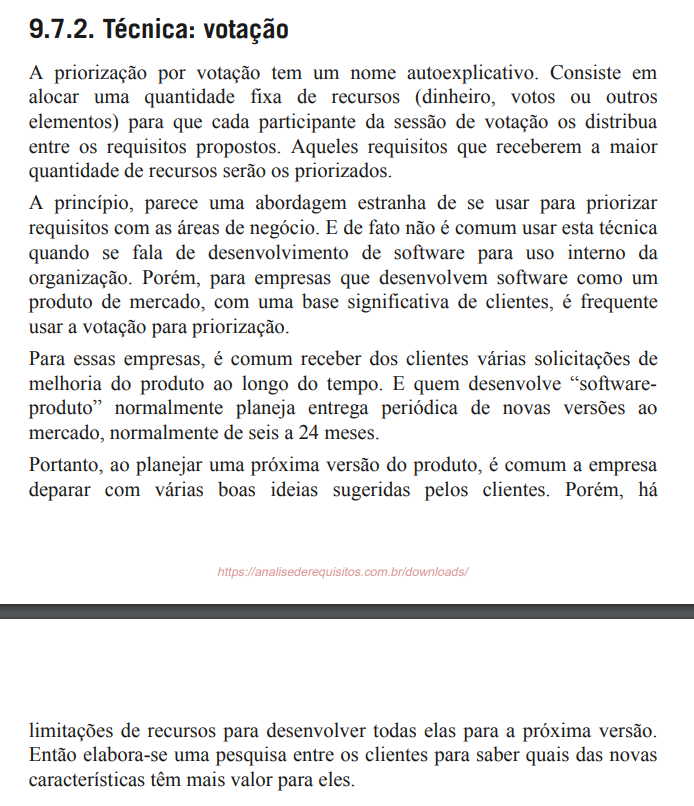

# Votação

## 1. Introdução

 Para tornar a priorização dos requisitos mais democrática e participativa, o grupo utilizou uma técnica baseada em <b>votação por pontuação</b>. Nessa abordagem, cada participante pode escolher um número limitado de requisitos que considera mais importantes, atribuindo um voto a eles. Ao final, os requisitos mais votados são priorizados com base na quantidade de votos recebidos (VAZQUEZ et al., 2016). 

## 2. Metodologia

### 2.1. Cronograma

 A técnica foi aplicada em uma videochamada realizada no dia 02/05/2025, às 22:30h. Durante a reunião, cada participante teve direito a <b>15 votos</b>, que foram utilizados para eleger os requisitos mais relevantes conforme sua perspectiva. Cada membro da equipe presente assumiu um papel de acordo com as partes interessadas, que poderiam ser o cliente, os desenvolvedores ou as <a href="../../usuarios/personas">personas</a>.

Tabela 1: Participantes da Votação

| Nome                                                    | Papel                                                        | Data       | Hora  |
| ------------------------------------------------------- | ------------------------------------------------------------ | ---------- | ----- |
| [Caio Duarte](https://github.com/caioduart3)            | Desenvolvedor                                                | 02/05/2025 | 22:30 |
| Clístenes Mendonça                                      | Cliente (pesquisador)                                        | 02/05/2025 | 22:30 |
| [Gabriel Pinto](https://github.com/GabrielSPinto)       | Lúcia (<a href="../../usuarios/personas">persona</a>)        | 02/05/2025 | 22:30 |
| [João Félix](https://github.com/joaofmoreiraa)          | Marcos (<a href="../../usuarios/personas">persona</a>)       | 02/05/2025 | 22:30 |
| [Laryssa Felix](https://github.com/felixlaryssa)        | Roberto (<a href="../../usuarios/personas">persona</a>)      | 02/05/2025 | 22:30 |
| Leonardo Gomes                                          | Cliente (pesquisador)                                        | 02/05/2025 | 22:30 |
| [Ludmila Nunes](https://github.com/ludmilaaysha)        | Desenvolvedor                                                | 02/05/2025 | 22:30 |
| [Mayara Marques](https://github.com/maymarquee)         | Desenvolvedor                                                | 02/05/2025 | 22:30 |

Fonte: [Ludmila Nunes](https://github.com/ludmilaaysha), 2025.

### 2.2. Aplicação da técnica

 Cada participante votou de acordo com o que considerava mais relevante para seu papel dentro do aplicativo. A pontuação foi feita com base em votos em uma planilha no <a href="https://docs.google.com/spreadsheets">Google Planilhas</a> (a qual pode ser consultada <a href="../../../assets/documents/votacaoGrupo5_planilha.pdf" target="blank">aqui</a>), onde cada participante distribuía seus 15 votos pelos requisitos que considerava mais importantes. Ao final, os votos foram somados, e os requisitos com maior pontuação foram considerados prioritários. O critério de corte foi a ausência de votos.

## 3. Resultado da priorização

A lista completa de votos pode ser visualizada nas tabelas 2 e 3. A Tabela 2 foi ordenada do requisito mais votado ao menos votado. A Tabela 3 conta com todos os requisitos que não obtiveram voto nenhum e, portanto, não foram priorizados.

### 3.1. Requisitos mais votados

Tabela 2: Requisitos Prioritários

| ID    | Descrição                                                                                                                                                                                                    | Votos recebidos |
| ----- | ------------------------------------------------------------------------------------------------------------------------------------------------------------------------------------------------------------ | --------------- |
| RF01  | O sistema deve possuir notícias atualizadas sobre dados demográficos/socioeconômicos do Brasil, de seus estados e municípios.                                                                                | 6               |
| RF22  | Na aba “síntese”, dados como gentílico, área territorial, população, renda, orçamento, IDH, matrículas, salário médio, PIB per capita e mortalidade infantil devem estar disponíveis por estado e município. | 6               |
| RNF04 | O sistema deve garantir que usuários com baixo letramento estatístico consigam utilizar a interface.                                                                                                         | 5               |
| RNF01 | O sistema deve estar disponível de forma estável, sem travamentos ou quedas frequentes.                                                                                                                      | 5               |
| RF23  | Filtros por país, estado e município devem estar disponíveis na aba “síntese”.                                                                                                                               | 4               |
| RF50  | Possibilidade de realizar o próximo censo pelo aplicativo                                                                                                                                                    | 4               |
| RNF03 | O sistema deve ser compatível com ferramentas de acessibilidade (áudio, Libras).                                                                                                                             | 4               |
| RF03  | Se houver algum dado/indicador atrelado à notícia lida, esse indicador deve estar presente no topo da página da notícia.                                                                                     | 3               |
| RF05  | O aplicativo deve possuir uma navbar inferior que permita que o usuário navegue pelas diversas funcionalidades principais da aplicação.                                                                      | 3               |
| RF07  | Ao clicar no dado, deve aparecer gráfico mais completo com evolução temporal do indicador.                                                                                                                   | 3               |
| RF09  | Ao lado do nome do indicador, deve aparecer a definição daquele indicador.                                                                                                                                   | 3               |
| RF21  | O calendário deve permitir visualização de meses passados e futuros em relação ao mês atual.                                                                                                                 | 3               |
| RF28  | O usuário pode favoritar indicadores e visualizar as últimas atualizações.                                                                                                                                   | 3               |
| RF29  | Comparativo de indicadores por região.                                                                                                                                                                       | 3               |
| RF34  | Mapas interativos, com visualização de dados geográficos e demográficos.                                                                                                                                     | 3               |
| RF40  | O sistema deve apresentar mais dados na seção síntese para os respectivos locais (estado, município), como IDH, total de veículos, governante, entre outros, semelhante ao site de referência.               | 3               |
| RF43  | O sistema deve permitir a comparação dos censos realizados em diferentes anos.                                                                                                                               | 3               |
| RF47  | O sistema deve indicar políticas públicas com base na análise dos dados adquiridos.                                                                                                                          | 3               |
| RF53  | Opção de alterar o tamanho da fonte (com botão)                                                                                                                                                              | 3               |
| RF55  | O sistema deve permitir busca refinada por dados e publicações.                                                                                                                                              | 3               |
| RF57  | O sistema deve integrar-se com a conta Gov.br.                                                                                                                                                               | 3               |
| RF61  | O sistema deve apresentar os dados do Censo de forma visual e interativa (ex: infográficos, gráficos).                                                                                                       | 3               |
| RNF02 | O sistema deve permitir uso fluido tanto em computadores quanto em dispositivos móveis.                                                                                                                      | 3               |
| RF06  | Sistema deve possuir a aba de indicadores, com principais dados do IBGE, prévia de gráfico e valor com coloração simbólica (verde/vermelha).                                                                 | 2               |
| RF25  | Modo offline para uso do aplicativo sem conexão com a internet.                                                                                                                                              | 2               |
| RF30  | Possibilidade de responder a questionários relacionados ao censo diretamente pelo app.                                                                                                                       | 2               |
| RF35  | Possibilidade de filtro por tipo de dado.                                                                                                                                                                    | 2               |
| RF36  | Possibilidade de exportar gráficos e resumos em formatos como PDF.                                                                                                                                           | 2               |
| RF37  | Computar informações de dados e gerar relatórios para exportação.                                                                                                                                            | 2               |
| RF39  | O sistema deve filtrar notícias por região e/ou tempo.                                                                                                                                                       | 2               |
| RF54  | Opção de alto contraste do aplicativo (com botão)                                                                                                                                                            | 2               |
| RF58  | O sistema deve permitir o compartilhamento de gráficos com link da fonte.                                                                                                                                    | 2               |
| RF59  | O sistema deve permitir a consulta a dados demográficos e indicadores por nível territorial detalhado.                                                                                                       | 2               |
| RF60  | O sistema deve possuir uma FAQ com respostas às dúvidas mais comuns.                                                                                                                                         | 2               |
| RF02  | Sistema deve possuir uma funcionalidade de busca, que independe da tela em que o usuário se encontra.                                                                                                        | 1               |
| RF04  | A notícia deve estar na aba de notícias do aplicativo.                                                                                                                                                       | 1               |
| RF10  | Uma aba de calendário deve estar presente, com eventos/pesquisas principais do IBGE.                                                                                                                         | 1               |
| RF11  | Cada dado da aba de síntese deve possuir uma fonte atrelada.                                                                                                                                                 | 1               |
| RF13  | O sistema deve oferecer opção de controle de notificações (ativar ou desativar).                                                                                                                             | 1               |
| RF16  | Deve haver uma opção de compartilhar o aplicativo.                                                                                                                                                           | 1               |
| RF18  | As redes sociais do IBGE devem ser linkadas.                                                                                                                                                                 | 1               |
| RF20  | No calendário, os dias com evento/pesquisa devem ter cor diferente dos demais.                                                                                                                               | 1               |
| RF27  | Notificações para notícias relevantes e atualizações dos indicadores favoritos.                                                                                                                              | 1               |
| RF31  | Possibilidade de realizar e preencher questionários diretamente no aplicativo.                                                                                                                               | 1               |
| RF33  | Acesso a dados de diferentes fontes como o IBGE, através do app.                                                                                                                                             | 1               |
| RF45  | O sistema deve realizar estudos preditivos com base nos dados atuais.                                                                                                                                        | 1               |
| RF51  | Opção de modo noturno                                                                                                                                                                                        | 1               |
| RF52  | Opção de mudança de idiomas (Português, Inglês, Espanhol)                                                                                                                                                    | 1               |
| RF56  | O sistema deve disponibilizar explicações simplificadas sobre os termos técnicos.                                                                                                                            | 1               |
| RF63  | O sistema deve integrar todos ou a maioria dos aplicativos utilizados na coleta de dados de pesquisas.                                                                                                       | 1               |

Fonte: [Ludmila Nunes](https://github.com/ludmilaaysha), 2025.

### 3.1. Requisitos não priorizados

Figura 1: Referência da votação

| ID   | Descrição                                                                                                                  | Votos recebidos |
| ---- | -------------------------------------------------------------------------------------------------------------------------- | --------------- |
| RF08 | Notícias relacionadas ao dado devem aparecer na tela do dado.                                                              | 0               |
| RF12 | Uma aba de extras deve existir.                                                                                            | 0               |
| RF14 | O sistema deve notificar o usuário sobre novas notícias.                                                                   | 0               |
| RF15 | Deve haver uma opção de avaliação do aplicativo com coleta de perfil, satisfação, funcionalidades mais usadas e sugestões. | 0               |
| RF17 | Uma opção de suporte deve existir, com ligação ao site do IBGE.                                                            | 0               |
| RF19 | As notícias devem ser compartilháveis.                                                                                     | 0               |
| RF24 | Jogos educativos sobre geografia, demografia e temas sociais.                                                              | 0               |
| RF26 | Central de Ajuda dentro do app, com informações sobre o uso do aplicativo                                                  | 0               |
| RF32 | Integração com outras fontes como sites ou APIs externas (ex: dados de transporte público).                                | 0               |
| RF38 | O sistema deve apresentar os indicadores sociais e agropecuários.                                                          | 0               |
| RF41 | O sistema deve exibir conteúdos produzidos para outras plataformas, como YouTube, TikTok e Instagram, em uma aba dedicada. | 0               |
| RF42 | O sistema deve analisar os conteúdos acessados pelo usuário para recomendar conteúdos similares.                           | 0               |
| RF44 | O sistema deve exibir uma confirmação sobre a identidade do recenseador.                                                   | 0               |
| RF46 | O sistema deve informar quais fatores influenciam o aumento ou a diminuição de determinado indicador.                      | 0               |
| RF48 | O sistema deve comparar os locais com maior e menor taxa de resposta ao censo.                                             | 0               |
| RF49 | Compartilhamento de métricas do aplicativo com a fonte atrelada ao IBGE                                                    | 0               |
| RF62 | O sistema deve permitir acesso às publicações completas de cada pesquisa com a metodologia detalhada.                      | 0               |

Fonte: [Ludmila Nunes](https://github.com/ludmilaaysha), 2025. Retirado de (VAZQUEZ et al.)

## 4. Considerações finais

 A votação permitiu identificar com clareza quais requisitos são considerados mais relevantes pelos diferentes perfis de participantes. O método colaborativo foi eficaz para contemplar as diferentes visões e promover uma escolha justa e baseada em dados objetivos. A priorização gerada será utilizada como base para os próximos ciclos de desenvolvimento do sistema. 

## 5. Gravação da priorização

 A votação foi registrada e pode ser acessada abaixo.

<iframe width="560" height="315" src="https://www.youtube.com/embed/1Bh_mfdDU6w?si=pIplN4J0N42qtKdc" title="Técnica de Priorização: Votação" frameborder="0" allow="accelerometer; autoplay; clipboard-write; encrypted-media; gyroscope; picture-in-picture; web-share" referrerpolicy="strict-origin-when-cross-origin" allowfullscreen></iframe>

## 6. Referências
> VAZQUEZ, Carlos; SIMÕES, Guilherme. **Engenharia de Requisitos**: Software Orientado ao Negócio. Rio de Janeiro: Brasport, 2016. p. 392–393.

Figura 1: Referência da votação

Fonte: [Ludmila Nunes](https://github.com/ludmilaaysha), 2025. Retirado de (VAZQUEZ et al.)

## Histórico de Versões 

Tabela 1: Histórico de versões

| Versão |Descrição     |Autor                                       |Data    |Revisor|
|:-:     | :-:          | :-:                                        | :-:        |:-:|
|1.0     |Criação da documento|[Laryssa Felix](https://github.com/felixlaryssa)| 03/05/2025 |  [Letícia Monteiro](https://github.com/LeticiaMonteiroo)  |
|  2.0   | Criação e estruturação do relatório da priorização | [Ludmila Nunes](https://github.com/ludmilaaysha) | 04/05/2025 | [João Félix](https://github.com/joaofmoreiraa) |

Fonte: [Caio Duarte](https://github.com/caioduart3), [Gabriel Pinto](https://github.com/GabrielSPinto), [João Félix](https://github.com/joaofmoreiraa), [Laryssa Felix](https://github.com/felixlaryssa), [Letícia Monteiro](https://github.com/LeticiaMonteiroo), [Ludmila Nunes](https://github.com/ludmilaaysha) e [Mayara Marques](https://github.com/maymarquee), 2025.
