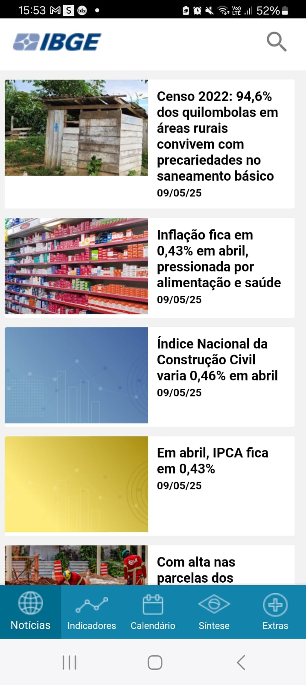
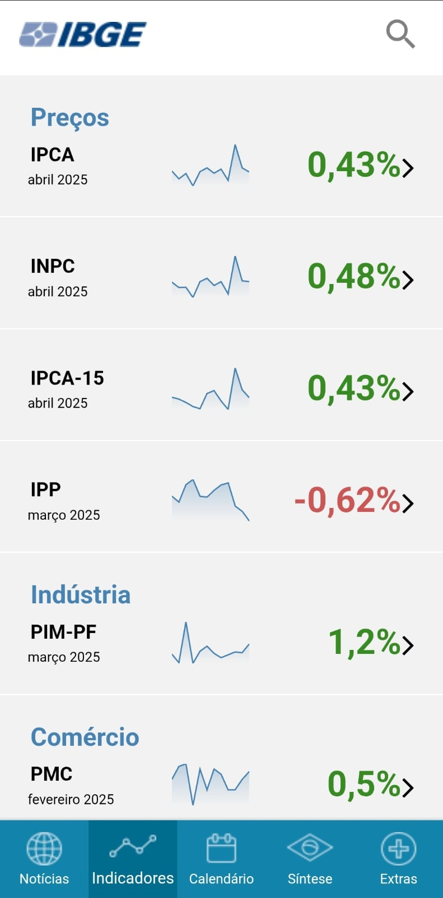
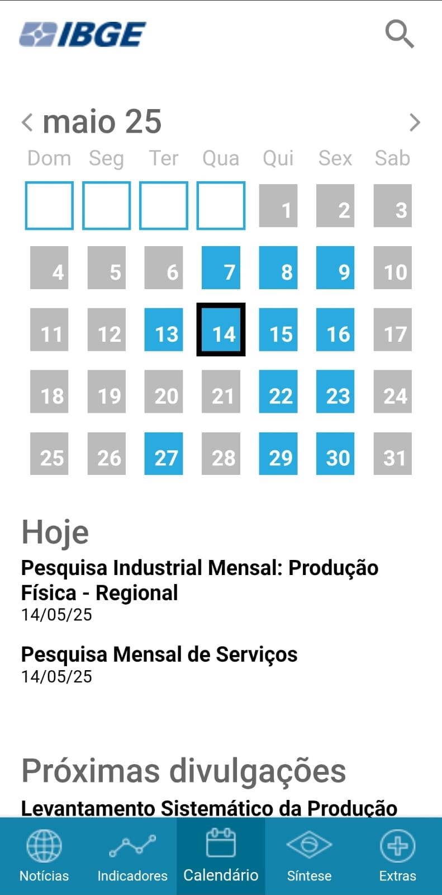
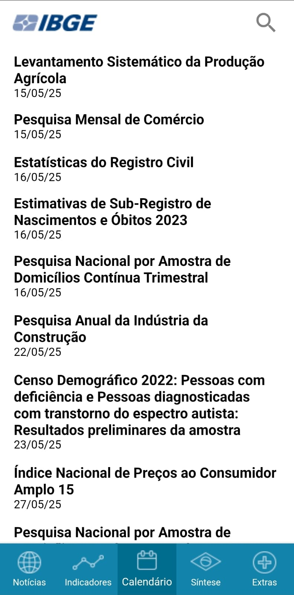
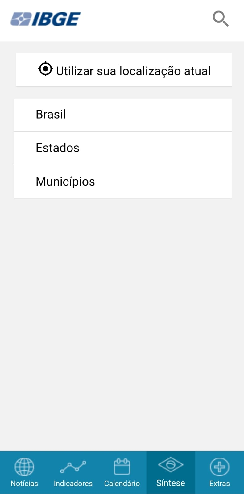
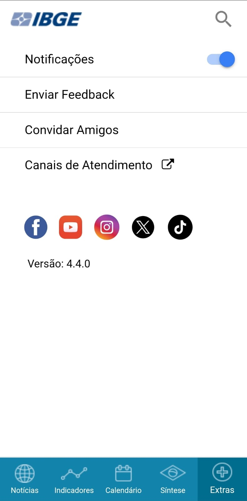

# Análise de Interface do Usuário

## 1. Introdução

A análise de interface do usuário é uma técnica de elicitação que consiste na análise de um sistema já existente, navegando pelas telas, tendo a visão que um usuário teria. O objetivo é elicitar requisitos funcionais e de usuário. 

Essa técnica permite descobrir funcionalidades ao explorar as telas disponíveis, entender os passos que os usuários seguem e elaborar casos de uso. A análise da UI ajuda a revelar dados importantes para os usuários e facilita o entendimento do funcionamento de um sistema existente - muitas vezes sem precisar perguntar diretamente aos usuários.

!!! Atenção

      Não se deve assumir que uma funcionalidade existente deve ser mantida ou a tela existente também deve permanecer. O foco é entender e se adaptar conforme as necessidades do sistema.  

## 2. Metodologia 

A elicitação foi conduzida pela estudante <a href="https://github.com/maymarquee">Mayara Marques</a>, que realizou a navegação pelo aplicativo do IBGE pelo celular. Funcionalidades foram observadas e listadas em um documento Google, servindo de rascunho. 

### 2.1 Cronograma

A tabela 1 abaixo informa sobre os participantes da elicitação, bem como o horário da reunião, data e função.

Tabela 1: Participantes.

| Nome                                             | Data                   |  Hora | Função |
| ------------------------------------------------ | ------------------------ | -------------- | -------|
| [Caio Duarte](https://github.com/caioduart3)   |  03/05/2025 |  12:00 | Revisor de Requisitos | 
| [Gabriel Pinto](https://github.com/GabrielSPinto) |  03/05/2025 | 10:00 | Revisor de Requisitos | 
| [João Félix](https://github.com/joaofmoreiraa)   |  03/05/2025 |  19:00 | Revisor do artefato | 
| [Larysssa Felix](https://github.com/felixlaryssa)   |  03/05/2025 |  10:30 | Revisor de Requisitos | 
| [Letícia Monteiro](https://github.com/LeticiaMonteiroo)   |  03/05/2025 |  11:00 | Revisor de Requisitos | 
| [Ludmila Nunes](https://github.com/ludmilaaysha)   |  03/05/2025 |  11:30 | Revisor de Requisitos |
| [Mayara Marques](https://github.com/maymarquee)   |  02/05/2025|  14:55 | Elicitadora de Requisitos |

Fonte: [Mayara Marques](https://github.com/maymarquee), 2025. 

### 2.2 Observações 

  <ul>
    <li><strong>Interface e Acessibilidade</strong>
      <ul>
        <li>Letras pequenas dificultam a usabilidade, principalmente para pessoas idosas.</li>
        <li>Falta de função de zoom.</li>
        <li>Algumas abas possuem pouca funcionalidade.</li>
      </ul>
    </li>

    <li><strong>Funcionalidades</strong>
      <ul>
        <li>Navegação por localização pode ser falha ou limitada.</li>
        <li>Sistema permite acesso a dados por município.</li>
        <li>Função de acesso a dados funciona melhor na busca direta do que pela localização.</li>
        <li>Presença de abas: Notícias, Síntese, Extras, Calendário, Indicadores.</li>
      </ul>
    </li>

    <li><strong>Notificações</strong>
      <ul>
        <li>O aplicativo envia notificações com base em notícias publicadas.</li>
      </ul>
    </li>

    <li><strong>Feedback</strong>
      <ul>
        <li>Formulário de feedback semelhante ao do questionário realizado pelo grupo.</li>
        <li>Algumas funções (ex: botão "Finalizar") não funcionam como esperado.</li>
      </ul>
    </li>

    <li><strong>Compartilhamento</strong>
      <ul>
        <li>Notícias podem ser compartilhadas; dados específicos, não.</li>
      </ul>
    </li>
  </ul>

## 3. Requisitos Elicitados 

A tabela 2 abaixo apresenta os requisitos funcionais elicitados durante a análise de interface do usuário para o aplicativo do IBGE. 

Tabela 2: Requisitos Funcionais de Análise de Interface.

<table border="1" cellpadding="8" cellspacing="0" style="border-collapse: collapse; width: 100%;">
  <thead>
    <tr>
      <th>Código</th>
      <th>Descrição do Requisito Funcional</th>
      <th>Implementado</th>
    </tr>
  </thead>
  <tbody>
    <tr><td>RFA1</td><td>O sistema deve possuir notícias atualizadas sobre dados demográficos/socioeconômicos do Brasil, de seus estados e municípios.</td><td>Sim</td></tr>
    <tr><td>RFA2</td><td>Sistema deve possuir uma funcionalidade de busca, que independe da tela em que o usuário se encontra.</td><td>Sim</td></tr>
    <tr><td>RFA3</td><td>Se houver algum dado/indicador atrelado à notícia lida, esse indicador deve estar presente no topo da página da notícia.</td><td>Sim</td></tr>
    <tr><td>RFA4</td><td>A notícia deve estar na aba de notícias do aplicativo.</td><td>Sim</td></tr>
    <tr><td>RFA5</td><td>O aplicativo deve possuir uma navbar inferior que permita que o usuário navegue pelas diversas funcionalidades principais da aplicação.</td><td>Sim</td></tr>
    <tr><td>RFA6</td><td>Sistema deve possuir a aba de indicadores, com principais dados do IBGE, prévia de gráfico e valor com coloração simbólica (verde/vermelha).</td><td>Sim</td></tr>
    <tr><td>RFA7</td><td>Ao clicar no dado, deve aparecer gráfico mais completo com evolução temporal do indicador.</td><td>Sim</td></tr>
    <tr><td>RFA8</td><td>Notícias relacionadas ao dado devem aparecer na tela do dado.</td><td>Sim</td></tr>
    <tr><td>RFA9</td><td>Ao lado do nome do indicador, deve aparecer a definição daquele indicador.</td><td>Sim</td></tr>
    <tr><td>RFA10</td><td>Uma aba de calendário deve estar presente, com eventos/pesquisas principais do IBGE.</td><td>Sim</td></tr>
    <tr><td>RFA11</td><td>A aba de síntese deve conter dados censitários dos municípios, estados e do Brasil.</td><td>Sim</td></tr>
    <tr><td>RFA12</td><td>Cada dado da aba de síntese deve possuir uma fonte atrelada.</td><td>Sim</td></tr>
    <tr><td>RFA13</td><td>Uma aba de extras deve existir.</td><td>Sim</td></tr>
    <tr><td>RFA14</td><td>O sistema deve oferecer opção de controle de notificações (ativar ou desativar).</td><td>Sim</td></tr>
    <tr><td>RFA15</td><td>O sistema deve notificar o usuário sobre novas notícias.</td><td>Sim</td></tr>
    <tr><td>RFA16</td><td>Deve haver uma opção de avaliação do aplicativo com coleta de perfil, satisfação, funcionalidades mais usadas e sugestões.</td><td>Sim</td></tr>
    <tr><td>RFA17</td><td>Deve haver uma opção de compartilhar o aplicativo.</td><td>Sim</td></tr>
    <tr><td>RFA18</td><td>Uma opção de suporte deve existir, com ligação ao site do IBGE.</td><td>Sim</td></tr>
    <tr><td>RFA19</td><td>As redes sociais do IBGE devem ser linkadas.</td><td>Sim</td></tr>
    <tr><td>RFA20</td><td>As notícias devem ser compartilháveis.</td><td>Sim</td></tr>
    <tr><td>RFA21</td><td>No calendário, os dias com evento/pesquisa devem ter cor diferente dos demais.</td><td>Sim</td></tr>
    <tr><td>RFA22</td><td>O calendário deve permitir visualização de meses passados e futuros em relação ao mês atual.</td><td>Sim</td></tr>
    <tr><td>RFA23</td><td>Na aba “síntese”, dados como gentílico, área territorial, população, renda, orçamento, IDH, matrículas, salário médio, PIB per capita e mortalidade infantil devem estar disponíveis por estado e município.</td><td>Sim</td></tr>
    <tr><td>RFA24</td><td>Filtros por país, estado e município devem estar disponíveis na aba “síntese”.</td><td>Sim</td></tr>
  </tbody>
</table>

Fonte: [Mayara Marques](https://github.com/maymarquee), 2025. 

A tabela 3 abaixo apresenta as siglas <b>RFA*</b>, explicando seus respectivos requisitos funcionais, com origem na análise de interface e focando na rastreabilidade para futuras implementações.

Tabela 3: Siglas dos requisitos funcionais.

  <table style="border-collapse: collapse; text-align: center; margin: 0;">
    <thead>
      <tr>
        <th><b>Sigla</b></th>
        <th><b>Descrição do Requisito</b></th>
      </tr>
    </thead>
    <tbody>
      <tr>
        <td><b>RFA*</b></td>
        <td>Requisito Funcional de Análise de Interface</td>
      </tr>
    </tbody>
  </table>

Fonte: [Mayara Marques](https://github.com/maymarquee), 2025. 

## 4. Gravação da Elicitação 

No vídeo abaixo é possível observar a gravação da elicitação e, consequentemente, a prova da existência desses requisitos no aplicativo analisado. 
 

<iframe width="560" height="315" src="https://www.youtube.com/embed/046NMaeUnmI?si=papihGPW_2tn8eZk" title="YouTube video player" frameborder="0" allow="accelerometer; autoplay; clipboard-write; encrypted-media; gyroscope; picture-in-picture; web-share" referrerpolicy="strict-origin-when-cross-origin" allowfullscreen></iframe>

## 5. Print screen do Aplicativo

Apesar de o vídeo conter a gravação completa de todas as telas e funcionalidades implementadas no aplicativo, é importante incluir capturas de tela (prints) para facilitar a visualização de determinados requisitos. Isso evita que quem for analisar o projeto precise assistir ao vídeo inteiro para encontrar informações específicas.
 

  
Figura 1 – <i>Página Inicial</i> do App

  
  

    Fonte: <a href="https://www.ibge.gov.br" target="_blank">Aplicativo IBGE</a>, 2025.
  

  
Figura 2 – <i>Página "Indicadores"</i> do App

  
  

    Fonte: <a href="https://www.ibge.gov.br" target="_blank">Aplicativo IBGE</a>, 2025.
  

  
Figura 3 – <i>Página "Calendário"</i> do App

  
  

    Fonte: <a href="https://www.ibge.gov.br" target="_blank">Aplicativo IBGE</a>, 2025.
  

  
Figura 4 – <i>Página "Calendário" 2</i> do App

  
  

    Fonte: <a href="https://www.ibge.gov.br" target="_blank">Aplicativo IBGE</a>, 2025.
  

  
Figura 5 – <i>Página "Síntese"</i> do App

  
  

    Fonte: <a href="https://www.ibge.gov.br" target="_blank">Aplicativo IBGE</a>, 2025.
  

  
Figura 6 – <i>Página "Extras"</i> do App

  
  

    Fonte: <a href="https://www.ibge.gov.br" target="_blank">Aplicativo IBGE</a>, 2025.
  

## 6. Bibliografia

> WIEGERS, Karl Eugene; BEATTY, Joy. Software requirements: best practices. 3. ed. Redmond: Microsoft Press, 2013. 

## 7. Histórico de Versões

Tabela 4: Histórico de Versões
 

| Versão |Descrição     |Autor                                       |Data    |Revisor|
|:-:     | :-:          | :-:                                        | :-:        |:-:|
|1.0   |Criação do documento|[Mayara Marques](https://github.com/maymarquee)| 02/05/2025 |  [João Félix](https://github.com/joaofmoreiraa) |
|1.1   |Adição de foto da fonte referência|[Mayara Marques](https://github.com/maymarquee)| 04/05/2025 |  [Caio Duarte](https://github.com/caioduart3) |
|1.2   |Complemento tabela de cronograma|[Mayara Marques](https://github.com/maymarquee)| 06/05/2025 |  [Larysssa Felix](https://github.com/felixlaryssa) |
|1.3   |Adição das Fotos a Página|[Letícia Monteiro](https://github.com/LeticiaMonteiroo)| 14/05/2025 |  [Larysssa Felix](https://github.com/felixlaryssa) |
|1.4   |Correções para entrega 5 da disciplina|[Mayara Marques](https://github.com/maymarquee)| 22/06/2025 |  [Ludmila Nunes](https://github.com/ludmilaaysha) |

Fonte: [Caio Duarte](https://github.com/caioduart3), [Gabriel Pinto](https://github.com/GabrielSPinto), [João Félix](https://github.com/joaofmoreiraa), [Larysssa Felix](https://github.com/felixlaryssa), [Letícia Monteiro](https://github.com/LeticiaMonteiroo), [Ludmila Nunes](https://github.com/ludmilaaysha) e [Mayara Marques](https://github.com/maymarquee), 2025.
 
