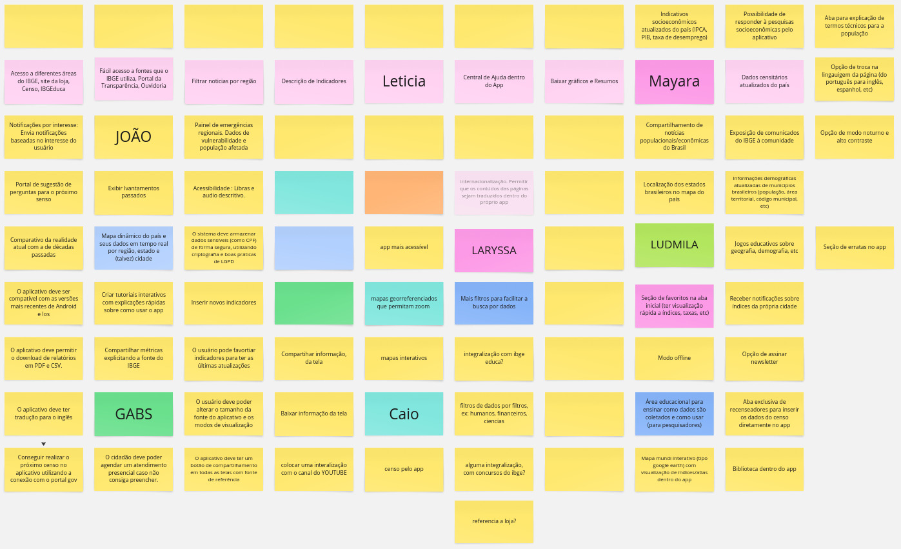

# Brainstorming para Elicitação de Requisitos

O <b><i>brainstorming</i></b> é uma técnica amplamente utilizada para elicitação de requisitos, com o objetivo de gerar ideias criativas e identificar as necessidades de um sistema ou produto. Segundo <b>Alistair Cockburn</b> (2001), o <i>brainstorming</i> é uma técnica de grupo que incentiva a livre expressão de ideias entre os participantes, sem julgamentos, buscando gerar uma grande quantidade de informações em um curto espaço de tempo.
 

No contexto da elicitação de requisitos, o <i>brainstorming</i> foi utilizado para elicitar tanto os requisitos já existentes quanto novos para o <b>aplicativo do IBGE</b>, de forma colaborativa. A interação entre os participantes, focada na troca de ideias, possibilita uma visão abrangente dos requisitos e auxilia na definição dos objetivos do sistema. 

## 1. Metodologia

A metodologia adotada para essa elicitação foi a abordagem da técnica de <i>brainstorming</i>, que promove a geração livre e colaborativa de ideias entre os participantes do grupo. A equipe coletou informações relevantes com ajuda do site <a href= "https://miro.com/">Miro</a>, em uma reunião pela plataforma <a href= "https://www.microsoft.com/pt-br/microsoft-teams/free">Microsoft Teams</a>.

### 1.1 Cronograma 

A tabela 1 abaixo informa sobre os participantes da elicitação, bem como o horário da reunião e a data.

Tabela 1: Participantes Brainstorming.

| Nome                                             | Data                   |  Hora |
| ------------------------------------------------ | ------------------------ | -------------- |
| [Caio Duarte](https://github.com/caioduart3)   |  24/04/2025 |  21:10 |
| [Gabriel Pinto](https://github.com/GabrielSPinto) |  24/04/2025 | 21:10 |
| [João Félix](https://github.com/joaofmoreiraa)   |  24/04/2025 |  21:10 |
| [Larysssa Felix](https://github.com/felixlaryssa)   |  24/04/2025 |  21:10 |
| [Letícia Monteiro](https://github.com/LeticiaMonteiroo)   |  24/04/2025 |  21:10 |
| [Ludmila Nunes](https://github.com/ludmilaaysha)   |  24/04/2025 |  21:10 |
| [Mayara Marques](https://github.com/maymarquee)   |  24/04/2025 |  21:10 |

Fonte: [Gabriel Pinto](https://github.com/GabrielSPinto), [Mayara Marques](https://github.com/maymarquee), 2025.

## 2. Momentos de Elicitação

Durante a reunião de brainstorming do projeto, a equipe seguiu uma estrutura bem definida, com tempos específicos para cada fase do processo. A seguir, o detalhamento dos momentos e dos grupos de ideias levantados:

### 2.1 Primeiro Momento (10 minutos)

Neste início, os participantes se concentraram em gerar ideias livremente, sem críticas ou julgamentos. Foi uma fase de exploração ampla, onde todas as sugestões relacionadas aos requisitos foram bem-vindas.

### 2.2 Segundo Momento (5 minutos)

Nesta fase, o tempo de geração de ideias foi ampliado, mantendo o foco na exploração de uma variedade de opções, com maior ênfase em detalhar as ideias que surgiram no primeiro momento.

### 2.3 Último Momento (3 minutos)

No final, foi dado um tempo reduzido para que os membros fizessem as últimas contribuições, ajustando ou acrescentando detalhes às ideias discutidas previamente. Esse momento foi importante para finalizar o brainstorming e garantir que todas as ideias relevantes fossem capturadas.

O resultado inicial da elicitação pode ser observada na figura 1.

  
Figura 1 – <i>Brainstorming</i> realizado pela equipe

  
  

  Fonte: <a href="https://miro.com/" target="_blank">Aplicativo Miro</a>, 2025.
  

## 3. Organização das Ideias

Após o <i>brainstorming</i>, a equipe organizou as ideias semelhantes, agrupando-as de forma lógica com base em suas similaridades ou no impacto que teriam no projeto. A seguir, os <b>grupos de ideias levantados</b> durante a organização:  

 

<iframe width="768" height="432" src="https://miro.com/app/live-embed/uXjVI-VNGi4=/?moveToViewport=-6391,-1242,5011,2989&embedId=361280646911" frameborder="0" scrolling="no" allow="fullscreen; clipboard-read; clipboard-write" allowfullscreen></iframe>

Após essa organização, algumas ideias passaram a ser discutidas em maior profundidade, especialmente em relação à <b>descrição de indicadores</b> e à <b>acessibilidade</b>. A equipe começou a considerar a viabilidade e aplicabilidade dessas ideias dentro do escopo do projeto, ajustando-as conforme necessário.

## 4. Limpeza de Requisitos

Além disso, a equipe fez uma <b>limpeza dos requisitos</b>, garantindo que todos estivessem em conformidade com o escopo do projeto. Requisitos que não se aplicavam ou que não estavam alinhados aos objetivos foram descartados, sempre com respeito pelas ideias de todos os participantes e sem julgamentos severos.

## 5. Requisitos Elicitados

A tabela 2 abaixo apresenta os requisitos elicitados durante o brainstorming para o aplicativo do IBGE. As ideias foram organizadas conforme as categorias identificadas no processo.

Tabela 2: Requisitos elicitados no <i>brainstorming</i>

|  **#** | **Área**                       | **Requisito**                                                                                  | **Implementado**           |
|-------|---------------------------------|-------------------------------------------------------------------------------------------------|--------------------|
| RFB1     | **Interação**                   | Jogos educativos sobre geografia, demografia e temas sociais.                                   | Não          |
| RFB2     | **Interação**                   | Modo offline para uso do aplicativo sem conexão com a internet.                                | Não          |
| RFB3     | **Interação**                   | Acesso a explicações de termos técnicos dentro do aplicativo.                                  | Sim          |
| RFB4     | **Acessibilidade**              | Opção de modo noturno e aumento de contraste.                                                   | Não      |
| RFB5     | **Acessibilidade**              | Acessibilidade para deficientes visuais (aumento de fontes, contrastes, etc.).                 | Não          |
| RFB6     | **Acessibilidade**              | Central de Ajuda dentro do app, com informações sobre o uso do aplicativo.                     | Não          |
| RFB7     | **Favoritos**                   | Notificações para notícias relevantes e atualizações dos indicadores favoritos.                | Não          |
| RFB8     | **Favoritos**                   | O usuário pode favoritar indicadores e visualizar as últimas atualizações.                      | Não          |
| RFB9     | **Filtros**                     | Exibir resultados filtrados por dados de interesse (ex: região, faixa etária, etc.).           | Não          |
| RFB10    | **Filtros**                     | Comparativo de indicadores por região.                                                         | Não          |
| RFB11    | **Questionários**               | Possibilidade de responder a questionários relacionados ao censo diretamente pelo app.         | Não          |
| RFB12    | **Questionários**               | Possibilidade de realizar e preencher questionários diretamente no aplicativo.                 | Não          |
| RFB13    | **Censo**                       | Criar ou realizar o censo diretamente pelo app, com integração com outros dados externos.      | Não          |
| RFB14    | **Censo**                       | Possibilidade de preencher o censo com dados diretamente pelo app.                             | Não          |
| RFB15    | **Integrações**                 | Integração com outras fontes como sites ou APIs externas (ex: dados de transporte público).    | Não          |
| RFB16    | **Integrações**                 | Acesso a dados de diferentes fontes como o IBGE, através do app.                              | Sim          |
| RFB17    | **Mapas**                       | Mapas interativos, com visualização de dados geográficos e demográficos.                        | Não          |
| RFB18    | **Mapas**                       | Possibilidade de filtro por tipo de dado.                                                      | Não          |
| RFB19    | **Mapas**                       | Mapas personalizados para exibição de dados por regiões.                                       | Não          |
| RFB20    | **Exportação**                  | Possibilidade de exportar gráficos e resumos em formatos como PDF.                             | Não          |
| RFB21    | **Exportação**                  | Computar informações de dados e gerar relatórios para exportação.                              | Não          |
| RFB22    | **Existentes**                  | Inclusão de dados atualizados de estatísticas econômicas e demográficas do Brasil.             | Sim          |
| RFB23    | **Existentes**                  | Integração com sistemas existentes para trazer dados de outras plataformas governamentais.      | Não          |

Fonte: [Caio Duarte](https://github.com/caioduart3), [Gabriel Pinto](https://github.com/GabrielSPinto), [João Félix](https://github.com/joaofmoreiraa), [Larysssa Felix](https://github.com/felixlaryssa), [Letícia Monteiro](https://github.com/LeticiaMonteiroo), [Ludmila Nunes](https://github.com/ludmilaaysha) e [Mayara Marques](https://github.com/maymarquee), 2025.
 

A tabela 3 abaixo apresenta as siglas <b>RFB</b> e <b>RNFB</b>, explicando seus respectivos requisitos funcionais e não funcionais, com origem no brainstorming e focando na rastreabilidade para futuras implementações.

Tabela 3: Siglas dos requisitos funcionais e não funcionais

  <table style="border-collapse: collapse; text-align: center; margin: 0;">
    <thead>
      <tr>
        <th><b>Sigla</b></th>
        <th><b>Descrição do Requisito</b></th>
      </tr>
    </thead>
    <tbody>
      <tr>
        <td><b>RFB</b></td>
        <td>Requisito Funcional de Brainstorming</td>
      </tr>
      <tr>
        <td><b>RNFB</b></td>
        <td>Requisito Não Funcional de Brainstorming</td>
      </tr>
    </tbody>
  </table>

Fonte: <a href="https://github.com/caioduart3">Caio Duarte</a>, 
  <a href="https://github.com/GabrielSPinto">Gabriel Pinto</a>, 
  <a href="https://github.com/joaofmoreiraa">João Félix</a>, 
  <a href="https://github.com/felixlaryssa">Larysssa Felix</a>, 
  <a href="https://github.com/LeticiaMonteiroo">Letícia Monteiro</a>, 
  <a href="https://github.com/ludmilaaysha">Ludmila Nunes</a> e 
  <a href="https://github.com/maymarquee">Mayara Marques</a>, 2025..

## 6. Gravação da Elicitação

A gravação dessa elicitação pode ser observada no link abaixo.

<iframe width="560" height="315" src="https://www.youtube.com/embed/yY5ZaPZXCsU?si=EzUx92Hg8qJe_cZQ" title="YouTube video player" frameborder="0" allow="accelerometer; autoplay; clipboard-write; encrypted-media; gyroscope; picture-in-picture; web-share" referrerpolicy="strict-origin-when-cross-origin" allowfullscreen></iframe>

## 7. Referências

>COCKBURN, Alistair. *Writing effective use cases*. Addison-Wesley, 2001.

> SERRANO, Milene; SERRANO, Maurício. Requisitos – Aula 07. UnB, 2025.  Disponível em: <https://aprender3.unb.br/pluginfile.php/3096086/mod_resource/content/2/Requisitos%20-%20Aula%2007.pdf>. Acesso em: 25 abr. 2025.

## 8. Histórico de versões

Tabela 4: Histórico de versões

| Versão |Descrição     |Autor                                       |Data    |Revisor|
|:-:     | :-:          | :-:                                        | :-:        |:-:|
|1.0     |Criação do documento|[Gabriel Pinto](https://github.com/GabrielSPinto)| 25/04/2025 | [Mayara Marques](https://github.com/maymarquee)|
|1.1     |Revisão e adição da gravação|[Mayara Marques](https://github.com/maymarquee)| 25/04/2025 | [Gabriel Pinto](https://github.com/GabrielSPinto)|
|1.2     |Ajustes do artefato|[Mayara Marques](https://github.com/maymarquee)| 03/05/2025 | [Caio Duarte](https://github.com/caioduart3)|

Fonte: [Caio Duarte](https://github.com/caioduart3), [Gabriel Pinto](https://github.com/GabrielSPinto), [João Félix](https://github.com/joaofmoreiraa), [Larysssa Felix](https://github.com/felixlaryssa), [Letícia Monteiro](https://github.com/LeticiaMonteiroo), [Ludmila Nunes](https://github.com/ludmilaaysha) e [Mayara Marques](https://github.com/maymarquee), 2025.
