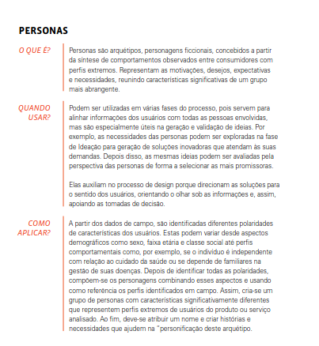

# Personas:

## 1. Introdução

 As <b>personas</b> representam um dos pilares do design centrado no ser humano, funcionando como personagens arquetípicos criados a partir de dados reais e observações qualitativas. Elas permitem sintetizar informações sobre os comportamentos, desejos e necessidades dos usuários, facilitando o entendimento empático do público-alvo. Segundo Brown (2010), a construção de personas auxilia os times de desenvolvimento a enxergarem além de dados estatísticos, conectando-se emocionalmente com os usuários e promovendo soluções que sejam verdadeiramente relevantes. A ideia não é apenas representar o usuário típico, mas entender profundamente o contexto em que ele vive e interage com os sistemas e serviços. 
 
 No projeto de requisitos voltado ao <b>IBGE</b>, a definição de personas foi essencial para garantir que os produtos digitais desenvolvidos atendessem à pluralidade da população brasileira. Considerando a missão do Instituto de produzir e divulgar informações estatísticas de interesse nacional, é crucial entender os diferentes perfis de seus usuários — que vão desde técnicos especializados até cidadãos com pouca familiaridade com tecnologias digitais. Como destaca Brown (2010), ao incorporar perspectivas diversas desde os estágios iniciais do projeto, é possível construir soluções mais inclusivas e eficazes, antecipando barreiras de acesso e criando oportunidades reais de engajamento. 
 
 A elaboração de personas nesse contexto foi guiada por uma abordagem empática, que envolve escutar, observar e interpretar as experiências dos usuários em seu ambiente real. Essa prática não apenas orienta a elicitação de requisitos com mais precisão, como também serve como uma ferramenta de comunicação entre os membros da equipe, promovendo alinhamento de visão e foco no valor humano das soluções propostas. 

## 1.1 Categorias de personas

A categorização das personas é fundamental para guiar o projeto conforme diferentes perfis de usuários. Dentre as principais categorias estão as seguintes:

<ul style="text-align: justify; padding-left: 4em; margin-top: 0.5em;">
<li><b>Persona Primária</b>: É o principal foco do projeto. Toda a interface deve ser projetada para atender plenamente às necessidades dessa persona, sem comprometimentos.
<li><b>Persona Secundária</b>: Usuário cujas necessidades são semelhantes às da primária, mas com pequenas diferenças que exigem ajustes de interface, sem sacrificar a experiência da persona primária.
<li><b>Antipersona</b>: Representa um perfil que deliberadamente não será contemplado no projeto. Ajuda a evitar dispersão de esforços com usuários fora do escopo.
</ul>

## 2. Metodologia

A criação das personas foi realizada com base em uma combinação de métodos qualitativos e automatizados. Foram definidas cinco personas — duas primárias, duas secundárias e uma antipersona — com o objetivo de representar diferentes perfis de usuários do sistema. Cada persona foi construída a partir da análise de dados coletados por meio de questionários, cujas respostas forneceram informações sobre identidade, objetivos, habilidades, tarefas, relacionamentos, requisitos e expectativas dos usuários, com base no Perfil de Usuário previamente definido.

Para garantir a unicidade visual e facilitar a compreensão das representações, as imagens das personas foram geradas por inteligência artificial, utilizando as ferramentas ChatGPT (para criação dos nomes e atributos dos personagens).

## 3. Elenco

## 3.1 Personas Primárias

<strong>Tabela 1:</strong> Persona Primária 1

|**Persona Primária 1**|**Lúcia Oliveira**|
|:--:|:--:|
|**Foto**:|
<strong>Figura 1:</strong> Foto de Lúcia Oliveira

<strong>Fonte:</strong> ChatGPT, 2025.
|
|**Idade**:|55 anos|
|**Ocupação**:|Professora e Pesquisadora|
|**Localização**:|Centro-Oeste|
|**Escolaridade**:|Pós-graduada, Doutorado em Estatística|
|**Tecnologia**:|Computador e internet de alta velocidade, uso de softwares de análise estatística|
|**Habilidades Digitais**:|Avançadas, utilizadora de ferramentas de análise e visualização de dados|
|**Expectativas**:|Obter dados precisos e atualizados para suas pesquisas acadêmicas, além de buscar soluções inovadoras para contribuir com o avanço de seu campo|
|**Frustrações**:|Dificuldades com a integração de dados em formatos diferentes e a falta de informações acessíveis em certos portais|
|**Cenário de Uso**:|Lúcia utiliza ferramentas online para coletar e analisar dados, frequentemente acessando o portal do IBGE para obter informações estatísticas para seus projetos de pesquisa|
|**Descrição**:|Lúcia é uma pesquisadora experiente que trabalha com dados para melhorar a qualidade de suas pesquisas e desenvolver soluções inovadoras, especialmente focada em estudos sociais, ambientais e de políticas públicas|
|**Justificativa**:|Esta persona reflete um perfil de pesquisadora acadêmica que depende de dados oficiais e ferramentas digitais avançadas para realizar seu trabalho e contribuir com seu campo de estudo|

<strong>Autor:</strong> Gabriel Pinto, 2025

<strong>Tabela 2:</strong> Persona Primária 2

|**Persona Primária 2**|**Roberto Souza**|
|:--:|:--:|
|**Foto**:|
<strong>Figura 2:</strong> Foto de Roberto Souza

<strong>Fonte:</strong> ChatGPT, 2025.
|
|**Idade**:|38 anos|
|**Ocupação**:|Servidor público, analista de dados no IBGE|
|**Localização**:|Distrito-Federal|
|**Escolaridade**:|Ensino Superior Completo em Economia|
|**Tecnologia**:|Computador de alta performance, software de análise de dados, acesso à internet de alta velocidade|
|**Habilidades Digitais**:|Avançadas, utiliza ferramentas estatísticas e de visualização de dados|
|**Expectativas**:|Fornecer dados claros e acessíveis à imprensa e ao público em geral, garantindo precisão nas informações divulgadas|
|**Frustrações**:|Dificuldade de explicar dados complexos de maneira simples para públicos não especializados e lidar com distorções na interpretação da imprensa|
|**Cenário de Uso**:|Roberto acessa o portal de notícias do IBGE regularmente para coletar dados atualizados e prepara relatórios para a mídia. Ele também mantém contato com jornalistas, explicando e detalhando os dados de maneira acessível|
|**Descrição**:|Roberto é um analista de dados com grande experiência em estatísticas e um excelente comunicador, responsável por traduzir dados complexos em informações acessíveis para a população, garantindo que as informações do IBGE sejam corretamente interpretadas e divulgadas|
|**Justificativa**:|Esta persona reflete um servidor público altamente qualificado que desempenha um papel vital na comunicação de dados oficiais à sociedade, ajudando na tomada de decisões informadas|

<strong>Autor:</strong> Gabriel Pinto, 2025

## 3.2 Personas Secundárias

<strong>Tabela 3:</strong> Persona Secundária 1

|**Persona Secundária 1**|**Mariana Santos**|
|:--:|:--:|
|**Foto**:|
<strong>Figura 3:</strong> Foto de Mariana Santos

<strong>Fonte:</strong> ChatGPT, 2025.
|
|**Idade**:|29 anos|
|**Ocupação**:|Assistente Social|
|**Localização**:|Nordeste|
|**Escolaridade**:|Ensino Superior Completo em Assistência Social|
|**Tecnologia**:|Smartphone de última geração, acesso à internet 4G|
|**Habilidades Digitais**:|Moderadas, usa aplicativos de comunicação e redes sociais|
|**Expectativas**:|Utilizar dados do IBGE para compreender tendências sociais e socioeconômicas e impactar positivamente a sociedade por meio de políticas públicas|
|**Frustrações**:|Dificuldade em acessar dados específicos ou ferramentas de visualização de dados não simplificados e claros|
|**Cenário de Uso**:|Mariana utiliza dados do IBGE para apoiar iniciativas de desenvolvimento regional e elaborar estratégias de políticas públicas que promovam a melhoria da qualidade de vida na sua região|
|**Descrição**:|Mariana é uma cidadã engajada, interessada em entender a realidade de sua região e utilizar dados oficiais para melhorar a qualidade de vida e contribuir para o desenvolvimento regional|
|**Justificativa**:|Esta persona reflete uma profissional do setor social que se dedica a aplicar dados concretos e atualizados para contribuir para a melhoria de sua comunidade, focando na análise e implementação de políticas públicas|

<strong>Autor:</strong> Gabriel Pinto, 2025

<strong>Tabela 4:</strong> Persona Secundária 2

| **Persona Secundária 2**|**Marcos Rodrigues**|
|:--:|:--:|
|**Foto**:|
<strong>Figura 4:</strong> Foto de Marcos Rodrigues

<strong>Fonte:</strong> ChatGPT, 2025.
|
|**Idade**:|25 anos|
|**Ocupação**:|Estudante de Políticas Públicas, em busca de primeiro emprego ou estágio|
|**Localização**:|Distrito Federal|
|**Escolaridade**:|Ensino Superior Completo em Políticas Públicas|
|**Tecnologia**:|Computador, smartphone e acesso à internet de alta qualidade|
|**Habilidades Digitais**:|Avançadas, usa ferramentas de análise de dados, redes sociais e plataformas acadêmicas|
|**Expectativas**:|Aplicar seus conhecimentos em políticas públicas para transformar questões sociais e políticas em sua comunidade, focando em inclusão social, educação e saúde|
|**Frustrações**:|Desafios ao buscar oportunidades de emprego na área, falta de experiências práticas e dificuldades na interpretação de dados complexos para políticas públicas|
|**Cenário de Uso**:|Marcos usa plataformas online, como o IBGE, para acessar dados estatísticos que o ajudam a entender as necessidades sociais e planejar políticas públicas. Ele também se envolve em eventos acadêmicos para expandir seu networking|
|**Descrição**:|Marcos é um recém-formado com uma forte motivação para implementar políticas públicas eficazes. Ele busca oportunidades de trabalho em instituições governamentais e ONGs, aplicando seus conhecimentos sobre gestão pública, economia e políticas sociais|
|**Justificativa**:|Esta persona reflete um jovem profissional de políticas públicas que está em busca de seu primeiro emprego e está comprometido com o desenvolvimento de políticas públicas inclusivas e eficientes usando dados estatísticos|

<strong>Autor:</strong> Gabriel Pinto, 2025

## 3.3 Antipersona

<strong>Tabela 5:</strong> Antipersona

|**Antipersona**|**João Silva**|
|:--:|:--:|
|**Foto**:|
<strong>Figura 5:</strong> Foto de João Silva

<strong>Fonte:</strong> ChatGPT, 2025.
|
|**Idade**:|78 anos|
|**Ocupação**:|Aposentado, ex-agricultor|
|**Localização**:|Norte|
|**Escolaridade**:|Não concluiu os estudos|
|**Tecnologia**:|Sem acesso à internet de alta qualidade, usa um rádio ocasionalmente|
|**Habilidades Digitais**:|Baixas, pouco ou nenhum contato com tecnologia avançada ou ferramentas online|
|**Expectativas**:|Entender os avanços do mundo moderno, mas seu foco é cuidar de sua propriedade e manter sua rotina no campo|
|**Frustrações**:|Dificuldade em acessar informações digitais, falta de conhecimento em tecnologias modernas, e desafios com a instabilidade de serviços locais|
|**Cenário de Uso**:|João passa a maior parte do tempo em sua propriedade rural, e, mesmo que tenha curiosidade sobre novos avanços, ele não se envolve com tecnologia ou informações digitais, limitando seu acesso ao mundo moderno|
|**Descrição**:|João é um homem aposentado que, embora interessado em aprender sobre as mudanças tecnológicas, continua a viver uma vida simples e prática no campo, focado em questões de subsistência e cuidado com a terra|
|**Justificativa**:|Esta antipersona reflete um indivíduo mais velho, com pouca educação formal e acesso limitado à tecnologia, o que dificulta sua interação com informações digitais e limita sua capacidade de acessar conteúdos online|

<strong>Autor:</strong> Gabriel Pinto, 2025

## 4. Referências

> BROWN, Tim. Design thinking: uma metodologia poderosa para decretar o fim das velhas ideias. Tradução de André Czarnobai. Rio de Janeiro: Alta Books, 2010.
> 
<strong>Figura 6:</strong> Referência Personas

> 
> 
<strong>Fonte:</strong> Design thinking, página 80 

## 5. Histórico de Versões 

Tabela 6: Histórico de versões

| Versão |Descrição     |Autor                                       |Data    |Revisor|
|:-:     | :-:          | :-:                                        | :-:        |:-:|
|1.0     |Criação da documento|[Gabriel Pinto](https://github.com/GabrielSPinto)| 02/05/2025 | [Caio Duarte](https://github.com/caioduart3)  |
|1.1     |Adicionando imagem da fonte de referência|[Gabriel Pinto](https://github.com/GabrielSPinto)| 04/05/2025 | [Caio Duarte](https://github.com/caioduart3)  |

Fonte: [Caio Duarte](https://github.com/caioduart3), [Gabriel Pinto](https://github.com/GabrielSPinto), [João Félix](https://github.com/joaofmoreiraa), [Larysssa Felix](https://github.com/felixlaryssa), [Letícia Monteiro](https://github.com/LeticiaMonteiroo), [Ludmila Nunes](https://github.com/ludmilaaysha) e [Mayara Marques](https://github.com/maymarquee), 2025.
