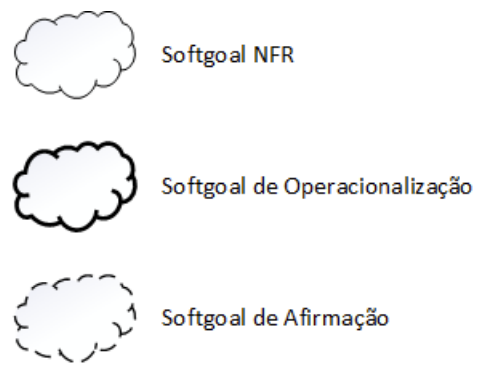
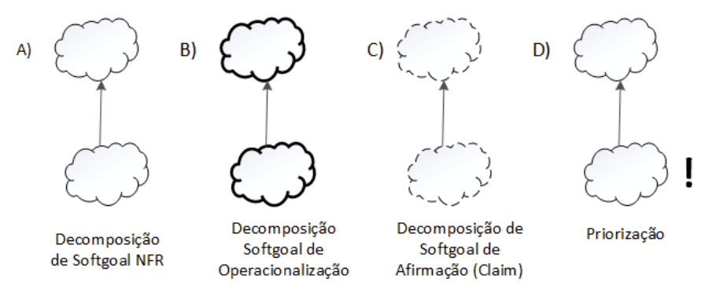

# NFR Framework

## 1. Introdução

O NFR Framework (Non-Functional Requirements Framework) é uma abordagem usada para identificar, categorizar e organizar os <a href="https://requisitos-de-software.github.io/2025.1-IBGE/elicitacao/Requisitos/">Requisitos Não-Funcionais</a> (non-functional requirements, NFRs) em sistemas de software.

## 2. Softgoal Interdependency Graph

O Softgoal Interdependency Graph (SIG) é uma representação visual fundamental do funcionamento do NFR Framework. Ele organiza os softgoals (metas não funcionais) e explicita, de forma gráfica e concisa, as decisões da equipe de desenvolvimento em relação a esses objetivos, bem como suas interdependências e possíveis conflitos <a id="anchor_1" href="#REF1">^1^</a>.

### 2.1 Tipos de Softgoal

Segundo Silva (2019)<a id="anchor_1" href="#REF1">^1^</a>., existem três tipos de Softgoals:

<ul>
<li><b>NFR:</b> representa os requisitos não-funcionais e podem estar interrelacionados, organizados em catálogos e apresentados de forma hierárquica no desenvolvimento do projeto.
<li><b>Operacionalização:</b> representam soluções de implementação para satisfazer softgoals NFR ou outros softgoals de operacionalização. Essas soluções
incluem operações, processos, representações de dados, estruturações e restrições
no sistema alvo para atender às necessidades indicadas pelos softgoals NFR e de
operacionalização.
<li><b>Afirmação:</b> permitem que as características do domínio (como prio-
ridades e carga de trabalho) sejam consideradas e devidamente refletidas no processo
de tomada de decisão. Eles servem como justificativa para apoiar ou negar a forma
como os softgoals são priorizados, refinados e os componentes são selecionados. Os
softgoals de afirmação fornecem as razões para as decisões de desenvolvimento, facili-
tando a revisão, a justificativa e a mudança do sistema, bem como o aprimoramento
da rastreabilidade.
</ul>

A representação destes softgoals podem ser observados na Figura 1.

<b>Figura 1</b> - Tipos de Softgoal

 Fonte: (SILVA, 2019)

#### 2.1.1 Interdependências

As interdependências representam as relações estabelecidas entre diferentes softgoals no NFR Framework. Essas interdependências são classificadas em dois tipos principais: decomposições e contribuições.

#### 2.1.2 Decomposições

As decomposições no NFR Framework podem ocorrer em diferentes níveis de abstração: softgoals de requisitos não funcionais (NFR), de operacionalização, de afirmação e de priorização (SILVA, 2019)<a id="anchor_1" href="#REF1">^1^</a>. Nas três primeiras categorias, os softgoals são subdivididos em softgoals mais específicos, contribuindo para a redução de ambiguidades e facilitando a análise e o refinamento dos requisitos. Os quatro tipos de decomposição estão representados na Figura 2:

<ul>
<li>Decomposição NFR: permite dividir preocupações primordiais em partes menores, promovendo clareza e auxiliando na definição de prioridades.

<li>Decomposição de Operacionalização: visa detalhar uma solução geral, desmembrando-a em soluções específicas e concretas.

<li>Decomposição de Afirmação: utilizada para expressar a aceitação ou negação de justificativas específicas no contexto do projeto.

<li>Decomposição de Priorização: uma decomposição especial em que o softgoal é refinado em outro softgoal de mesmo tipo e tópico, mas com a associação de um nível de prioridade.
</ul>

<b>Figura 2</b> - Tipos de Decomposição

 Fonte: (SILVA, 2019)

#### 2.1.3 Contribuições

No NFR Framework, os softgoals tendem a se especializar progressivamente por meio de refinamentos. Consequentemente, um softgoal derivado pode contribuir para o softgoal do qual se originou de maneira parcial ou integral, e de forma positiva ou negativa. A seguir, apresentam-se os principais tipos de contribuição <a id="anchor_1" href="#REF1">^1^</a>:

<ul>

<li>AND: todos os softgoals derivados devem ser satisfeitos para que o softgoal principal também o seja.

<li>OR: a satisfação de qualquer um dos softgoals derivados é suficiente para satisfazer o softgoal principal.

<li>MAKE (++): o softgoal derivado contribui de forma totalmente positiva para o softgoal principal, garantindo sua satisfação.

<li>BREAK (--): o softgoal derivado contribui de forma totalmente negativa, comprometendo a satisfação do softgoal principal.

<li>HELP (+): há uma contribuição positiva parcial, que favorece o softgoal principal, mas sem garanti-lo plenamente.

<li>HURT (-): contribuição negativa parcial, que dificulta a satisfação do softgoal principal, porém sem invalidá-lo completamente.

<li>UNKNOWN (?): o tipo e intensidade da contribuição são indeterminados.

<li>EQUALS: indica uma relação direta de equivalência entre o softgoal derivado e o softgoal principal — satisfazer um implica satisfazer o outro.

<li>SOME: a forma da contribuição (positiva ou negativa) é conhecida, mas sua intensidade permanece indefinida.
</ul>

#### 2.1.4 Procedimentos de Avaliação

Segundo Silva (2019), o procedimento de avaliação determina o grau que os requisitos não funcionais são satisfeitos por um conjunto de decisões. Dessa forma, o procedimento de avaliação determina
se cada softgoal ou interdependência do SIG foi suficientemente satisfeito. Para isso, são
atribuídos rótulos para os softgoals <a id="anchor_1" href="#REF1">^1^</a>:

**✓ (Satisfeito):** Indica que um requisito contribui positivamente para a satisfação de outro.

**𝒲⁺ (Fracamente satisfeito):** Representa uma contribuição positiva, porém com intensidade reduzida.

**✗ (Negado):** O requisito impacta negativamente outro, negando ou contradizendo sua realização.

**𝒲⁻ (Fracamente negado):** Sinaliza um impacto negativo menos intenso que o anterior.

**⚡(Conflitante):** Indica a existência de um conflito entre requisitos, com características tanto positivas quanto negativas.

**u (Indeterminado):** Representa uma relação cujo impacto é desconhecido ou não pode ser determinado com as informações disponíveis.

## 3. Metodologia

Os frameworks foram agrupados por temas, que por sua vez foram divididos em três categorias para limitar o escopo da análise. A partir desses temas, foi realizada uma introspecção para a construção do Softgoal Interdependency Graph (SIG), tomando como base os tópicos gerais definidos. O objetivo foi estabelecer relações com os requisitos não funcionais da Tabela 12.

Em seguida, realizou-se uma revisão da literatura para embasar teoricamente o modelo, seguida pela validação do SIG construído. A ferramenta utilizada para a elaboração do gráfico foi o <a href="https://app.diagrams.net/">Draw.io</a>.

## 4. Cartões de Especificação

 O cartão de especificação é um documento utilizado na engenharia de requisitos para registrar, de forma clara e padronizada, os Requisitos Não Funcionais (RNFs) de um sistema. Ele serve como um guia para garantir que todos os envolvidos no projeto compreendam o propósito, a origem, a prioridade e os critérios de aceitação de cada requisito. O cartão de especificação do presente projeto segue o seguinte formato:

Tabela 1: Template de cartão de especificação 

| Campo              | Descrição |
|--------------------|-----------|
| **Nr Requisito:**  | RNFXX |
| **Classificação:** | Classificação do RNF conforme a hierarquia do catálogo. |
| **Descrição:**     | Declaração única do significado do requisito |
| **Justificativa:** | Justificativa sobre a criação do requisito |
| **Origem:**        | Origem do requisito (*stakeholder*, norma técnica e etc...) |
| **Critério de Ajuste:** | Métrica do requisito que possa ser testada e que deve ser satisfeita. |
| **Dependências:**  | Requisitos relacionados a este. |
| **Prioridade:**    | Um número usado para decidir a importância relativa deste requisito entre os outros RNFs (varia de 1 a 10). A prioridade mínima é 1 e a máxima é 10. |
| **Conflitos:**     | Requisitos conflitantes com este. |
| **História:**      | Data de criação e de modificações. |

Fonte:[Caio Duarte](https://github.com/caioduart3), 2025.

Os cartões de especificação elaborados podem ser visualizados nas tabelas de 2 a 5:

Tabela 2: Cartão de especificação - RNF80 

| Campo              | Descrição |
|--------------------|-----------|
| **Nr Requisito:**  | RNF80 |
| **Classificação:** | Usabilidade  |
| **Descrição:**     | O sistema deve apresentar feedback visual e/ou sonoro para todas as ações do usuário, como cliques, carregamentos e envios de formulários. |
| **Justificativa:** | O feedback imediato melhora a experiência do usuário, reduz a incerteza sobre o funcionamento do sistema e aumenta a confiança nas interações. |
| **Origem:**        | Stakeholder (usuários), diretrizes de UX (User Experience). |
| **Critério de Ajuste:** | Para 100% das interações de entrada do usuário, deve haver resposta visual (como mudança de cor, loading spinner ou mensagem de sucesso/erro). Testes devem confirmar que usuários percebem o feedback em até 1 segundo após a ação. |
| **Dependências:**  | Nenhuma |
| **Prioridade:**    | 8 |
| **Conflitos:**     | Pode conflitar com configurações de acessibilidade ou desempenho em dispositivos com recursos limitados. |
| **História:**      | Criado em 31/05/2025. Sem modificações até o momento. |

Fonte: [Mayara Marques](https://github.com/maymarquee), 2025.

Tabela 3: Cartão de especificação - RNF77 

| Campo              | Descrição |
|--------------------|-----------|
| **Nr Requisito:**  | RNF77 |
| **Classificação:** | Usabilidade |
| **Descrição:**     | A interface do aplicativo deve seguir as diretrizes de design responsivo, garantindo usabilidade adequada em dispositivos móveis e tablets. |
| **Justificativa:** | Com o crescente uso de dispositivos móveis, é essencial que o aplicativo ofereça uma boa experiência de uso em diferentes tamanhos de tela. |
| **Origem:**        | Stakeholder (usuários finais) e boas práticas de design (Material Design, Human Interface Guidelines). |
| **Critério de Ajuste:** | O sistema deve se adaptar corretamente a resoluções de tela entre 320px e 1280px, sem perda de funcionalidade ou legibilidade. Testes de usabilidade devem confirmar uma taxa de sucesso mínima de 90% em tarefas básicas. |
| **Dependências:**  | Nenhuma |
| **Prioridade:**    | 9 |
| **Conflitos:**     | Pode conflitar com requisitos que definem layouts fixos ou específicos para desktop. |
| **História:**      | Criado em 31/05/2025. |

Fonte: [Caio Duarte](https://github.com/caioduart3), 2025.

Tabela 4: Cartão de especificação - RNF08 

| Campo              | Descrição |
|--------------------|-----------|
| **Nr Requisito:**  | RNF08 |
| **Classificação:** | Usabilidade |
| **Descrição:**     | O usuário deve poder desfazer ou refazer ações como desfavoritar indicadores, redefinir filtros ou cancelar comandos, evitando que erros exijam reinício completo da interação. |
| **Justificativa:** | Sua aplicação oferece maior controle sobre a navegação e reduz o impacto de ações equivocadas, promovendo uma experiência mais fluida e intuitiva. |
| **Origem:**        | Stakeholder (usuários), diretrizes de UX (User Experience). |
| **Critério de Ajuste:** | O sistema deve permitir, no mínimo, desfazer e refazer as três ações mencionadas sem necessidade de recarregar a página. |
| **Dependências:**  | Nenhuma |
| **Prioridade:**    | 8 |
| **Conflitos:**     | Nenhum identificado. |
| **História:**      | Criado em 01/06/2025. |

Fonte: [Ludmila Nunes](https://github.com/ludmilaaysha), 2025.

Tabela 5: Cartão de especificação - RNF09 

| Campo              | Descrição |
|--------------------|-----------|
| **Nr Requisito:**  | RNF09 |
| **Classificação:** | Usabilidade |
| **Descrição:**     | O sistema deve alertar o usuário antes de realizar ações críticas, e evitar campos que possam ser preenchidos incorretamente sem validação. |
| **Justificativa:** | Essa prática visa proteger os dados do usuário e evitar perdas ou ações indesejadas, promovendo maior segurança e confiança no uso do sistema. |
| **Origem:**        | Boas práticas de desenvolvimento centrado no usuário. |
| **Critério de Ajuste:** | Ações como "limpar filtros", "excluir favoritos" ou "encerrar sessão" devem exibir um aviso de confirmação. Campos obrigatórios devem ter validação com mensagens de erro. |
| **Dependências:**  | Nenhuma |
| **Prioridade:**    | 9 |
| **Conflitos:**     | Nenhum identificado. |
| **História:**      | Criado em 01/06/2025. |

Fonte: [Ludmila Nunes](https://github.com/ludmilaaysha), 2025.

Tabela 6: Cartão de especificação - RNF06 

| Campo              | Descrição |
|--------------------|-----------|
| **Nr Requisito:**  | RNF06 |
| **Classificação:** | Responsividade |
| **Descrição:**     | A interface do aplicativo deve se adaptar corretamente a diferentes tamanhos de tela e resoluções, garantindo boa visualização em smartphones, tablets e outros dispositivos. |
| **Justificativa:** | A diversidade de dispositivos usados pelos usuários requer que a interface mantenha consistência e boa experiência, independentemente do tamanho da tela. |
| **Origem:**        | Stakeholders (usuários finais) e diretrizes de acessibilidade/responsividade de interfaces. |
| **Critério de Ajuste:** | O aplicativo deve manter sua funcionalidade e legibilidade em telas de 4" a 13", com resoluções variando de 320x480 até 1920x1080. Os testes devem indicar ao menos 90% de compreensão visual e navegação bem-sucedida por usuários reais. |
| **Dependências:**  | Bibliotecas e frameworks de UI responsiva (como Bootstrap, Flutter, etc). |
| **Prioridade:**    | 7 |
| **Conflitos:**     | Pode entrar em conflito com layouts fixos ou hardcoded para desktop. |
| **História:**      | Criado em 01/06/2025. |

Fonte: [Gabriel Pinto](https://github.com/GabrielSPinto), 2025.

## 5. NFR

Analisados os requistos, conclui-se que, no geral, os requisitos do projeto buscam englobar as seguintes softgoals de <b>Usabilidade</b> e <b>Portabilidade</b>.

O NFR do projeto pode ser visualizado ao clicar <a href="./../../assets/images/modelagem/NFR-IBGE.drawio.svg">aqui</a> ou visualizado na Figura 3: 

Figura 3: NFR framework - IBGE 

Fonte: [Caio Duarte](https://github.com/caioduart3), [Gabriel Pinto](https://github.com/GabrielSPinto), [João Félix](https://github.com/joaofmoreiraa), [Laryssa Felix](https://github.com/felixlaryssa), [Letícia Monteiro](https://github.com/LeticiaMonteiroo), [Ludmila Nunes](https://github.com/ludmilaaysha) e [Mayara Marques](https://github.com/maymarquee), 2025.
 

## 6. Afirmações (Claims):

Segundo Chung et al. (2000), os claims são declarações que justificam afirmações de projeto no modelo NFR, especialmente quando há trade-offs entre requisitos não funcionais. Eles funcionam como uma racionalização estruturada, permitindo registrar o porquê de determinada decisão ter sido tomada mesmo diante de impactos negativos ou incertezas.

### 6.1. O uso de frameworks modernos reduz o impacto negativo em desempenho e manutenção:

O claim acima justifica que a utilização de frameworks modernos pode mitigar os impactos negativos causados pela busca por adaptabilidade da interface, como aumento da complexidade, prejuízo ao desempenho e dificuldade de manutenção. Ferramentas como Flutter, React Native e Bootstrap facilitam a responsividade e promovem reutilização de componentes, permitindo atingir o softgoal Adaptabilidade da Interface com menor custo e esforço. Dessa forma, mesmo havendo trade-offs, o uso dessas tecnologias representa uma solução viável e equilibrada.

## 7. Bibliografia

> <a id="REF1" href="#anchor_1">1.</a> SILVA, Reinaldo Antônio. NFR4ES: Um Catálogo de Requisitos Não-Funcionais para Sistemas Embarcados. Centro de Informática UFPE, Recife, 2019. Disponível em: <https://repositorio.ufpe.br/handle/123456789/34150>. Acesso em: 28 de mai de 2025.
> <a id="REF2" href="#anchor_2">2.</a> CHUNG, Lawrence; NIXON, Brian A.; YU, Eric; MAIDA, John. Non-Functional Requirements in Software Engineering. Boston: Springer, 2000.

## 8. Histórico de Versões 

Tabela XX: Histórico de versões

| Versão |Descrição     |Autor                                       |Data    |Revisor|
|:-:     | :-:          | :-:                                        | :-:        |:-:|
|1.0     |Criação do documento com introdução e bibliografia| [Caio Duarte](https://github.com/caioduart3)| 28/05/2025 | [Mayara Marques](https://github.com/maymarquee) |
|1.1     |Adiciona tabela 2| [Mayara Marques](https://github.com/maymarquee)  | 31/05/2025 | [Caio Duarte](https://github.com/caioduart3) |
|1.2     |Adiciona tabela 3| [Caio Duarte](https://github.com/caioduart3)| 31/05/2025 | [Mayara Marques](https://github.com/maymarquee) |
|1.3    | Produção do Framework NFR do RNF06 | [Gabriel Pinto](https://github.com/GabrielSPinto)                    | 31/05/2025 | [Letícia Monteiro](https://github.com/LeticiaMonteiroo)             |
|1.4    | Produção do Framework NFR do RNF01 | [João Félix](https://github.com/joaofmoreiraa)                       | 31/05/2025 | [Mayara Marques](https://github.com/maymarquee)                     |
|1.5    | Produção do Framework NFR do RNF08 | [Ludmila Nunes](https://github.com/ludmilaaysha)                     | 31/05/2025 | [Gabriel Pinto](https://github.com/GabrielSPinto)                    |
|1.6    | Produção do Framework NFR do RNF09 | [Ludmila Nunes](https://github.com/ludmilaaysha)                     | 31/05/2025 | [João Félix](https://github.com/joaofmoreiraa)                       |
|1.7    | Produção do Framework NFR do RNF27 | [Caio Duarte](https://github.com/caioduart3)                         | 31/05/2025 | [Laryssa Felix](https://github.com/felixlaryssa)                     |
|1.8    | Produção do Framework NFR do RNF28 | [Mayara Marques](https://github.com/maymarquee)                      | 31/05/2025 | [Caio Duarte](https://github.com/caioduart3)                         |
|1.9    | Produção do Framework NFR do RNF45 | [Letícia Monteiro](https://github.com/LeticiaMonteiroo)             | 31/05/2025 | [Ludmila Nunes](https://github.com/ludmilaaysha)                     |
|1.10    | Produção do Framework NFR do RNF84 | [Laryssa Felix](https://github.com/felixlaryssa)                     | 31/05/2025 | [João Félix](https://github.com/joaofmoreiraa)                       |
|1.11     | Adiciona tabelas 4 e 5| [Ludmila Nunes](https://github.com/ludmilaaysha) | 01/06/2025 | [Mayara Marques](https://github.com/maymarquee) |
|1.12     | Adiciona tabelas 6| [Gabriel Pinto](https://github.com/GabrielSPinto) | 01/06/2025 | [Caio Duarte](https://github.com/caioduart3) |
|1.13     | Adiciona Afirmações| [Gabriel Pinto](https://github.com/GabrielSPinto) | 01/06/2025 | [Laryssa Felix](https://github.com/felixlaryssa) |

Fonte: [Caio Duarte](https://github.com/caioduart3), [Gabriel Pinto](https://github.com/GabrielSPinto), [João Félix](https://github.com/joaofmoreiraa), [Laryssa Felix](https://github.com/felixlaryssa), [Letícia Monteiro](https://github.com/LeticiaMonteiroo), [Ludmila Nunes](https://github.com/ludmilaaysha) e [Mayara Marques](https://github.com/maymarquee), 2025.
 