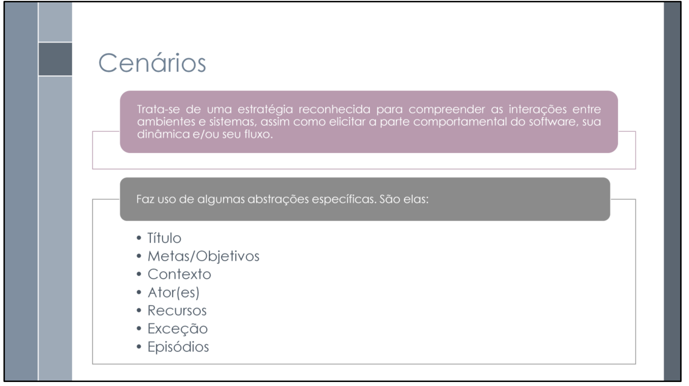

# Cenários

## 1. Introdução

Cenários se trata de uma estratégia usada para reconhecer interações entre ambientes e sistemas (SERRANO; SERRANO, 2025). Elementos como o comportamento do software, sua dinâmica e seu fluxo são possíveis de serem entendidos com cenários.

Podemos trazer os conceitos de cenários para o aplicativo IBGE, explorando diversos cenários que os usuários da aplicação podem passar ao utilizar o aplicativo. Esses cenários estão expostos nas tabelas de 1 a -. 

## 2. Bibliografia

> SERRANO, Milene; SERRANO, Maurício. Requisitos – Aula 10. UnB, 2025, p. 8. Disponível em: <https://aprender3.unb.br/pluginfile.php/3096108/mod_resource/content/1/Aula%2010.pdf>. Acesso em: 13 maio 2025.

## 3. Histórico de Versões 

Tabela 1: Histórico de versões

| Versão |Descrição     |Autor                                       |Data    |Revisor|
|:-:     | :-:          | :-:                                        | :-:        |:-:|
|1.0     |Criação do documento com introdução e bibliografia| [Mayara Marques](https://github.com/maymarquee)| 13/05/2025 | [Larysssa Felix](https://github.com/felixlaryssa) |

Fonte: [Caio Duarte](https://github.com/caioduart3), [Gabriel Pinto](https://github.com/GabrielSPinto), [João Félix](https://github.com/joaofmoreiraa), [Larysssa Felix](https://github.com/felixlaryssa), [Letícia Monteiro](https://github.com/LeticiaMonteiroo), [Ludmila Nunes](https://github.com/ludmilaaysha) e [Mayara Marques](https://github.com/maymarquee), 2025.
 