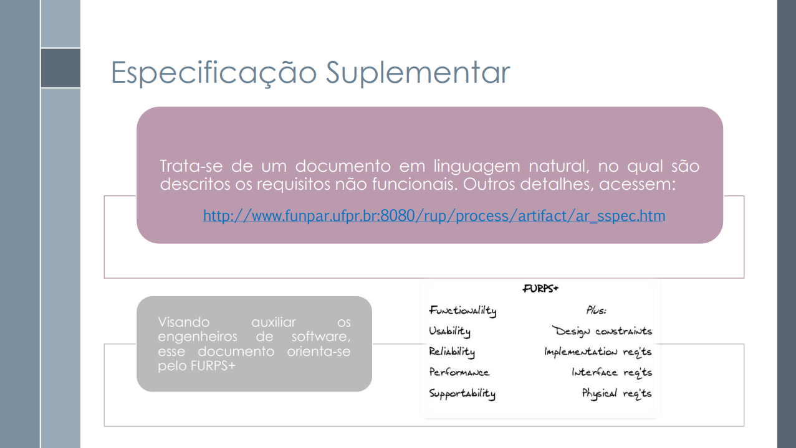
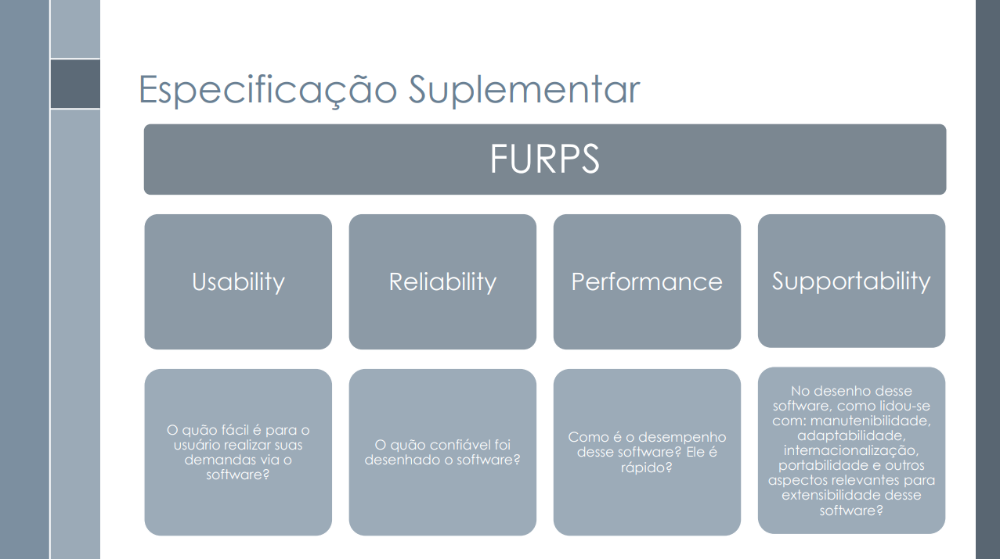
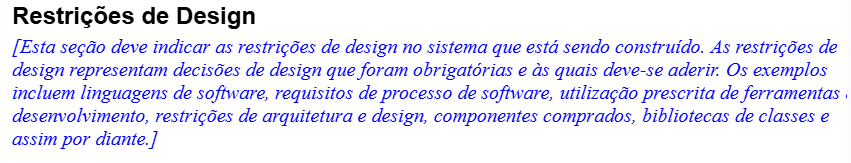

## 1. Introdução 

Nem todo requisito de um sistema pode ser descrito apenas por meio dos [casos de uso](https://requisitos-de-software.github.io/2025.1-IBGE/modelagem/useCases/#11-referencias). Muitos aspectos essenciais, como desempenho, confiabilidade, segurança ou até restrições legais, ficam de fora desse formato. Por isso é necessária a Especificação Suplementar, um documento dedicado a reunir tudo aquilo que o sistema precisa atender além das interações funcionais com o usuário.

Essa especificação serve como uma camada complementar, responsável por organizar e detalhar requisitos que envolvem desde restrições técnicas até atributos de qualidade, padrões regulatórios e exigências específicas de ambiente e compatibilidade. Em vez de focar no "o que o sistema faz", ela ilumina o "como ele deve ser".

Para estruturar esse conjunto de informações de forma clara e abrangente, é comum adotar o modelo FURPS+, que categoriza os requisitos em grupos como [Funcionalidade](http://127.0.0.1:8000/Requisitos-de-Software/2025.1-Grupo05/modelagem/especificacaoSuplementar/#3-metodologia), [Usabilidade](http://127.0.0.1:8000/Requisitos-de-Software/2025.1-Grupo05/modelagem/especificacaoSuplementar/#3-metodologia), [Confiabilidade](http://127.0.0.1:8000/Requisitos-de-Software/2025.1-Grupo05/modelagem/especificacaoSuplementar/#3-metodologia), [Desempenho](http://127.0.0.1:8000/Requisitos-de-Software/2025.1-Grupo05/modelagem/especificacaoSuplementar/#3-metodologia), [Suportabilidade](http://127.0.0.1:8000/Requisitos-de-Software/2025.1-Grupo05/modelagem/especificacaoSuplementar/#3-metodologia) e outros aspectos adicionais. Assim, a Especificação Suplementar se consolida como peça-chave para garantir que o sistema final seja robusto, aderente às expectativas e pronto para operar em seu contexto real.

## 2. Finalidade

A especificação suplementar tem como objetivo documentar todos os requisitos do sistema que não são capturados nos casos de uso, especialmente os requisitos não-funcionais, regras de negócio, restrições técnicas ou legais e condições de qualidade. Ela existe para garantir que o sistema não atenda apenas às funcionalidades esperadas,
mas também seja eficiente, seguro, compatível, legalmente adequado e utilizável, assegurando que todos os aspectos essenciais à qualidade e ao funcionamento do sistema sejam considerados no seu desenvolvimento.

## 3. Metodologia

A descrição dos requisitos foi elaborada com base no modelo FURPS+, uma abordagem utilizada para classificar os requisitos de um sistema. O acrônimo FURPS+ representa cinco categorias principais de requisitos, além de outras considerações adicionais indicadas pelo sinal de “+”. São elas:

- F - Functionality [(Funcionalidade)](http://127.0.0.1:8000/Requisitos-de-Software/2025.1-Grupo05/modelagem/especificacaoSuplementar/#4-especificacao-suplementar): engloba os aspectos funcionais do software, isto é, os comportamentos e serviços que ele deve fornecer. Nesta categoria, estão incluídos os requisitos já detalhados por meio dos casos de uso.

- U - Usability [(Usabilidade)](http://127.0.0.1:8000/Requisitos-de-Software/2025.1-Grupo05/modelagem/especificacaoSuplementar/#52-usabilidade): refere-se à qualidade da interação do usuário com o sistema. Leva em conta princípios de usabilidade como os propostos por Nielsen (PREECE; ROGERS; SHARP, 2005, p. 48-49), questionando, por exemplo, "quão fácil é para o usuário realizar suas tarefas com o software?"

- R - Reliability [(Confiabilidade)](http://127.0.0.1:8000/Requisitos-de-Software/2025.1-Grupo05/modelagem/especificacaoSuplementar/#53-confiabilidade): diz respeito à robustez e integridade do sistema, incluindo requisitos como frequência e severidade de falhas, tempo médio entre falhas, capacidade de recuperação, e interoperabilidade.

- P - Performance [(Desempenho)](http://127.0.0.1:8000/Requisitos-de-Software/2025.1-Grupo05/modelagem/especificacaoSuplementar/#54-desempenho): abrange os requisitos relacionados ao desempenho do sistema, como tempo de resposta, uso de recursos (memória, CPU), disponibilidade e escalabilidade.

- S - Supportability [(Suportabilidade)](http://127.0.0.1:8000/Requisitos-de-Software/2025.1-Grupo05/modelagem/especificacaoSuplementar/#55-suportabilidade): agrupa características que facilitam o suporte e a manutenção do sistema, incluindo testabilidade, adaptabilidade, compatibilidade, escalabilidade, manutenibilidade, localizabilidade, entre outras.

- “+” - Outros requisitos não funcionais: esta categoria contempla restrições adicionais que não se enquadram nas anteriores, como:

    - Requisitos de design: imposições sobre ferramentas, padrões ou estilos de desenvolvimento.

    - Requisitos de implementação: especificações relacionadas ao código, como uso obrigatório de determinadas linguagens ou frameworks.

    - Requisitos de interface: restrições específicas sobre como o sistema deve interagir com o usuário.

    - Requisitos físicos: limitações de hardware, como dimensões, materiais ou peso.

## 4. Especificação Suplementar

### 5.1 Funcionalidades 

Os requisitos funcionais estão localizados na seção de Elicitação dentro da página de [Requisitos Elicitados](https://requisitos-de-software.github.io/2025.1-IBGE/elicitacao/Requisitos/#3-requisitos-elicitados), especificamente na [tabela 1](https://requisitos-de-software.github.io/2025.1-IBGE/elicitacao/Requisitos/#3-requisitos-elicitados).

### 5.2 Usabilidade

| **ID** | **Descrição do Requisito Não Funcional**                                                                                                                       |
| ------ | -------------------------------------------------------------------------------------------------------------------------------------------------------------- |
| RNF11  | O sistema deve manter um padrão de cores, fontes, botões e posicionamento dos elementos da interface em todas as telas, garantindo consistência visual. |
| RNF13  | Toda ação realizada pelo usuário deve gerar um feedback visual ou sonoro imediato, para garantir que o usuário compreenda o resultado da sua interação. |
| RNF14  | O sistema deve permitir a alteração do tamanho da fonte em toda a interface. |
| RNF15  | O sistema deve oferecer a opção de ativar o modo noturno, alterando o esquema de cores para tons escuros. |
| RNF16  | Um novo usuário deve ser capaz de realizar as tarefas principais em até 5 minutos de uso do aplicativo, sem necessidade de ajuda externa. |
| RNF17  | A interface do aplicativo deve se adaptar corretamente a diferentes tamanhos de tela e resoluções, garantindo boa visualização em smartphones, tablets e outros dispositivos. |
| RNF18  | O sistema deve informar o usuário, em tempo real, sobre o andamento de processos como carregamento de dados, envio de formulários ou sincronização, por meio de barras de progresso, ícones animados ou mensagens de status. |
| RNF19  | O usuário deve poder desfazer ou refazer ações como desfavoritar indicadores, redefinir filtros ou cancelar comandos, evitando que erros exijam reinício completo da interação. |
| RNF20  | O sistema deve alertar o usuário antes de realizar ações críticas, e evitar campos que possam ser preenchidos incorretamente sem validação. |

Fonte: [Ludmila Nunes](https://github.com/ludmilaaysha), 2025.

### 5.3 Confiabilidade

| **ID** | **Descrição do Requisito Não Funcional**                                                                                                                                   |
| ------ | -------------------------------------------------------------------------------------------------------------------------------------------------------------------------- |
| RNF21  | O sistema deve apresentar tempo médio entre falhas (MTBF - Mean Time Between Failures) superior a 100 horas de uso contínuo.                                                                            |
| RNF22  | O aplicativo deve ser capaz de recuperar automaticamente sessões interrompidas devido a quedas de conexão ou falhas inesperadas.                                           |
| RNF23  | Em caso de falha, o sistema deve registrar o erro localmente e sincronizar com o servidor assim que houver conexão, para fins de diagnóstico e correção.                   |
| RNF24  | O aplicativo deve manter a integridade dos dados mesmo em casos de encerramento abrupto ou desligamento inesperado do dispositivo.                                         |
| RNF25  | O sistema deve oferecer mensagens de erro compreensíveis e orientações claras para o usuário em caso de falhas, sem exibir códigos técnicos confusos.                      |
| RNF26  | A comunicação entre o aplicativo e os servidores do IBGE deve utilizar protocolos seguros (ex: HTTPS), garantindo a confiabilidade na transferência de dados.              |
| RNF27  | O aplicativo deve passar por testes de estresse e de carga para garantir seu funcionamento estável mesmo com picos de acesso simultâneo.                                   |
| RNF28  | O sistema deve garantir interoperabilidade com diferentes versões dos principais sistemas operacionais móveis (Android e iOS), mantendo a estabilidade entre atualizações. |

Fonte: [Laryssa Felix](https://github.com/felixlaryssa), 2025.

### 5.4 Desempenho

| **ID** | **Descrição do Requisito Não Funcional**                                                                                                                                               |
| ------ | -------------------------------------------------------------------------------------------------------------------------------------------------------------------------------------- |
| RNF29  | O sistema deve apresentar tempo de resposta inferior a 2 segundos para carregamento de telas principais, como visualização de notícias, dados e gráficos.                              |
| RNF30  | O aplicativo deve utilizar no máximo 60% da CPU do dispositivo durante operações de uso intenso, como filtros de dados ou geração de gráficos.                                         |
| RNF31  | O consumo de memória RAM pelo aplicativo não deve ultrapassar 250 MB em uso comum, garantindo desempenho mesmo em smartphones intermediários.                                          |
| RNF32  | O aplicativo deve estar disponível para acesso 99,5% do tempo ao longo do mês, considerando atualizações, falhas e manutenções.                                                        |
| RNF33  | O sistema deve suportar pelo menos 5.000 acessos simultâneos sem degradação perceptível de desempenho.                                                                                 |
| RNF34  | O tempo de sincronização de dados com o servidor não deve ultrapassar 5 segundos em redes 4G ou superiores.                                                                            |
| RNF35  | A navegação entre seções do app (como estatísticas, indicadores e notícias) deve ocorrer com transições de no máximo 1 segundo para garantir fluidez na experiência do usuário.        |
| RNF36  | O sistema deve realizar compressão de dados para reduzir o tempo de carregamento de conteúdo, principalmente em conexões móveis com baixa velocidade.                                  |
| RNF37  | O desempenho do aplicativo deve ser validado em pelo menos três modelos diferentes de smartphones (baixo, médio e alto desempenho), garantindo funcionalidade mínima em cada um deles. |

 
Fonte: [Laryssa Felix](https://github.com/felixlaryssa), 2025.

### 5.5 Suportabilidade
| **ID** | **Descrição do Requisito Não Funcional**                                                                                                                       |
| ------ | -------------------------------------------------------------------------------------------------------------------------------------------------------------- |
| RNF01  | O sistema deve estar em conformidade com a LGPD (Lei nº 13.709/2018), assegurando o tratamento seguro, legal e transparente dos dados pessoais coletados.      |
| RNF02  | O sistema deve criptografar todos os dados pessoais transmitidos utilizando TLS 1.2 ou superior.                                                               |
| RNF03  | O sistema deve criptografar todos os dados pessoais armazenados utilizando algoritmos robustos como AES-256.                                                   |
| RNF04  | O sistema deve exibir uma política de privacidade clara ao usuário antes do início do preenchimento do Censo.                                                  |
| RNF05  | O sistema deve registrar o consentimento explícito do usuário para o uso de seus dados pessoais.                                                               |
| RNF06  | O sistema deve permitir que o usuário solicite a exclusão ou correção de seus dados pessoais conforme previsto na LGPD.                                        |
| RNF07  | O sistema deve registrar logs detalhados dos eventos de autenticação e envio de dados, incluindo data/hora, IP, status da operação e identificador do usuário. |
| RNF08  | Os logs do sistema devem ser armazenados de forma segura e imutável por no mínimo 5 anos para fins de auditoria.                                               |
| RNF09  | O acesso aos logs deve ser restrito a usuários autorizados com controle de acesso baseado em perfis.                                                           |
| RNF10  | O sistema deve permitir a geração de relatórios de auditoria sob demanda.                                                                                      |

Fonte: [Caio Duarte](https://github.com/caioduart3), 2025.

### 5.6 Restrições de Design

| **ID** | **Descrição do Requisito Não Funcional**                                                                                                                                   |
| ------ | -------------------------------------------------------------------------------------------------------------------------------------------------------------------------- |
| RNF38  | O design visual do aplicativo deve preservar a identidade visual do IBGE, incluindo uso das cores institucionais e logotipo oficial.                               |
| RNF39  | O sistema deve seguir o princípio da responsividade, adaptando-se automaticamente a diferentes tamanhos e orientações de tela.                                             |
| RNF40  | Todas as decisões de design devem priorizar a **simplicidade e clareza na interação com dados estatísticos**, evitando sobrecarga cognitiva no usuário.                    |
| RNF41  | A experiência do usuário deve ser priorizada, com foco em **fluxos intuitivos e navegação direta**, minimizando a quantidade de cliques até a informação desejada.         |
| RNF42  | O design da informação deve facilitar a interpretação de gráficos, mapas e tabelas, com **uso de legendas claras, cores contrastantes e ícones intuitivos**.               |
| RNF43  | O sistema deve prever escalabilidade de design para inclusão futura de novos tipos de dados, filtros e relatórios sem comprometer a estrutura atual.    
| RNF44  | O aplicativo deve estar apto a funcionar de forma offline para consulta de dados previamente sincronizados, com atualização automática quando a conexão for restabelecida. |                   

### 5.7 Requisitos de Implementação

| ID    | Descrição do Requisito Não Funcional                                                                                      |
|-------|----------------------------------------------------------------------------------------------------------------------------|
| RNF45 | O aplicativo deve ser desenvolvido utilizando tecnologias compatíveis com dispositivos Android e iOS.                     |
| RNF46 | O código-fonte deve seguir boas práticas de programação, com uso de versionamento (ex: Git) e documentação de métodos.    |
| RNF47 | O sistema deve ser compatível com bibliotecas gráficas modernas para renderização de gráficos estatísticos.               |
| RNF48 | O aplicativo deverá utilizar frameworks responsivos que permitam adaptação automática a diferentes tamanhos de tela.      |
| RNF49 | O tempo de inicialização do aplicativo não deve ultrapassar 3 segundos em dispositivos de entrada compatível.             |
| RNF50 | O aplicativo deve ser projetado com arquitetura modular, facilitando futuras manutenções e atualizações.                  |

Fonte: [Joao Felix](https://github.com/joaofmoreiraa), 2025.

### 5.8 Requisitos de Sistema de Ajuda e de Documentação de Usuário Online

| ID    | Descrição do Requisito Não Funcional                                                                                       |
|-------|-----------------------------------------------------------------------------------------------------------------------------|
| RNF51 | O aplicativo deve conter uma seção de ajuda acessível a partir do menu principal, com instruções claras de uso.            |
| RNF52 | A documentação do usuário deve estar disponível online e acessível por meio de link no próprio aplicativo.                 |
| RNF53 | A seção de ajuda deve conter tópicos de perguntas frequentes (FAQ) e tutoriais passo a passo ilustrados.                   |
| RNF54 | O conteúdo de ajuda deve ser escrito em linguagem simples, adequada ao público-alvo geral e não técnico.                   |
| RNF55 | A documentação online deve ser responsiva e acessível em diferentes dispositivos (mobile, tablet e desktop).               |
| RNF56 | O sistema deve permitir atualizações periódicas da documentação, sem necessidade de atualização do aplicativo principal.   |

Fonte: [Joao Felix](https://github.com/joaofmoreiraa), 2025.

### 5.9 Requisitos de Licenciamento

| ID    | Descrição do Requisito Não Funcional                                                                                   |
|-------|-------------------------------------------------------------------------------------------------------------------------|
| RNF57 | O aplicativo deve exibir os termos de uso e política de privacidade no primeiro acesso do usuário.                     |
| RNF58 | Todo o conteúdo de dados estatísticos deve respeitar as licenças de uso e atribuição do IBGE.                          |
| RNF59 | O software deve ser disponibilizado sob uma licença de código aberto compatível com uso governamental (ex: MIT, GPL).  |
| RNF60 | Componentes de terceiros utilizados no aplicativo devem estar devidamente licenciados e creditados.                    |
| RNF61 | O uso do aplicativo será gratuito e restrito apenas a fins informativos e educacionais, conforme normas institucionais.|

Fonte: [Joao Felix](https://github.com/joaofmoreiraa), 2025.

### 5.10 Observações Legais, de Copyright e Outras

### 5.11 Padrões Aplicáveis

| ID     | Padrão Aplicável | Descrição |
|--------|------------------|-----------|
| PAD01  | eMAG             | O Modelo de Acessibilidade de Governo Eletrônico define diretrizes para garantir que o sistema seja acessível a todas as pessoas, inclusive com deficiência. |
| PAD02  | WCAG 2.1 (AA)    | As Diretrizes de Acessibilidade para Conteúdo Web garantem que o sistema possa ser utilizado por usuários com diferentes necessidades, incluindo leitores de tela. |
| PAD03  | LGPD             | A Lei Geral de Proteção de Dados regula o tratamento de dados pessoais e deve ser integralmente seguida pelo sistema. |
| PAD04  | ISO/IEC 27001    | Padrão internacional para gestão da segurança da informação, recomendável para proteger dados sensíveis do sistema. |
| PAD05  | ABNT NBR 9241    | Norma brasileira que trata de ergonomia na interação humano-computador, aplicável à interface do sistema. |
| PAD06  | Material Design ou Bootstrap | Padrões de design visual para manter consistência na interface do usuário. |
| PAD07  | Licenças de Código Aberto (MIT, GPL, etc.) | O uso de bibliotecas e frameworks deve respeitar suas respectivas licenças de uso e distribuição. |

Fonte: [Gabriel Pinto](https://github.com/GabrielSPinto) , 2025.

### 5.12 Requisitos Físicos

## 6. Bibliografia

> BRASIL. Ministério da Ciência, Tecnologia, Inovações e Comunicações. Secretaria-Executiva. Diretoria de Tecnologia da Informação. Coordenação Geral de Sistemas. Especificação Suplementar: Sigla do Projeto – Nome do Projeto. Versão 1.0. Brasília: MCTIC. Disponível em: <https://aprender3.unb.br/pluginfile.php/3096129/mod_resource/content/2/SiglaProjeto_EspecificacaoSuplementar.pdf >. Acesso em: 14 maio 2025.

> SERRANO, Milene; SERRANO, Maurício. Requisitos – Aula 13. UnB, 2025, p. 28,29 e 30. Disponível em: [<https://aprender3.unb.br/pluginfile.php/3096108/mod_resource/content/1/Aula%2010.pdf>](https://aprender3.unb.br/pluginfile.php/3096118/mod_resource/content/1/Requisitos%20-%20Aula%20013a.pdf). Acesso em: 14 maio 2025.

> CORPORATION, Rational Software. **Rational Unified Process: Especificação Suplementar – Template**. Disponível via arquivo: rup_sspec.dot. Acesso em 12 maio 2025.

## 7. Histórico de Versões 

Tabela 3: Histórico de versões

| Versão |Descrição     |Autor                                       |Data    |Revisor|
|:-:     | :-:          | :-:                                        | :-:        |:-:|
|1.0     |Criação do documento| [Laryssa Felix](https://github.com/felixlaryssa)| 14/05/2025 | [João Félix](https://github.com/joaofmoreiraa) |
|2.0     |Tópico de introdução| [João Félix](https://github.com/joaofmoreiraa)| 14/05/2025 | [Laryssa Felix](https://github.com/felixlaryssa) |
|3.0     |Tópicos de finalidade e metodologia| [Laryssa Felix](https://github.com/felixlaryssa)| 14/05/2025 | [João Félix](https://github.com/joaofmoreiraa) |
|4.0     |Adição de RNF de suportabilidade| [Caio Duarte](https://github.com/caioduart3) | 17/05/2025 | [Ludmila Nunes](https://github.com/ludmilaaysha) |
|4.1     |Adição de RNF de usabilidade| [Ludmila Nunes](https://github.com/ludmilaaysha) | 17/05/2025 | [Caio Duarte](https://github.com/caioduart3) |
|4.2     |Adição de Padrões Aplicáveis| [Gabriel Pinto](https://github.com/GabrielSPinto) | 17/05/2025 | [Letícia Monteiro](https://github.com/LeticiaMonteiroo) |
|4.3     |Adição de RNF de confiabiliadade, desempenho e restrições de Design | [Laryssa Felix](https://github.com/felixlaryssa)| 17/05/2025 | [João Félix](https://github.com/joaofmoreiraa) |
|5.0     |Adição da bibliografia | [Laryssa Felix](https://github.com/felixlaryssa)| 17/05/2025 | [João Félix](https://github.com/joaofmoreiraa) |
|5.1     |Adição de bibliografia | [Mayara Marques](https://github.com/maymarquee)| 17/05/2025 | [Ludmila Nunes](https://github.com/ludmilaaysha) |
|5.2     |Adição de RNF de Implementação, Sistema de Ajuda e de Documentação de Usuário Online, Licenciamento | [Joao Felix](https://github.com/joaofmoreiraa)| 17/05/2025 | [Laryssa Felix](https://github.com/felixlaryssa) |

Fonte: [Caio Duarte](https://github.com/caioduart3), [Gabriel Pinto](https://github.com/GabrielSPinto), [João Félix](https://github.com/joaofmoreiraa), [Laryssa Felix](https://github.com/felixlaryssa), [Letícia Monteiro](https://github.com/LeticiaMonteiroo), [Ludmila Nunes](https://github.com/ludmilaaysha) e [Mayara Marques](https://github.com/maymarquee), 2025.
 