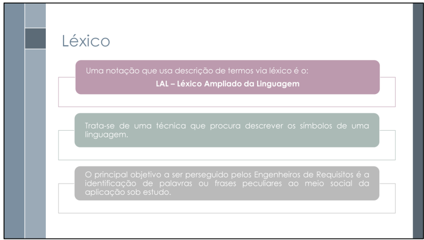

## 1. Introdução

<b>Léxico</b> é uma técnica utilizada na Engenharia de Requisitos para descrever, de forma clara e padronizada, os termos e conceitos relevantes de um sistema (SERRANO et al.). Cada termo léxico representa um símbolo ou expressão da linguagem utilizada no domínio do problema, e sua definição facilita o entendimento comum entre os envolvidos no projeto, como desenvolvedores, usuários e <i>stakeholders</i>.

## 2. Metodologia

Como pode ser observado no cronograma apresentado na <b>Tabela 1</b> e de acordo com as características apontadas na <b>Seção 2.2.</b>, as integrantes <a href="https://github.com/ludmilaaysha">Ludmila Nunes</a> e <a href="https://github.com/maymarquee">Mayara Marques</a> foram responsáveis pelo desenvolvimento dos léxicos relacionados ao aplicativo do projeto.

### 2.1. Cronograma

Tabela 1: Cronograma de elaboradores dos léxicos

| Nome                                                    |Data       | Hora  | Função                                                        | 
| ------------------------------------------------------- | ------------------------------------------------------------ | ---------- | ----- |
| [Ludmila Nunes](https://github.com/ludmilaaysha)        | 14/05/2025 | - | Elaboradora dos léxicos                                                | 
| [Mayara Marques](https://github.com/maymarquee)         | 14/05/2025 | - | Elaboradora dos léxicos                                                |

Fonte: [Ludmila Nunes](https://github.com/ludmilaaysha), 2025.

### 2.2. Abordagem utilizada

Para construção do Léxico, foi utilizada a notação <b>LAL – Léxico Ampliado da Linguagem</b>, que realiza a descrição de símbolos de uma linguagem via léxico. Para construir essa descrição, são utilizados alguns elementos, os quais incluem:

<ul>
    <li><b>Noção:</b> é a denotação do símbolo, ou seja, o que ele significa. Cada símbolo possui uma ou mais noções;</li>
    <li><b>Impacto:</b> é a conotação do símbolo, isto é, como a aplicação impacta o símbolo ou como o símbolo impacta a aplicação. Cada símbolo possui um ou mais impactos;</li>
    <li><b>Sinônimos:</b> como em dicionários, são palavras ou expressões com significados equivalentes ao do símbolo. Cada símbolo pode ter nenhum, um ou vários sinônimos;</li>
    <li><b>Tipo:</b> a LAL define quatro tipos de símbolos, os quais estão descritos na <b>Tabela 2</b>. Cada símbolo pertence a um, e somente um, tipo;</li>
    <li><b>Hiperlinks:</b> são links dentro do léxico que relacionam o símbolo a um requisito ou a outro símbolo léxico.</li>
</ul>

Tabela 2: Tipos de léxicos do LAL

| Tipo           |Noção                                                                        | Impacto                    |
| -------------- | --------------------------------------------------------------------------- | -------------------------- |
| Sujeito        | Quem é o sujeito.                                                           | As ações que executa.       |
| Verbo          | Quem realiza, quando acontece e quais os procedimentos envolvidos.          | Quais os reflexos da ação do ambiente [...] e quais os novos estados decorrentes. |
| Objeto         | Definir o objeto e identificar os outros objetos com os quais se relaciona. | Ações que podem ser aplicadas ao objeto. |
| Estado         | O que significa e quais ações levaram a esse estado.                        | Identificar outros estados e ações que podem ocorrer a partir do estado que se descreve. |

Fonte: Adaptado de (SERRANO et al.).

## 3. Léxicos

### <a id="L01" href="#anchor_L01">L01: Nome</a>

O primeiro Léxico, presente na Tabela 4, faz o uso dos seguintes requisitos não implementados: requisito (<a href ="">CÓDIGO</a>), requisito (<a href ="">CÓDIGO</a>) e requisito (<a href ="">CÓDIGO</a>).

Tabela 4: Léxico 01 – Nome (L01)

| L01           | Descrição                                                                                                                                                                                                                                                                 |
| ------------- | ------------------------------------------------------------------------------------------------------------------------------------------------------------------------------------------------------------------------------------------------------------------------- |
| <b>Classificação</b> | Tipo do léxico.                                                                                                                                                                                                                                                                     |
| <b>Impacto</b>       | Impacto do léxico.                                                                                                                                                                                                                |
| <b>Noção</b>         | Noção do léxico. Pense em usar *hiperlinks* |
| <b>Sinônimos</b>    | Sinônimos do léxico.                                                                                                                                                                                                                    |

Fonte: [Ludmila Nunes](https://github.com/ludmilaaysha) e [Mayara Marques](https://github.com/maymarquee), 2025.

## 4. Conclusão

## 5. Bibliografia

> SERRANO, Milene; SERRANO, Maurício. Requisitos – Aula 10. UnB, 2025. Disponível em: <[https://aprender3.unb.br/pluginfile.php/3096108/mod_resource/content/1/Aula%2010.pdf](https://aprender3.unb.br/pluginfile.php/3096108/mod_resource/content/1/Aula%2010.pdf)>. Acesso em: 14 de maio 2025. p. 12–20.

Figura 1: Referência de Léxicos

Fonte: (SERRANO et al.).

## Histórico de Versões 

Tabela X: Histórico de versões

| Versão |Descrição     |Autor                                       |Data    |Revisor|
|:-:     | :-:          | :-:                                        | :-:        |:-:|
|1.0     | Criação e estruturação do documento | [Ludmila Nunes](https://github.com/ludmilaaysha) | 14/05/2025 | [Mayara Marques](https://github.com/maymarquee) |

Fonte: [Caio Duarte](https://github.com/caioduart3), [Gabriel Pinto](https://github.com/GabrielSPinto), [João Félix](https://github.com/joaofmoreiraa), [Laryssa Felix](https://github.com/felixlaryssa), [Letícia Monteiro](https://github.com/LeticiaMonteiroo), [Ludmila Nunes](https://github.com/ludmilaaysha) e [Mayara Marques](https://github.com/maymarquee), 2025.
