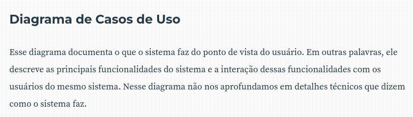

# Diagrama de Casos de Uso

## 1. Introdução

Neste documento, apresentamos os diagramas de casos de uso para o aplicativo IBGE, que tem como objetivo fornecer informações sobre a população brasileira e suas características.

## 2. Metodologia

A confecção dos diagramas de casos de uso contou com a participação de todos os membros do grupo, que utilizaram da plataforma <a href="https://app.diagrams.net/">Draw.io</a>. Os diagramas tiveram a validação do cliente Clístenes Mendonça. É possível observar o cronograma desse artefato na tabela 1, bem como a gravação de sua validação posteriormente abaixo no documento.

### 2.1 Cronograma

Tabela 1: Cronograma de elaboração e validação do artefato

| Nome                                             | Data       | Hora | Função                  |
| ------------------------------------------------ | ---------- | ---- | ----------------------- |
| [Caio Duarte](https://github.com/caioduart3)  | 06/05/2025 |  20:00   | Elaborador do diagrama |
| Clístenes Mendonça | 17/05/2025 | 23:00   | Cliente |
| [Gabriel Pinto](https://github.com/GabrielSPinto)  | 13/05/2025 | 16:00   | Elaborador de documento |
| [João Félix](https://github.com/joaofmoreiraa)  | 17/05/2025 | 16:00    | Elaborador do diagrama |
| [Larysssa Felix](https://github.com/felixlaryssa)  | 17/05/2025 | 17:00    | Elaborador do diagrama |
| [Letícia Monteiro](https://github.com/LeticiaMonteiroo)  | 17/05/2025 | 23:00    | Elaborador do diagrama e participante da validação |
| [Ludmila Nunes](https://github.com/ludmilaaysha) | 17/05/2025 | 23:00    | Elaborador do diagrama e participante da validação|
| [Mayara Marques](https://github.com/maymarquee)  | 17/05/2025 | 23:00    | Elaborador do diagrama e participante da validação |

Fonte: [Mayara Marques](https://github.com/maymarquee), 2025.

## 3. Descrição do Diagrama de Caso de Uso

O diagrama de casos de uso do aplicativo IBGE é uma ferramenta que representa, de forma gráfica e simplificada, as funcionalidades oferecidas pelo sistema sob a perspectiva dos usuários (atores). Segundo a DevMedia, esse tipo de diagrama permite visualizar as principais interações entre os atores e o sistema, contribuindo para a identificação dos requisitos funcionais. Assim, é possível compreender o que o sistema deve fazer a partir das ações que os usuários desejam realizar, facilitando a comunicação entre desenvolvedores, analistas e stakeholders.

## 4. Atores

Os atores representam os papéis exercidos pelos usuários que interagem com o sistema, sejam pessoas ou sistemas externos. Segundo a DevMedia, os atores simbolizam entidades externas que se comunicam com o sistema para realizar uma ação ou receber um serviço. Eles são fundamentais na modelagem dos casos de uso, pois ajudam a identificar os objetivos dos usuários e as funcionalidades que o sistema deve oferecer.

### 4.1 Usuário

Ator principal que representa o cidadão comum. Ele:

<ul>
<li>Visualiza notícias, dados demográficos e mapas (estados/municípios).
<li>Analisa indicadores estatísticos e compara informações por período.
<li>Consulta o calendário de eventos/coletas.
<li>Compartilha informações em redes sociais (WhatsApp, Instagram).
<li>Acessa fontes e referências dos dados apresentados.
<li>Configura preferências, como ativar/desativar notificações, acessa canais de atendimento e redes sociais do IBGE e compartilha o aplicativo com amigos.
</ul>

### 4.2 Portal IBGE

Ator secundário representando um sistema externo. Ele:

<ul>
<li>Fornece dados e referências oficiais ao aplicativo.
<li>Permite a atualização e validação das informações consultadas
</ul>

## 5. Diagramas realizados

Nas figuras 1 e 2 são possíveis observar os diagramas de casos de uso do aplicativo IBGE realizados pelo grupo.

### 5.1 Diagrama de Casos de Uso: Requisitos Implementados

Figura 1: Versão 1.0 do diagrama de Casos de uso – app IBGE : Requisitos Implementados

Fonte: [Caio Duarte](https://github.com/caioduart3) e [Mayara Marques](https://github.com/maymarquee), 2025.

### 5.2 Diagrama de Casos de Uso: Requisitos Não Implementados

Figura 2: Versão 1.0 do diagrama de Casos de uso – app IBGE : Requisitos Não Implementados

Fonte: [Caio Duarte](https://github.com/caioduart3), [Gabriel Pinto](https://github.com/GabrielSPinto), [João Félix](https://github.com/joaofmoreiraa), [Larysssa Felix](https://github.com/felixlaryssa), [Letícia Monteiro](https://github.com/LeticiaMonteiroo), [Ludmila Nunes](https://github.com/ludmilaaysha) e [Mayara Marques](https://github.com/maymarquee), 2025.

## 6. Pré-condições

No processo de modelagem de sistemas com UML, uma pré-condição é um estado necessário do sistema antes que um Caso de Uso possa ser executado. Ela representa uma regra de consistência ou um requisito técnico/funcional que deve estar satisfeito para que o fluxo de execução inicie corretamente.

<ul>
<li>O usuário deve ter acesso à internet.
<li>O aplicativo deve estar instalado em um dispositivo compatível (smartphone ou tablet).
</ul>

## 7. Pós-condições

As pós-condições representam os estados possíveis do sistema após a conclusão de um caso de uso, descrevendo o que muda ou permanece como resultado da interação com o usuário. Elas são úteis para validar os efeitos de uma funcionalidade no sistema e garantir que o comportamento esperado foi atingido.

Exemplos de pós-condições:

<ul>
<li>O usuário visualiza as informações atualizadas no aplicativo.  
<li>O usuário compartilha informações com sucesso nas redes sociais. 
</ul>

 

## 8. Fluxo de Eventos

O Fluxo de Eventos descreve como o ator interage com o sistema durante a execução de um caso de uso e é dividido em três partes. O Fluxo Básico mostra o caminho principal e bem-sucedido da interação, sempre começando com uma ação do ator e finalizando com o objetivo do caso de uso alcançado. Já os Fluxos Alternativos representam variações opcionais do fluxo básico, ocorrendo quando o ator faz uma escolha diferente, como compartilhar uma informação ou acessar uma fonte externa. Por fim, os Fluxos de Exceção tratam erros ou falhas funcionais, como dados indisponíveis ou tempo de resposta excedido. Nesses casos, o sistema informa o problema ao usuário e, sempre que possível, permite a retomada do fluxo principal.

Tabela 2: Fluxo de Eventos

| Caso de Uso                      | Fluxo Básico                                                                                                                                                                                                                                                                                                                                                                                                                                                                                                                            | Fluxos Alternativos                                                                                                                                                                                                                                                                                                                                                                                                                   | Fluxos de Exceção                                                                                                                                                                                                                                                                      |
| -------------------------------- | --------------------------------------------------------------------------------------------------------------------------------------------------------------------------------------------------------------------------------------------------------------------------------------------------------------------------------------------------------------------------------------------------------------------------------------------------------------------------------------------------------------------------------------- | ------------------------------------------------------------------------------------------------------------------------------------------------------------------------------------------------------------------------------------------------------------------------------------------------------------------------------------------------------------------------------------------------------------------------------------- | -------------------------------------------------------------------------------------------------------------------------------------------------------------------------------------------------------------------------------------------------------------------------------------- |
| **Analisar Indicadores**         | **FB1.** O sistema apresenta filtros (indicador, região, período).**FB2.** O usuário seleciona indicador. **FB3.** O sistema apresenta regiões. **FB4.** O usuário seleciona regiões. **FB5.** O sistema apresenta períodos. **FB6.** O usuário seleciona período. **FB7.** O sistema valida conexão com internet. \[FA1] **FB8.** O sistema consulta base e apresenta indicadores. **FB9.** O sistema permite comparação. **FB10.** O usuário pode compartilhar. \[FA2] **FB11.** Finaliza caso de uso. | **FA1. Sem conexão:** FA1.1. Sistema informa ausência de conexão. FA1.2. Retorna ao passo FB1 após reconexão. FA1.3. Finaliza fluxo.  **FA2. Compartilhar:** FA2.1. Exibe opções de compartilhamento. FA2.2. Usuário escolhe rede. FA2.3. Sistema compartilha. FA2.4. Retorna ao FB11. FA2.5. Finaliza fluxo.                                                                                           | **FE1. Indicadores indisponíveis:** FE1.1. Exibe mensagem “dados não encontrados”. FE1.2. Retorna ao passo FB2. FE1.3. Finaliza fluxo.  **FE2. Tempo excedido:** FE2.1. Exibe “tempo excedido. Tente novamente”. FE2.2. Retorna ao FB6. FE2.3. Finaliza fluxo. |
| **Visualizar Notícias**          | **FB1.** O sistema valida conexão com internet. \[FA1] **FB2.** O sistema acessa base de notícias. **FB3.** Exibe lista com título, data e resumo. **FB4.** Usuário seleciona notícia. **FB5.** Sistema exibe notícia completa. **FB6.** Usuário pode acessar fonte externa. \[FA2] **FB7.** Usuário pode compartilhar notícia. \[FA3] **FB8.** Finaliza caso de uso.                                                                                                                                              | **FA1. Sem conexão:** FA1.1. Sistema informa ausência de conexão. FA1.2. Retorna ao início após reconexão. FA1.3. Finaliza fluxo.  **FA2. Acessar fonte:** FA2.1. Abre link no navegador. FA2.2. Permite retorno. FA2.3. Finaliza fluxo.  **FA3. Compartilhar:** FA3.1. Exibe opções (WhatsApp, Instagram). FA3.2. Usuário escolhe rede. FA3.3. Sistema compartilha. FA3.4. Finaliza fluxo. | **FE1. Falha ao carregar notícia:** FE1.1. Exibe mensagem de erro. FE1.2. Retorna à lista de notícias. FE1.3. Finaliza fluxo.                                                                                                                                                 |
| **Consultar Dados Demográficos** | **FB1.** Sistema valida conexão com internet. \[FA1] **FB2.** Sistema exibe filtros (região, sexo, idade). **FB3.** Usuário define filtros. **FB4.** Sistema processa consulta e carrega dados. **FB5.** Sistema exibe gráficos e tabelas. **FB6.** Usuário pode compartilhar. \[FA2] **FB7.** Finaliza caso de uso.                                                                                                                                                                                                  | **FA1. Sem conexão:** FA1.1. Sistema informa ausência de internet. FA1.2. Retorna ao início após reconexão. FA1.3. Finaliza fluxo.  **FA2. Compartilhar:** FA2.1. Sistema exibe opções. FA2.2. Usuário escolhe rede. FA2.3. Sistema compartilha. FA2.4. Finaliza fluxo.                                                                                                                                    | **FE1. Nenhum dado para filtro:** FE1.1. Exibe mensagem “nenhum dado encontrado”. FE1.2. Retorna ao FB2. FE1.3. Finaliza fluxo.                                                                                                                                               |

Fonte: [Gabriel Pinto](https://github.com/GabrielSPinto), 2025.

## 9. Relacionamentos

Os relacionamentos entre os casos de uso e os atores são fundamentais para entender como o sistema interage com os usuários e outros sistemas. Eles ajudam a identificar as dependências e as interações necessárias para o funcionamento do sistema. Os relacionamentos podem ser classificados em três tipos principais: associação, generalização e inclusão.

<ul>
<li><b>Generalização:</b> Indica que um ator ou caso de uso é uma especialização de outro. Isso significa que o ator ou caso de uso herda as características do elemento pai. No diagrama, é representada por uma linha sólida com um triângulo na extremidade do elemento pai.
<li><b>Inclusão:</b> Representa um relacionamento entre dois casos de uso, onde um caso de uso (caso de uso pai) inclui o comportamento de outro caso de uso (caso de uso filho). Isso significa que o caso de uso pai invoca o caso de uso filho. No diagrama, é representada por uma linha pontilhada com uma seta apontando para o caso de uso incluído.
<li><b>Associação:</b> Representa uma interação ou comunicação simples entre os atores com casos de uso. É representado por uma linha sólida que liga os atores aos casos de uso. 
</ul>

### 9.1 Pontos de Extensão

<ul>
<li><b>PE1. IBGE_UC001_VisualizarNotícias – Compartilhar informação por WhatsApp, Instagram</b>  
Permite ao usuário compartilhar a notícia visualizada, se desejar.
<li><b>PE2. IBGE_UC001_VisualizarNotícias – Acessar referências de indicadores</b>  
Permite que o usuário acesse fontes e referências da notícia.
<li><b>PE3. IBGE_UC003_AnalisarIndicadores – Comparar indicadores em espaço de tempo, mensal ou anual</b>  
Extensão ativada caso o usuário deseje realizar comparações detalhadas por período.
</ul>

### 9.2 Pontos de Inclusão

<ul>
<li><b>PI1. IBGE_UC002_VisualizarDadosDemográficos – Validar conexão com a internet</b>  
A consulta aos dados depende da verificação da conexão.
<li><b>PI2. IBGE_UC003_AnalisarIndicadores – Validar conexão com a internet</b> 
A análise dos indicadores exige conexão ativa.
<li><b>PI3. IBGE_UC004_VisualizarMapaDeRegiões – estados</b>  
Visualizar estados faz parte da navegação no mapa.
<li><b>PI4. IBGE_UC004_VisualizarMapaDeRegiões – municípios</b>  
Visualizar municípios também está incluído na funcionalidade de mapa.
</ul>

## 10. Validação

A gravação da validação com o cliente pode ser observada abaixo. 

<iframe width="560" height="315" src="https://www.youtube.com/embed/YijSXiPgdEk?si=l45GqRTF2JGud3hc" title="YouTube video player" frameborder="0" allow="accelerometer; autoplay; clipboard-write; encrypted-media; gyroscope; picture-in-picture; web-share" referrerpolicy="strict-origin-when-cross-origin" allowfullscreen></iframe>

## 11. Referências

> DEVMEDIA. O que é UML e diagramas de caso de uso – Introdução prática à UML. Disponível em: <https://www.devmedia.com.br/o-que-e-uml-e-diagramas-de-caso-de-uso-introducao-pratica-a-uml/23408>. Acesso em: 13 maio 2025.  

**Figura 1:** Referência Casos de Uso  
  
 **Fonte:** Artigo Devmedia  

## 12. Histórico de Versões

Tabela 3: Histórico de Versões
 

| Versão | Descrição               | Autor                                       | Data       | Revisor                                  |
|--------|-------------------------|---------------------------------------------|------------|------------------------------------------|
| 1.0    | Criação do documento     | [Caio Duarte](https://github.com/caioduart3) | 06/05/2025 | [Gabriel Pinto](https://github.com/GabrielSPinto) |
| 1.1    | Adiciona diagrama de casos de uso | [Caio Duarte](https://github.com/caioduart3) | 06/05/2025 | [Gabriel Pinto](https://github.com/GabrielSPinto) |
| 1.2    | Adiciona demais itens do artefato | [Gabriel Pinto](https://github.com/GabrielSPinto) | 13/05/2025 | [Mayara Marques](https://github.com/maymarquee) |
| 1.3    | Adiciona diagrama de requisitos não implementados | [Caio Duarte](https://github.com/caioduart3), [João Félix](https://github.com/joaofmoreiraa), [Larysssa Felix](https://github.com/felixlaryssa), [Letícia Monteiro](https://github.com/LeticiaMonteiroo), [Ludmila Nunes](https://github.com/ludmilaaysha) e [Mayara Marques](https://github.com/maymarquee) | 17/05/2025 |  [Gabriel Pinto](https://github.com/GabrielSPinto) |
| 1.4    | Adiciona cronograma e gravação da validação | [Mayara Marques](https://github.com/maymarquee) | 18/05/2025 | [Ludmila Nunes](https://github.com/ludmilaaysha) |
| 1.5    | Adiciona nova versão de diagrama| [Gabriel Pinto](https://github.com/GabrielSPinto) | 22/05/2025 | [Mayara Marques](https://github.com/maymarquee) |

Fonte: [Caio Duarte](https://github.com/caioduart3), [Gabriel Pinto](https://github.com/GabrielSPinto), [João Félix](https://github.com/joaofmoreiraa), [Larysssa Felix](https://github.com/felixlaryssa), [Letícia Monteiro](https://github.com/LeticiaMonteiroo), [Ludmila Nunes](https://github.com/ludmilaaysha) e [Mayara Marques](https://github.com/maymarquee), 2025.

