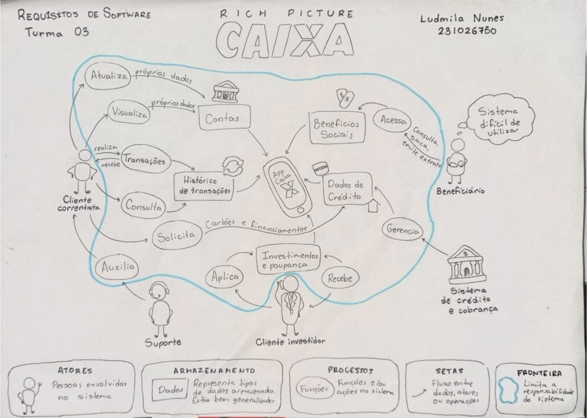
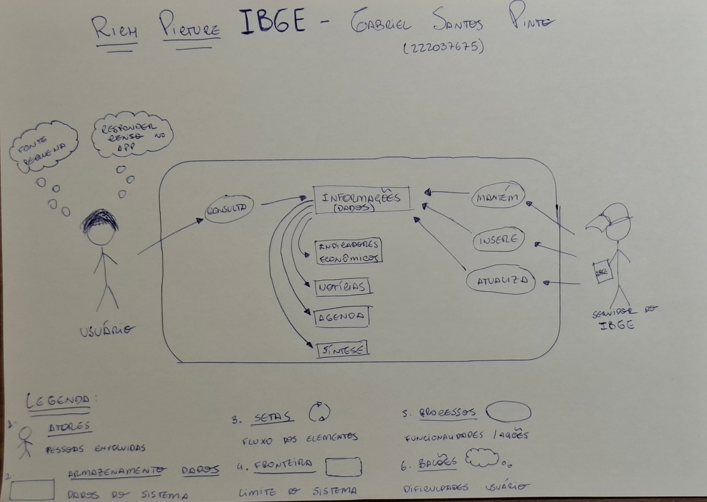
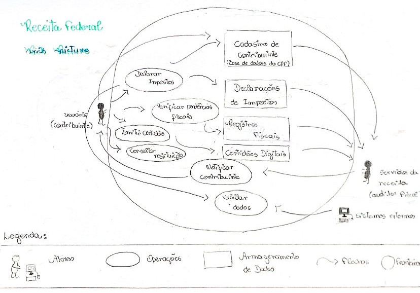
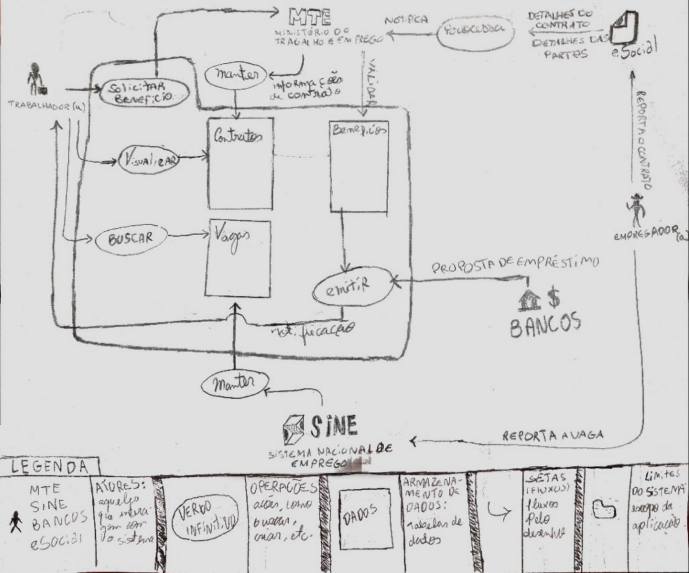
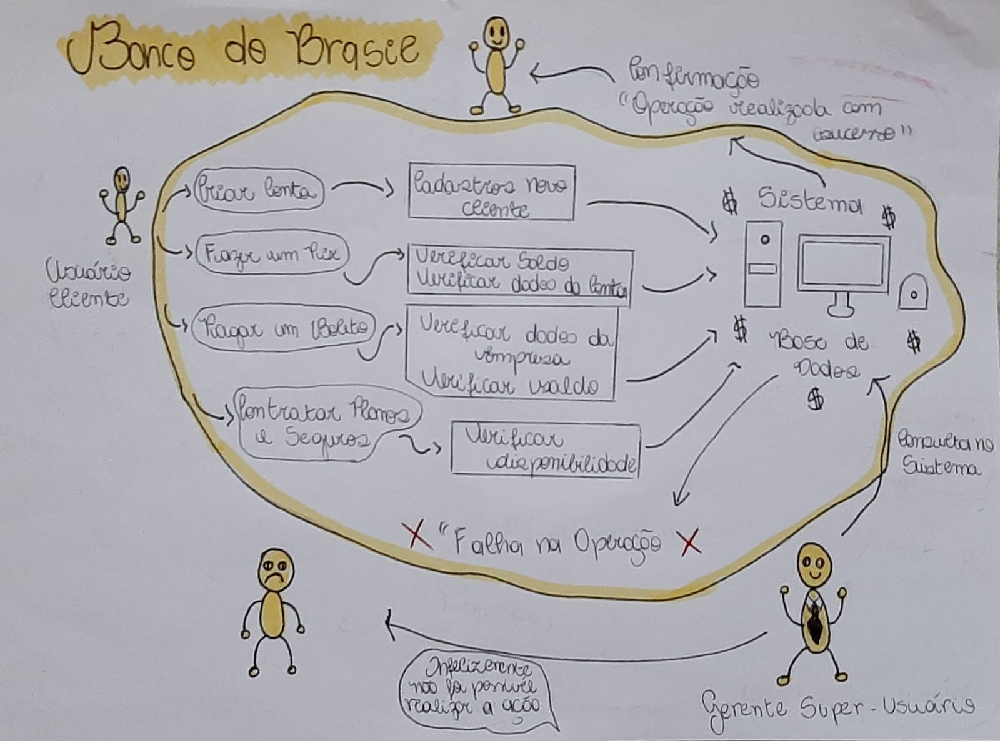

# Rich Picture - Apps analisados 

***

## 1. Introdução

Para estudos da disciplina, o grupo realizou individualmente análises de diversos aplicativos governamentais elegíveis para serem estudados na disciplina (nunca foram utilizados anteriormente e estão sob domínio do governo), o que gerou a criação de <i>Rich Pictures</i> desses aplicativos.
 

<i>Rich Picture</i> é um desenho que visa representar elementos envolvidos no sistema de forma clara e objetiva, destacando atores, operações, armazenamento de dados, fluxos e limites do sistema analisado. 

## 2. Ferramentas

Para confecção dos <i>Rich Pictures</i>, foram utilizados materiais manuais, como papel A4, lápis e caneta. 

## 3. Rich Pictures
### 3.1 Metrô-DF

O primeiro <i>Rich Picture</i> produzido pela equipe foi sobre o app <b>Metrô-DF</b>, realizado pela estudante Mayara Marques. Como atores, foi definido o usuário (cidadão de Brasília), o administrador (quem gerencia o app) e o suporte. Ações como buscar, consultar, favoritar, informar, notificar, manter e atualizar estão presentes no sistema, que se relacionam com os dados das linhas de metrô, estações de trem, horário das linhas, notícias, achados e perdidos e problemas na operação das linhas. O suporte ao usuário não está incluso nos limites do sistema. O <i>Rich Picture</i> pode ser observado na figura 1.

Figura 1: <i>Rich Picture</i> do app Metrô-DF

Fonte: [Mayara Marques](https://github.com/maymarquee), 2025.

### 3.2 CAIXA

Outro <i>Rich Picture</i> confeccionado pelo grupo foi o da <b>CAIXA</b>, realizado por Ludmila Nunes, e pode ser observado na figura 2. Atores como cliente correntista, cliente investidor, benefíciário, suporte e sistema de crédito e cobrança foram representados. Ações como atualizar, receber, aplicar, solicitar, consultar e acessar são possíveis de serem realizadas, além de terem como dados as contas, histórico de transações, benefícios sociais, dados de crédito e investimento e poupança. Os atores estão fora dos limites do sistema.  

Figura 2: <i>Rich Picture</i> do app CAIXA

Fonte: [Ludmila Nunes](https://github.com/ludmilaaysha), 2025.

### 3.3 e-Título

Outro app analisado pelo aluno João Victor, foi o <b>e-Título</b>, observado na figura 3. Como atores, foram identificados o eleitor, o mesário, o suporte e o TSE. Pagar multa, verificar situação, realizar login, consultar local de votação e justificar ausência são algumas das operações que podem ser realizadas no aplicativo. Dados dos eleitores, dados das votações ativas, dívidas eleitorais e situações eleitorais são alguns dados armazenados no sistema. Os atores e a ação de ajudar o usuário estão fora do sistema. 

Figura 3: <i>Rich Picture</i> do app e-Título

Fonte: [João Felix](https://github.com/joaofmoreiraa), 2025.

### 3.4 IBGE

Aplicativo analisado pelo Gabriel, o <i>Rich Picture</i> do <b>IBGE</b> também pode ser observado na figura 4. Os atores do sistema são o usuário e o servidor do IBGE. Ações de manter, consultar, inserir e atualizar são possíveis e se relacionam com os dados de indicadores econômicos, notícias, agenda e síntese. Sentimentos de reponder censo pelo aplicativo e de insatisfação com fonte pequena são sentidos pelo usuário. Os atores estão fora dos limites da aplicação.

Figura 4: <i>Rich Picture</i> do app IBGE

Fonte: [Gabriel Santos](https://github.com/GabrielSPinto), 2025.

### 3.5 Receita Federal

A partir do aplicativo analisado pela Laryssa, foi feito o <i>Rich Picture</i> da <b>Receita Federal</b> que pode ser observado na figura 5. Os atores do sistema são o usuário, servidor da Receita e sistemas externos. Com ações de declarar impostos, verificar pendências fiscais, emitir certidão e consultar restituição. Já os atores estão fora dos limites da aplicação.

Figura 5: <i>Rich Picture</i> do app Receita Federal

Fonte: [Laryssa Felix](https://github.com/felixlaryssa), 2025.

### 3.6 Carteira de Trabalho Digital

Aplicativo avaliado por Caio, o <i>Rich Picture</i> da <b>Carteira de Trabalho Digital</b> está representado na figura 6. Esse <i>Rich Picture</i> ilustra que a plataforma tem como função principal registrar informações sobre vínculos empregatícios e benefícios dos usuários (trabalhadores). Além disso, o sistema também mantém disponíveis oportunidades de emprego para quem está em busca de trabalho, permitindo que os usuários interajam com essas vagas, além disso pode-se consultar contratos, e requisitar benefícios. O sistema ainda apresenta ao usuário ofertas de empréstimo feitas por instituições bancárias de acordo com o perfil do trabalhador.

Figura 6: <i>Rich Picture</i> do app Carteira de Trabalho Digital

Fonte: [Caio Duarte](https://github.com/Caioduart3), 2025.

### 3.7 Banco do Brasil

Aplicativo avaliado por Letícia Monteiro, o <i>Rich Picture</i> do <b>Banco do Brasil</b> está representado na figura 7. Esse <i>Rich Picture</i> retrata o ecossistema do Banco do Brasil, destacando os principais atores e processos. Como o cliente (usuário dos serviços bancários), o funcionário (responsável pelas operações internas), algumas operações como Criar conta, Fazer Pix, Pagar Boleto, Contratar Seguros e Planos.
Os dados envolvidos abrangem informações de clientes, movimentações financeiras, registros de transações e relatórios regulatórios. O sistema também lida com riscos operacionais, como falhas técnicas. A representação visual pode ser observada na imagem anexa:

Figura 7: <i>Rich Picture</i> do Banco do Brasil

Fonte: [Letícia](https://github.com/LeticiaMonteiroo), 2025.

## 4. Bibliografia
> CTEC2402 - Software Development Project. **Introducing Rich Pictures**. Disponível em: [https://aprender3.unb.br/pluginfile.php/3096055/mod_resource/content/2/1_5145791542719414573.pdf](https://aprender3.unb.br/pluginfile.php/3096055/mod_resource/content/2/1_5145791542719414573.pdf)​. Acesso em: 5 abr. 2025.

> Metrô-DF. Versão 2.3.0. Disponível em: [https://play.google.com/store/apps/details?id=br.gov.df.metroapp&hl=pt_BR](https://play.google.com/store/apps/details?id=br.gov.df.metroapp&hl=pt_BR). Acesso em: 6 abr. 2025.

> CAIXA. Versão 4.9.0. Disponível em: [https://play.google.com/store/apps/details?id=br.com.gabba.Caixa&hl=pt_BR](https://play.google.com/store/apps/details?id=br.com.gabba.Caixa&hl=pt_BR). Acesso em: 7 abr. 2025.

> e-Título. Versão 2025.02.25. Disponível em: [https://play.google.com/store/apps/details?id=br.jus.tse.eleitoral.etitulo&hl=pt_BR](https://play.google.com/store/apps/details?id=br.jus.tse.eleitoral.etitulo&hl=pt_BR). Acesso em: 7 abr. 2025.

> IBGE. Versão 4.4.0. Disponível em: [https://play.google.com/store/apps/details?id=br.gov.ibge&hl=pt_BR](https://play.google.com/store/apps/details?id=br.gov.ibge&hl=pt_BR). Acesso em: 7 abr. 2025.

> Receita Federal. Versão 4.5.0. Disponível em: [https://play.google.com/store/apps/details?id=br.gov.economia.receita.rfb&hl=pt_BR](https://play.google.com/store/apps/details?id=br.gov.economia.receita.rfb&hl=pt_BR). Acesso em: 7 abr. 2025.

> Carteira de Trabalho Digital. Versão 7.1.7. Disponível em: [https://play.google.com/store/apps/details?id=br.gov.dataprev.carteiradigital&hl=pt_BR](https://play.google.com/store/apps/details?id=br.gov.dataprev.carteiradigital&hl=pt_BR). Acesso em: 7 abr. 2025. 

> Banco do Brasil. Versão 7.1.7. Disponível em: [https://play.google.com/store/apps/details?id=br.com.bb.android&hl=pt_BR&pli=1](https://play.google.com/store/apps/details?id=br.com.bb.android&hl=pt_BR&pli=1). Acesso em: 7 abr. 2025. 

## 5. Histórico de versões 

Tabela 1: Histórico de versões

| Versão | Descrição       | Autor                                            | Data                                  | Revisor     |
| ------ | ---------- | ------------------------------------------------ | ------------------------------------------ | ----------- |
| 1.0    | Criação do artefato com primeiros Rich Pictures | [Mayara Marques](https://github.com/maymarquee) | 17/04/2025 | [Ludmila Nunes](https://github.com/ludmilaaysha)|
| 1.1    | Adiconando Rich Pictures | [Laryssa Felix](https://github.com/felixlaryssa) | 19/04/2025 | [Mayara Marques](https://github.com/maymarquee)|
| 1.2    | Adiconando Rich Picture de Carteira de Trabalho Digital | [Caio Duarte](https://github.com/Caioduart3) | 19/04/2025 | [Mayara Marques](https://github.com/maymarquee)|
| 1.3    | Adiconando Rich Picturure Banco do Brasil | [Letícia](https://github.com/LeticiaMonteiroo) | 20/04/2025 | [Mayara Marques](https://github.com/maymarquee)|

Fonte: [Caio Duarte](https://github.com/caioduart3), [Gabriel Pinto](https://github.com/GabrielSPinto), [João Félix](https://github.com/joaofmoreiraa), [Larysssa Felix](https://github.com/felixlaryssa), [Letícia Monteiro](https://github.com/LeticiaMonteiroo), [Ludmila Nunes](https://github.com/ludmilaaysha) e [Mayara Marques](https://github.com/maymarquee), 2025.
