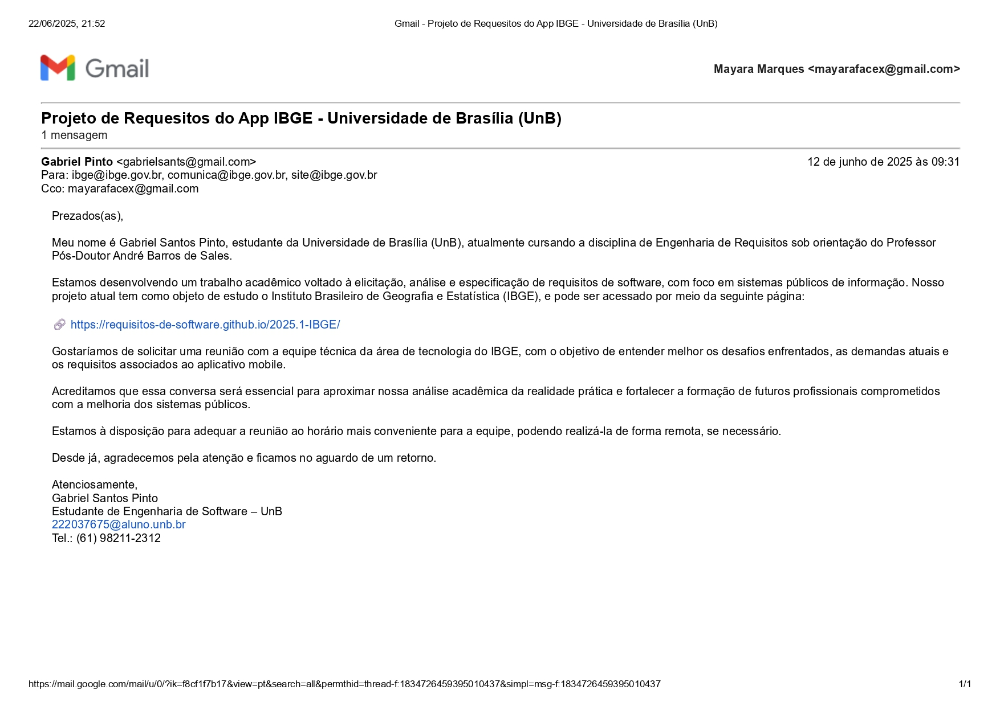

# Contato com Equipe Técnica

## 1. Introdução

Como parte das entregas da disciplina, a validação com a equipe técnica do IBGE é necessária, pois permite a retirada de dúvidas e validação de artefatos produzidos. Esse artefato tem como objetivo registrar e documentar as interações realizadas com os responsáveis técnicos do sistema que está sendo analisado. 

## 2. Metodologia

Como técnica de contato, o grupo enviou um e-mail para os destinatários ibge@ibge.gov.br, comunica@ibge.gov.br e site@ibge.gov.br no dia 12 de Junho de 2025, às 09:31, pelo aluno <a href="https://github.com/GabrielSPinto">Gabriel Pinto</a>. 

Esses e-mails foram escolhidos para serem os destinatários porque são disponibilizados na central de atendimento no site do <a href="https://www.ibge.gov.br/">IBGE</a>.

## 3. Comunicação

A mensagem enviada à equipe técnica do IBGE pode ser observada na Figura 1 abaixo:

Figura 1: Foto da mensagem enviada ao IBGE

Fonte: [Mayara Marques](https://github.com/maymarquee), 2025.

## 4. Resposta do IBGE

Até o dia da entrega da etapa 5 da disciplina (22 de Junho de 2025), o grupo não obteve respostas do IBGE. Caso ocorra o retorno do contato, essa informação será adicionada ao artefato pela equipe. 

## 5. Histórico de Versões

Tabela 1: Histórico de versões

| Versão |Descrição     |Autor                                       |Data    |Revisor|
|:-:     | :-:          | :-:                                        | :-:        |:-:|
|1.0     | Criação do documento | [Mayara Marques](https://github.com/maymarquee)| 22/06/2025 | [Caio Duarte](https://github.com/caioduart3)  |

Fonte: [Caio Duarte](https://github.com/caioduart3), [Gabriel Pinto](https://github.com/GabrielSPinto), [João Félix](https://github.com/joaofmoreiraa), [Larysssa Felix](https://github.com/felixlaryssa), [Letícia Monteiro](https://github.com/LeticiaMonteiroo), [Ludmila Nunes](https://github.com/ludmilaaysha) e [Mayara Marques](https://github.com/maymarquee), 2025.
